# Power Platform Workshop: Administration and Governance

### Overall Estimated Duration: 8 Hours

## Overview

In this hands-on lab, you will step into the role of a Power Platform administrator for Fabrikam and Contoso, gaining end-to-end experience in governance, monitoring, and deployment. You’ll begin by inventorying existing Power Apps and flows, then leverage the Center of Excellence (CoE) Starter Kit to track usage and enforce data policies. Next, you’ll build a Microsoft Form–based request workflow with Power Automate approvals to provision new environments and Dataverse databases on demand. You’ll explore managed environments and pipelines to promote solutions from development through test and production stages. Finally, you’ll practice app auditing and learn how to create and publish a Power App within Microsoft Teams, extending it both inside and outside your team.

## Objectives

By the end of this lab, you will be able to:

- **Securing your Tenant**: In this hands-on lab, participants will assume the role of a Power Platform environment administrator for Fabrikam, discover and inventory existing Power Apps and flows in their tenant, and establish baseline data loss prevention and security policies. They will configure administrative connectors and governance tools to enforce these policies, ensuring users can continue building productive solutions while adhering to Fabrikam’s compliance requirements.

- **Reporting and Telemetry**: In this hands-on lab, participants will gain hands‑on experience as Power Platform administrators by inventorying existing Power Apps, flows, and environments across their tenant using the CoE Starter Kit. They will configure and customize the CoE “Monitor” dashboards and analytics to track usage metrics—such as app and flow activity, connector calls, and environment health—and implement baseline data loss prevention policies to enforce corporate compliance.

- **Action through Automation**: In this hands-on lab, participants will gain hands‑on experience automating Power Platform environment requests by building a Microsoft Form–based submission process and configuring a Power Automate approval flow to provision new environments and Dataverse databases upon admin approval. They will also explore the CoE Starter Kit’s auditing and user‑onboarding components to enforce governance and welcome new app makers into approved environments.

- **Managed Environments**: In this hands-on lab, participants will gain hands-on experience applying governance controls using Managed Environments and deploying solutions across environments using Power Platform Pipelines, enabling structured Dev > Test > Prod app lifecycle management.

- **Power Apps in Teams**: In this hands-on lab, participants will learn how to create a team in Microsoft Teams and build a Power App within it, gaining experience in app creation, publishing, and sharing for broader organizational use.

- **Dataverse for Teams (Optional)**: In this hands-on lab, participants will create a Power App within a Microsoft Team, publish it for team use, and share it with users outside the team to understand broad distribution capabilities.

## Prerequisites

- Familiarity with the Power Platform admin center and Microsoft Teams.
- Basic understanding of Power Apps, Power Automate, and Microsoft Dataverse.
- General knowledge of environment management, data governance, and DLP (Data Loss Prevention) policies.

## Getting Started with the Lab
 
### Accessing Your Lab Environment
 
Once you are ready to dive in, your virtual machine and **Guide** will be right at your fingertips within your web browser.

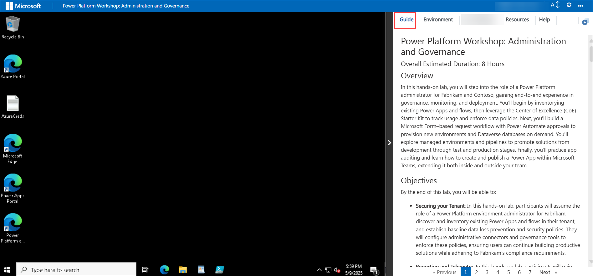

### Lab Guide Zoom In/Zoom Out

To adjust the zoom level for the environment page, click the **A↕ : 100%** icon located next to the timer in the lab environment.

### Virtual Machine & Lab Guide
 
Your virtual machine is your workhorse throughout the workshop. The lab guide is your roadmap to success.
 
### Exploring Your Lab Resources
 
To get a better understanding of your lab resources and credentials, navigate to the **Environment** tab.
 
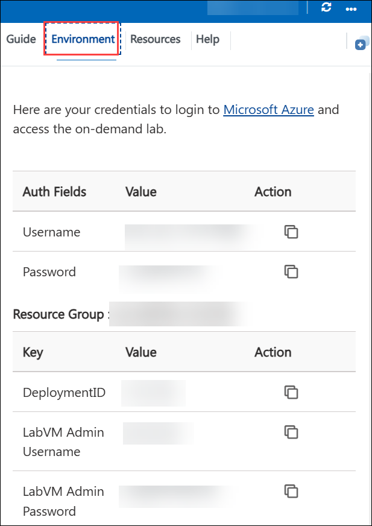
 
### Utilizing the Split Window Feature
 
For convenience, you can open the lab guide in a separate window by selecting the **Split Window** button from the top right corner.
 
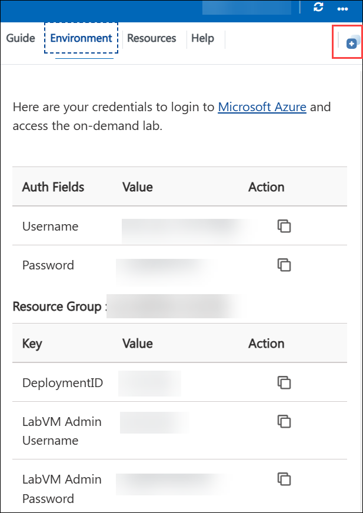
 
### Managing Your Virtual Machine
 
Feel free to **start, stop, or restart (2)** your virtual machine as needed from the **Resources (1)** tab. Your experience is in your hands!
 
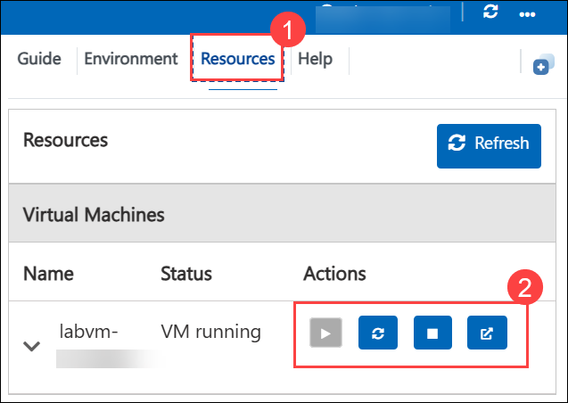

### Lab Validation

1. After completing the task, hit the **Validate** button under the Validation tab integrated into your lab guide. You can proceed to the next task if you receive a success message. If not, carefully read the error message and retry the step, following the instructions in the lab guide.

   

1. If you need any assistance, please contact us at cloudlabs-support@spektrasystems.com.

## Getting Started with Lab

1. In the JumpVM, click on the **Power Apps** portal shortcut of the Microsoft Edge browser that is available on the desktop.

    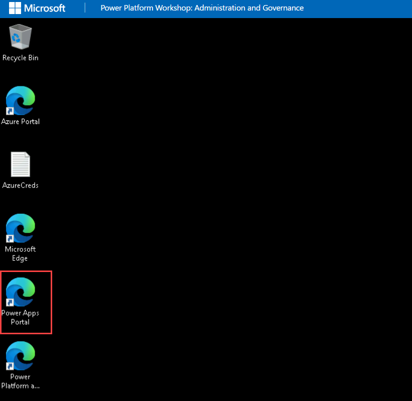

1. On the **Sign in** window, you will see the login screen, enter the following username  and click on **Next**.

   * Email/Username: <inject key="AzureAdUserEmail"></inject>

     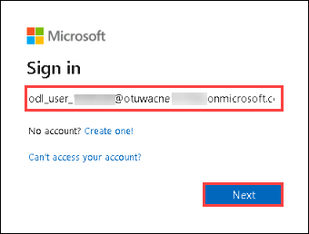

1. Now enter the following **password**  and click on **Sign in**. 

    * Password: <inject key="AzureAdUserPassword"></inject>
  
      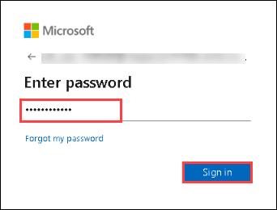

1. Select **Get Started**.

    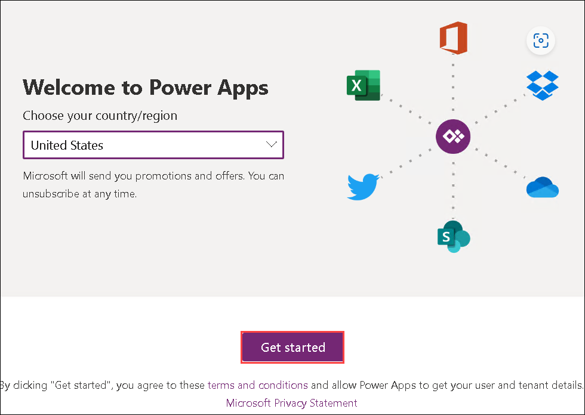

1.  Once logged in, click on **Environment** and select the default environment named **OTU WA AIW <inject key="Deployment ID" enableCopy="false" />**.

    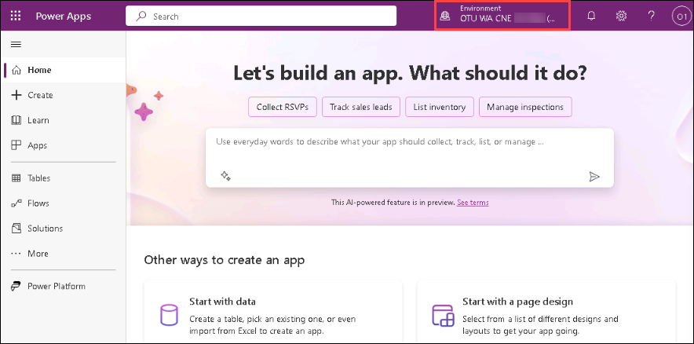

1. Select **Solutions (1)** and click on **Create database (2)**.

    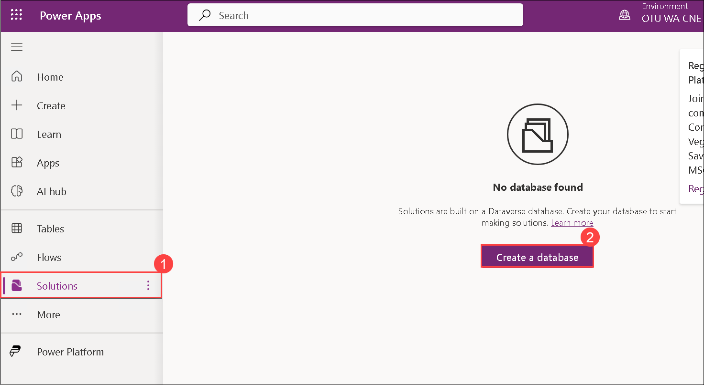

1. Now, leave all options as default and click on **Create my database** and the database creation process will start.
 
    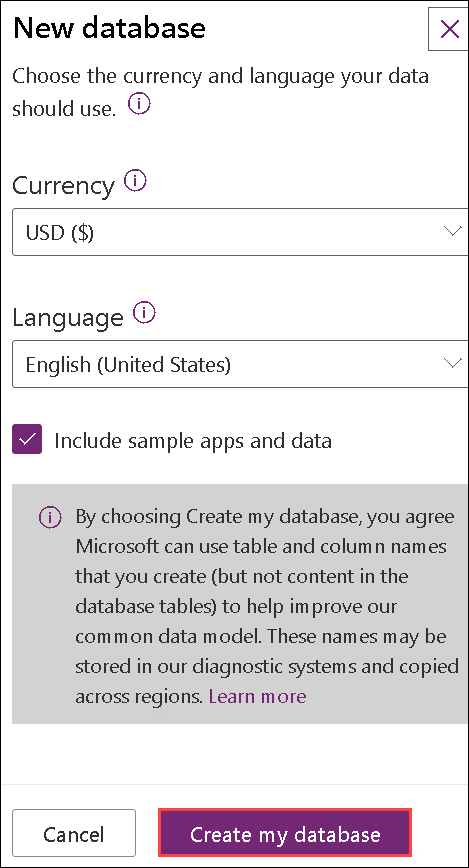

## Support Contact

The CloudLabs support team is available 24/7, 365 days a year, via email and live chat to ensure seamless assistance anytime. We offer dedicated support channels tailored specifically for learners and instructors, ensuring that all your needs are promptly and efficiently addressed.

Learner Support Contacts:

- Email Support: cloudlabs-support@spektrasystems.com
- Live Chat Support: https://cloudlabs.ai/labs-support

Click **Next** from the lower right corner to move on to the next page.

## Happy Learning!!
