## Admin in a day

#### Please note- the exercises provided here should be completed in a non-production environment. Often you will be assigned an environment by your facilitator. However, if you are completing these labs on your own, make sure to provision a developer or trial environment.

# M01-HOL-Securing your Tenant

## Table of Contents

1. Exercise 1 - Exploring existing Power Platform usage

   **Scenario**
   
   - Task 1: Review existing environments 

   - Task 2: Review existing Data policies

2. Exercise 2 – Plan an environment strategy

   **Scenario**
   
   - Task 1: Read about the current situation at Fabrikam

   - Task 2: Build an Environment Plan
  
   - Task 3: Review the example environment plan and compare it to yours 

3. Exercise 3 – Plan a DLP strategy

   **Scenario**
   
   - Task 1: Build a DLP Plan
   
   - Task 2: Review the example DLP plan and compare it to yours 

4. Exercise 4 – Evaluate the impact of adding DLP

   **Scenario**
   
   - Task 1: Create a trial environment
   
   - Task 2: Create a flow to get the weather
  
   - Task 3: Create a DLP Policy

5. Exercise 5 –  Configure a security role

   **Scenario**
   
   - Task 1: Import project management solution
   
   - Task 2: Create a security role
  
   - Task 3: Share app

#### Hands-on lab

## Lab Scenario

In this hands-on lab, you will be an environment administrator for Fabrikam helping to adopt the Power Platform. You have been assigned responsibility for ensuring that Fabrikam’s 
employees can build Power Apps applications and flows using Power Automate to help them be productive. At the same time, you are expected to ensure that Fabrikam’s data and 
security policies are followed. 

Some of Fabrikam’s employees have already started experimenting with the Power Platform so your first task is to get an understanding of what is already in use.

Next, you will be taking steps to put some baseline security policies in place to implement Fabrikam’s data and security policies.

## Lab Test Environment

This lab is designed to be completed in an environment setup for multiple students to complete the Admin in a day series of hands-on labs. We will be providing an environment for you to 
utilize for this course.

You will be assigned one or more users to use to complete the tasks. Because this is a shared environment, some tasks that require a tenant Global Administrator or a Service Administrator will already be completed. Your account will only be an environment administrator.

## Exercise 1: Exploring existing Power Platform usage

### Scenario

In this exercise, you will be exploring the tenant to see what Power Platform assets have already been created. Specifically, you will be looking at the following:

- Environments that have been created
- Data Loss Prevention (DLP) policies.

>**Note**: Before Proceeding with the HOL, rename the default environment display name with **User and Team Productivity**.

### Task 1: Review existing environments

1. Logged in with the **Lab Admin account** in an in-private browser session navigate to https://aka.ms/ppac and select **Environments**.

    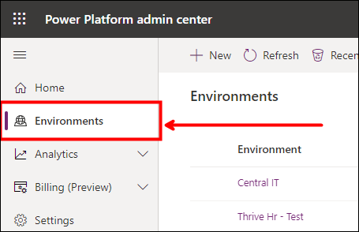

2. Review the list of environments. These are the environments that are available for you to manage.

   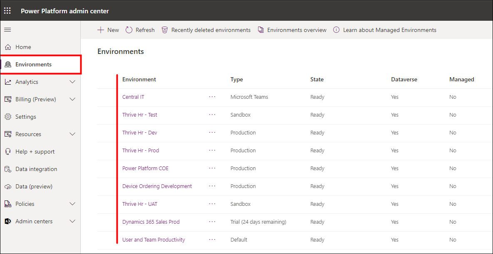

3. Notice the **Type** column, you can see Fabrikam is already using several types of environments.

4. You can filter and order environments. Select on the **Type (1)** column, select filter by **Production (2)**, and Select **Apply (3)**.

   

5. You should now see only the **Production** type environments.

   

6. Select on the **Type (1)** column again and filter by **Default (2)** and **Production (3)**, and select **Apply (4)**.

   

7. You should now see **Production** and **Default** environments.

8. Select on the **Environments (1)** column, select **Sort order** by **Ascending (2)**, and select **Apply (3)**.

   

9. The list of environments will show **Production** and _Default_ environments ordered by environment name in ascending order.

   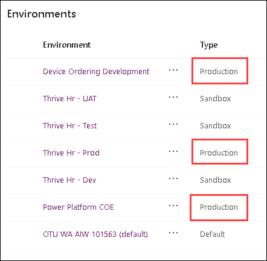

10. Now remove the filters and you should see all environments.

    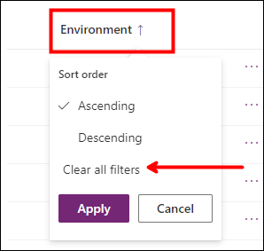

11. Next, notice all the environments with **Thrive Hr** in the name. These are a set of environments Contoso uses to manage the lifecycle of their Thrive apps; a suite of employee 
    engagement apps. They are built in Thrive Hr - Dev and then are promoted to Test -> UAT-> Production after testing by your admin team.

12. Select on the **Type** and filter by **Default**.

13. This is the environment in which all users are makers and can build their apps and flows. Think of this environment as supporting personal productivity use of the platform. This 
    is also the default location used by any customizations built with Power Apps in Office apps. The default environment can’t be deleted, but you can rename it to make clear its 
    purpose. For example, some name it _User__and Team Productivity_ like we have in this tenant.

14. Select the default environment by Selecting the name in the list to drill down into the detail page.

    

15. In the **Access** section, you’ll notice that there are multiple options to choose from, which can be used to determine who has access to which items.

16. Select **See all** under **Security Roles**.

    

17. From here, you can review all of the security roles for your company and manage their access to the company’s data. By default, users have access to all security roles. The business 
    unit currently listed is the same as the tenant and these are assigned to all users by default. Managed roles can be modified to create.

18. Use the search box in the top right and enter **Environment Maker** to find the Environment Maker security role, then select the lone result.

    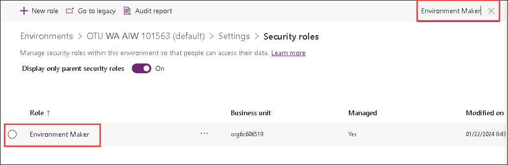
 
    >**Note:** Notice that the org is listed as the **Business Unit**; this means everyone in the organization will have this role by default. For environments other than the default, you control this. 
    However, default is special and Tenant can’t be removed from the role.

20. Go back to the Environment Details page.

    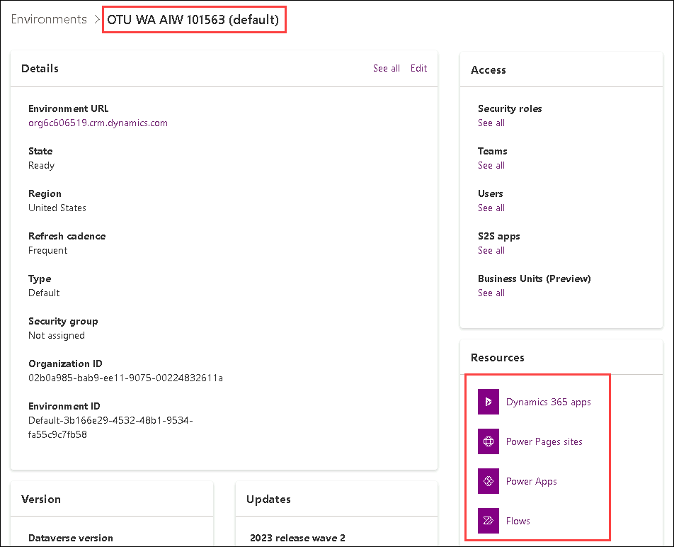

21. In the **Resources** section, Select **Power Apps**.

    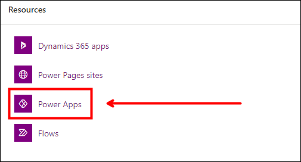

22. These are apps built by users in your default environment. Notice many of them are just test names because this is where a lot of users will experiment and build their first app. As 
    you scroll down the list you might notice some names are more deliberate e.g., Product Showcase. Later in the course, we will talk about how to identify these upcoming apps so you 
    can help guide them to ensure they mature and have adequate governance.

23. Click on the **... (1)** and select **Details (2)** to view app details, such as App Type (Standard/Premium), Web link, Connections and Shared information.

    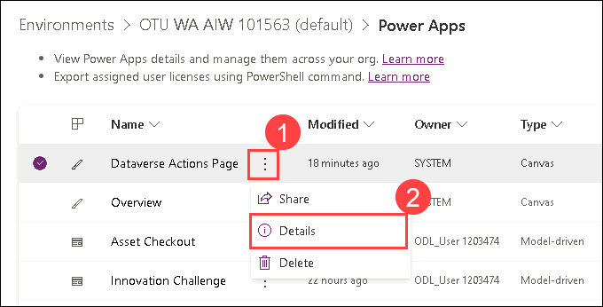

### Task 2: Review existing Data policies

1. Navigate to the admin portal https://aka.ms/ppac or https://admin.powerplatform.microsoft.com

2. Expand **Policies** and select **Data policies** on the left navigation.

3. Review the list of existing policies.

    - As the login you are using is not a tenant admin but only an environment admin, you will see policies that impact environments of which you are a member.

    - As an environment admin or regular environment user, you will also be able to see any tenant-wide DLP policies applied to your environment. However, you would not be able to edit 
      those tenant-side DLP policies.

    - As a Global Admin, Admin, Power Platform Service Admin or D365 Service Admin in your tenant, you will see all policies that exist in your tenant, even those that you did not 
      create.

4. Notice the Contoso Global DLP policy exists that is intended to span all environments (except selected ones) and represents the global DLP policy. For this lab environment Contoso 
   Global DLP policy has 4 environments selected instead of All except 4.

5. You will also notice a DLP for **Thrive Exceptions**. That team had worked with the IT department to agree on exceptions they needed for their environments and their environment would 
   be excluded from the Contoso Global DLP. This exception DLP policy would have their environments included and apply only to them.

   

6. Select the **Contoso Global DLP (1)** and select **Edit Policy (2)**.

   

7. Select **Prebuilt connectors (1)** and review the **Business (2)** connectors.

    

8. Select **Scope** and **Environments** to see how it they are configured.

   

9. Once finished, select either the **Data Policies (1)** button on the left menu panel, or the **Cancel (2)** button in the bottom right to head back to the Data Policies screen.

   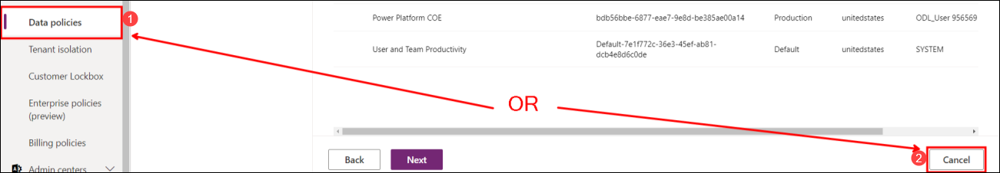

10. Select the **Thrive Exception DLP (1)** and select **Edit Policy (2)**.

    

11. Select on the **Prebuilt connectors** and select the **Business** tab. Based on the use case for the Thrive application the connectors in the Business group have been established. 
    You can also see how Scope and Environments are configured to only select the Thrive environments.

    

12. To exit this screen, select the **Data Policies** section on the left-hand side, or the **Cancel** button on the bottom right of the screen again.

    

## Exercise 2: Plan an environment strategy

In this exercise, you will be reviewing the scenario for Fabrikam that explains their current situation. After reviewing you will evaluate and propose an environmental plan.

### Task 1: Read about the current situation at Fabrikam

In this task, read the following and take notes that would help you propose an environment plan for Fabrikam.

You have recently joined the newly formed Power Platform center of Excellence team at Fabrikam and are responsible for establishing a governance strategy. Currently, there is no 
governance process established and employees can create apps, flows and even environments without any control. Fabrikam has been in existence for 40 years and has 4,500 employees 
at multiple office locations in the US, UK and EU. Fabrikam employees are all licensed for Office 365 E3 and a growing number of them have either Power Automate or Power Apps per user 
licenses. Over the last 6 months, Fabrikam’s management realized that this was greatly improving productivity, but they recognised without some planned governance it could easily get 
out of control. About 50 of the users are more advanced power users of the platform always looking at ways to push its limits. Fabrikam’s sales team of 100 users also use a heavily 
customized Dynamics 365 Sales app deployment.

One of the first things you did was look in the admin center to see how many environments were there. Currently, in the tenant, there are 45 environments with a variety of names that users 
choose. The majority of the applications looked like they were in the default environment or a couple of other custom environments that had been created. There was one environment that 
was the production Dynamics 365 application environment used by the sales team.

The most organized department is market research, they built an application that is used daily for conducting their market surveys. Currently, there is just a single custom environment 
named Market Research that supports the application. There are a couple of people in the department who are app makers making all the changes. They tend to do them in the late 
afternoons and evenings and publish them when nobody's around to avoid impacting other users. There is not currently any testing done before the app is published other than by the person 
making the changes. They are open to the testing idea but are not sure how to do it with a single environment.

You found out that the new environments have stopped being created simply because they have run out of storage from creating too many environments. When you asked about this you were 
handed a stack of requests that claimed they needed new environments. The following are the priority requests; we will ask you to help identify how to handle these when you fill out the 
environment strategy template.

- Request 1: A user would like to build a set of Power Automate flows that help organize their Outlook inbox and tag emails.

- Request 2: The VP of Service wants to build some custom apps to support their teams; like how the market research team has done.
    
- Request 3: Marketing wants to build an app that makes it easy to publish tweets on Twitter using the Twitter connector. They also plan to create Power Automate flows that notify 
    them of mentions along with the sentiment of the message.

- Request 4: HR would like to try the Crisis Comms app that Microsoft published and would like an environment for it to run in.
    
- Request 5: A user would like to build an app that uses a custom connector for a 3rd party service and also uses the DropBox connector.

Yesterday you got some good news, another 30GB of storage capacity for environments had been procured. You also got permission to put in place the necessary steps to ensure it does not 
get wasted.

### Task 2: Build an Environment Plan

In this task, you use the information from Task 1’s scenario to help you propose an environment plan for Fabrikam. To help you build the plan we have prepared a worksheet with questions 
for you to answer.

1. Open **M01 – HOL Environment Worksheet.docx** from the Resources folder and complete it by answering each of the questions. You should spend no more than 10 minutes on this before 
   proceeding to the next task.

### Task 3: Review the example environment plan and compare it to yours

In this task, we have provided you with a completed environment plan. Review the answers and compare them to the ones you built in the prior task.

1. Open the Example Environment Plan document **M01 – HOL Environment Example.docx** and compare the answers to the one you completed in the previous task.

2. Talk to your trainer about any significant differences that do not make sense to you.

## Exercise 3: Plan a DLP strategy

### Scenario

In this exercise, you will be planning a DLP strategy for Fabrikam using the same scenario background information from the last exercise.

### Task 1: Build a DLP Plan

In this task, you use the information from the last exercise’s scenario to help you propose a DLP plan for Fabrikam. To help you build the plan we have prepared a worksheet with questions 
for you to answer.

1. Open **M01 – HOL DLP Worksheet.docx** from the Resources folder and complete it by answering each of the questions. You should spend no more than 10 minutes on this before proceeding 
   to the next task.

### Task 2: Review the example DLP plan and compare it to yours

In this task, we have provided you with a completed environment plan. Review the answers and compare them to the ones you built in the prior task.

1. Open the Example Environment Plan document **M01 – HOL DLP Example.docx** and compare the answers to the one you completed in the previous task.

2. Talk to your trainer about any significant differences that do not make sense to you.

## Exercise 4: Evaluate the impact of adding DLP

### Scenario

In this exercise, you will create an environment, and a flow, and then view the impact of adding a DLP policy.

### Task 1: Create a trial environment

1. Navigate to the Power Platform admin center.

2. Select **Environments** and select **+ New**.

   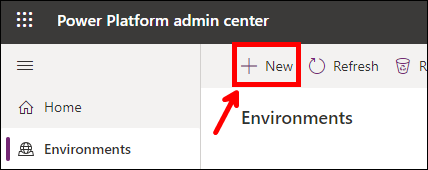

3. Enter **My Sandbox-<inject key="Deployment ID" enableCopy="false" />** for Name, select Region as **United States - Default**, select **Trial** as Type, select **Yes** for Add a Dataverse data store?, and select **Next**.

   

4. You may provide a **URL**, select **Currency**, and then set your security group to **All Contoso users** and select **Save**.

   

5. Wait for the environment to be created. The state will change to **Ready** when the environment is ready.

### Task 2: Create a flow to get the weather

1. Navigate to the Power Apps maker portal and select the environment you created.

   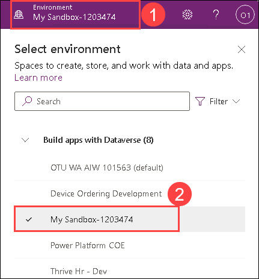

2. Select **Flows (1)** from the left, select **+ New flow (2)** and select **Scheduled cloud flow (3)**.

   

3. Enter **Weather Flow** for **Name**, select **Repeat every 1 Day**, and select **Create**.

    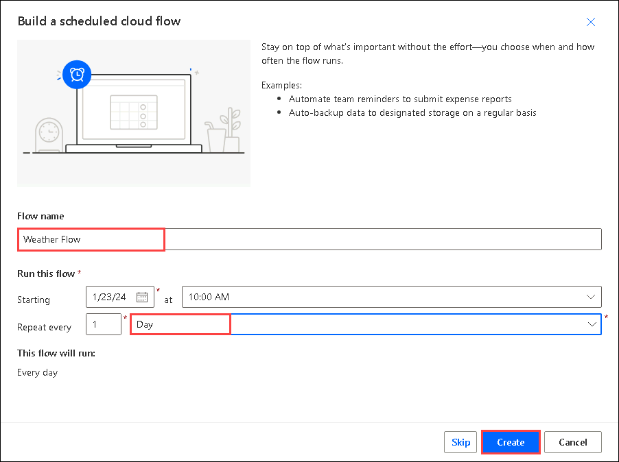

4. Select **+ New step**.

5. Search for **MSN (1)** and select **Get current weather MSN Weather (2)**.

   

6. Provide your **Location (1)**, select your preferred **Units (2)**, and select **+ New step (3)**.

   

7. Search for **Send an email (1)** and select **Send an email (V2) Office 365 Outlook (2)**.

   

8. Provide your email for **To:** **<inject key="AzureAdUserEmail"></inject>** and enter **Current Weather** for **Subject**.

9. Select on the Body enter **Current weather for:** and select **Location** from the Dynamic content pane.

   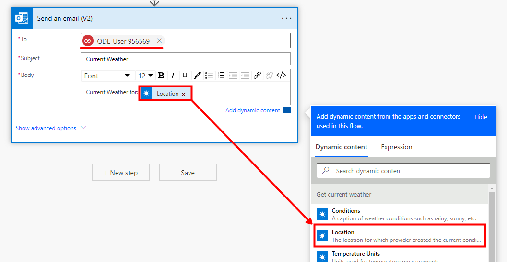

10. Hit the **[ENTER]** key **,** enter **Temperature:** and select **Temperature** from the Dynamic content pane.

11. Hit the **[ENTER]** key **,** enter **Conditions:** and select **Conditions** from the Dynamic content pane.

12. You may add other values to the email.

    

13. Select **Save**.

    

14. Go to My Flows by selecting the  button located on the top left of the page.

    

15. Select to open the flow and Select **Run**.

    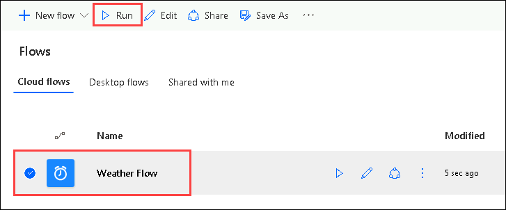

17. Select **Run flow**.

    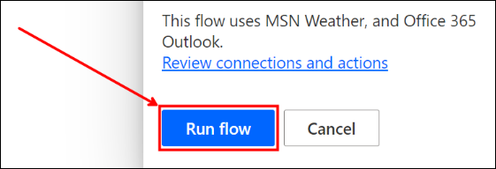

18. Select **Done** and wait for the flow run to complete. Select the **Refresh** button to see the update status.

    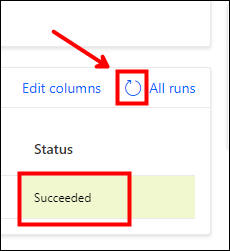

19. Navigate to **Outlook** and You should get an email with the weather information.

    

### Task 3: Create a DLP Policy

In this task, you will create an environment-specific DLP and see how it impacts your workflow.

1. Navigate back to the Power Platform admin center. If you’re on the Power Apps website, you can do this by selecting the gear in the header, and selecting **Admin Center**.

   

2. Select **Data policies (1)** and Select **+ New Policy (2)**.

   

3. Enter **My Sandbox-<inject key="Deployment ID" enableCopy="false" />** for **Name** and select **Next**.

   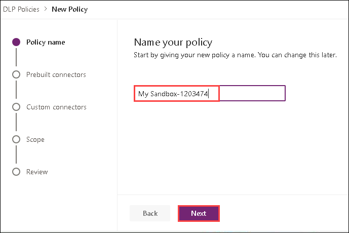

4. Search for Microsoft Dataverse, select **Microsoft Dataverse (1)**, and select **Move to Business (2)**. Choose carefully, you may have to expand the Name column to differentiate 
   between connectors in your search results.

   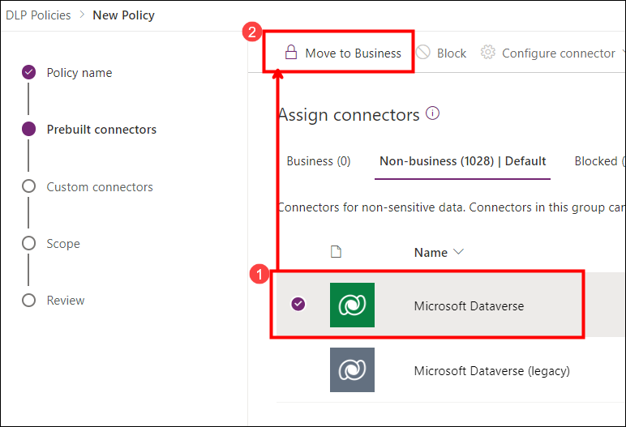

5. Search for SharePoint, select **SharePoint (1)** and select **Move to Business (2)**.

   

6. Search for Outlook, select **Office 365 Outlook (1)** and select **Move to Business (2)**.

   

7. Select the **Business** tab.

8. You should now have three connectors moved to Business. Select **Next**.

   

9. Skip the Custom connector by Selecting the **Next** button, we won’t be using any in this example.

10. Select **Add multiple environments (1)** from the options, then select **Next (2)**.

    

11. Choose the environment you created **My Sandbox-<inject key="Deployment ID" enableCopy="false" /> (1)** and select **+ Add to Policy (2)**.

    

12. Once done, select **Next**.

13. Review the policy, to make sure you have **(3) Business** connectors added, and only one **Environment** selected and select **Create policy**.

    

14. Navigate to Power Automate and make sure you are in the sandbox environment.

    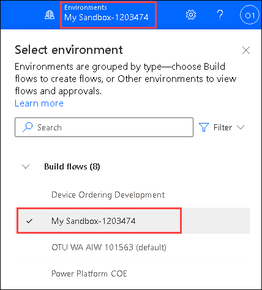

15. Select **My flows**.

    

16. The flow should now be suspended because of the DLP you created. Select to open the flow. This can take up to 5 minutes, wait a few minutes and then select refresh.

    

17. You should not be able to run the flow. There will be a notice at the top showing that the DLP is active and restricting access, and the **Status** should be suspended. Feel free to 
    close the webpage/tab once you’ve confirmed it has been suspended.

    

**Note**: After you finish this lab if you have time come back and modify the DLP you created to fix the problem. If you have trouble getting it to work, ask your instructor for some tips.

## Exercise 5: Configure a security role

### Scenario

In this exercise, you are going to import a pre-built Power Apps canvas app that was built in another environment. The application allows users to see a list of Projects stored in 
Dataverse. After importing you will build a Security Role to allow users to work with the Project table data. Finally, you will see how to share the application with a Microsoft Entra 
ID Security group and assign the security role you just built.

### Task 1: Import project management solution

1. Navigate to the Power Apps maker portal and select The My Sandbox environment named **My Sandbox-<inject key="Deployment ID" enableCopy="false" />** you created.

   

2. Select **Solutions (1)** and select **Import solution (2)**.

   

3. Select **Browse**.

4. Select the **Fabrikam Project Management (1)** solution located in the **C:\LabFiles\PPAdminAttendee%20(1)\PPAdminAttendee\M01 - HOL - Securing your tenant\Resources** folder and select **Open (2)**.

   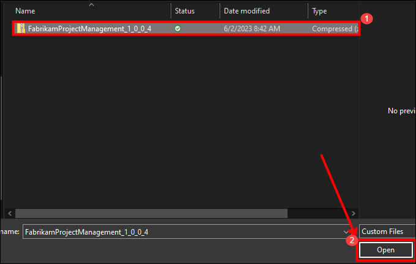

5. Select **Next**.

   

6. Select **Import** and wait for the import to complete. You should get a notification when the import succeeds.

7. Select **Publish all customizations** and wait for the publishing to complete.

   

8. Select to open the solution you just imported.

   

9. The solution should have six components.

    

10. Select to open the **Import Sample Data – Projects** flow. You are going to run this flow to insert some sample project data for the app to use.

    

11. Select **Edit**.

    

12. At this point, you may be asked to sign in to the flow. Sign in, and then select **Continue**.

    

13. Select to expand the **Parse JSON** step.

    

14. Examine the sample records the flow will create.

15. Select **Save** and wait for the flow to be saved.

    

16. Go back to the details view of the flow by selecting the back button.

    

17. Open the flow again.

18. **Turn on** the flow if Status is off.

    

19. Select **Run** to run the flow.

    

20. Select **Run flow**.

    

21. Select **Done** and wait for the run to complete.

    

22. Select the browser back button.

23. Go back to the solution page, by selecting the **Back to Solutions** button.

    

24. Select **Apps (1)** and select **Project List (2)** and click on **Play (3)** to run canvas application.

    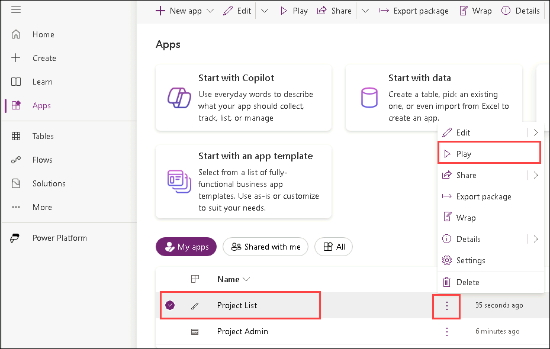

25. The application should load, and you should see the sample project records the flow created. Select the **+** in the top right of the app.

    

26. Enter **Test Project (1)** for **Title**, select **Due date (2)** and select **Submit (3)**.

    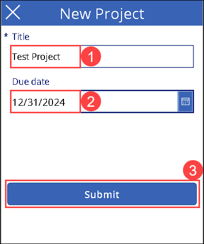

27. The application should create a new record and take you back to the list of projects.

     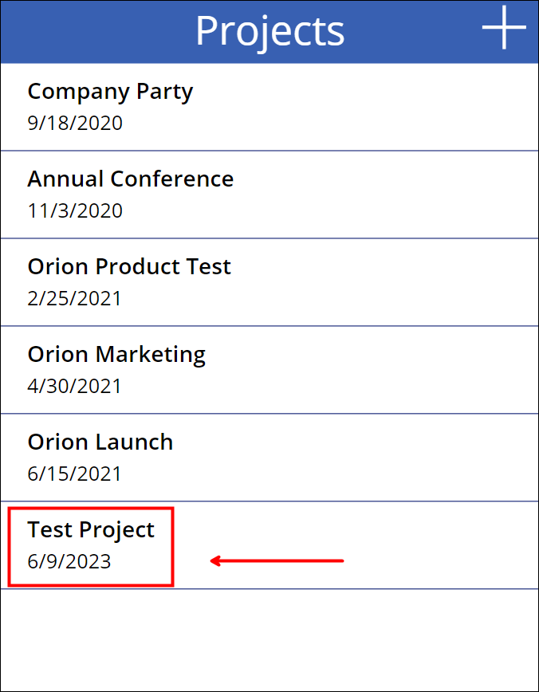

28. Close the Project List application browser window or tab.

### Task 2: Create a security role

1. Navigate to the Power Apps maker portal and make sure you have your sandbox environment selected.

2. Select **Solutions (1)** and select to open the **Fabrikam Project Management (2)** solution.

   

3. Select **+ New (1)** and select **Security** > **Security role (2)**.

    

4. Enter **Project Manager (1)** for **Role Name**  and select **Save (2)**.

   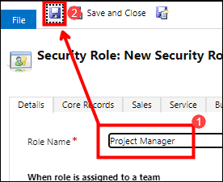

5. Select the **Custom Entities** tab.

6. Scroll down to locate the Project table and click on the name of the entity.

    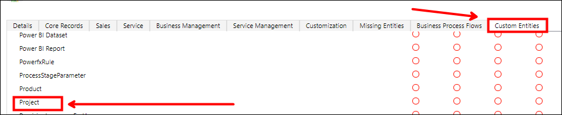

7. This action will give this role User rights to the Project entity. If you kept selecting on the label it would increase the permissions with each click until the user had full 
   privileges.

   

8. You will now give this role organization read privilege. Select the second dot from the left. You can also scroll up and see the column headers.

   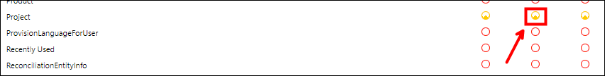

9. Click on the same dot two more times or until the dot is totally filled. This will allow any user with this role to see all project records in the Dataverse environment.

    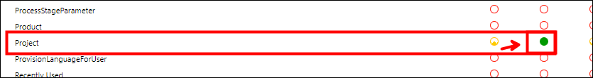

10. Select **Save and Close**.

    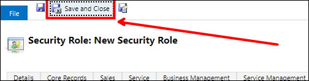

11. Select **Done** to update the solution.

    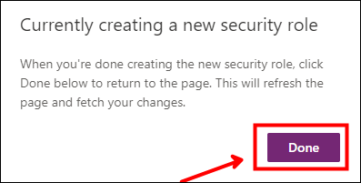

12. Select **Publish all customizations** and wait for the publishing to be completed.

    

13. Do not navigate away from this page.

### Task 3: Share app

1. Go back to the **Solutions** page by selecting the **Back to Solutions** button.

2. Click on **Apps (1)**, then choose **Project List (2)** application, and select **Share (3)**.

   

3. Search for **lab back office** and select it.

    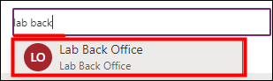

4. Select on the **Assign a security role** role dropdown.

   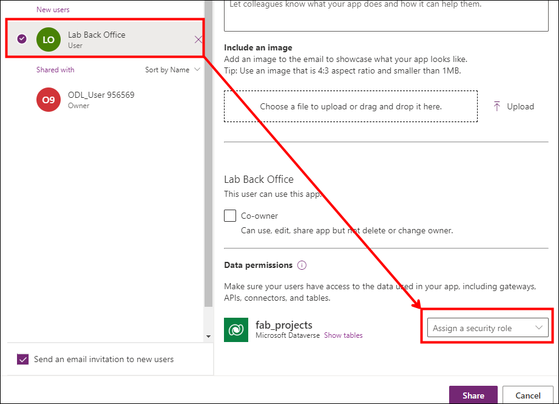

5. Select the **Project Manager** and **Basic User** roles and then select **Share**.

   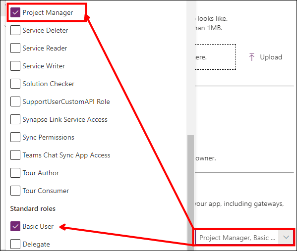

   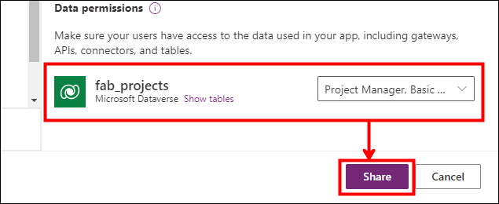

6. Close the share pane.

