## Admin in a day

# Reporting and Telemetry

#### Hands-on lab

## Lab Scenario

In this Hands-on Lab, you are an administrator helping adopt the Power Platform.

An important part of keeping the Power Platform running successfully is monitoring the ongoing usage. In this hands-on lab you will be using the platform tools and the COE Starter Kit to 
perform usage monitoring.

## Lab Test Environment

This lab is designed to be completed in an environment setup for multiple students to complete the Admin in a day series of hands-on labs.

You need to use the assigned user and environment information to complete this lab. You must have completed the prior labs to successfully complete this lab.

## Exercise 1: Explore the out of the box analytics

Now in this exercise, you will explore the out of the box analytics that are available from the Power Platform admin center.

### Task 1: Explore the Power Automate analytics

1. Navigate to **Power Platform admin center**

2. Expand **Analytics**.

3. Select **Power Automate**.

   

4. Ensure you’re under the **Environment View**.

5. Select change filters and change to the Power Platform COE environment.

6. Review the visuals in the **Runs** tab and then select the **Usage** tab.

   

7. Review the visuals in the **Usage** tab.

8. Review the visuals in the rest of the tabs.

9. In the top left corner of the screen, under the header, select **Overview** to review tenant level
    analytics.

    

10. Now you are looking at data for all environments you have access to.

11. Review the Usage data available on this tab, and then switch to Maker Activity and Inventory to review the other data available. Notice you can still filter on more specific criteria 
    using the dropdowns.

    


### Task 2 : Explore the Power Apps analytics

1. Navigate to **Power Platform admin center**

2. Expand **Power Apps**.

3. Change the Primary Tab to Environment View.

4. Switch the environment to **Power Platform COE** by changing the available filters.

   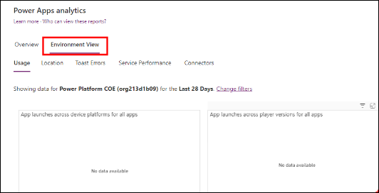

5. Review the visuals in **Usage, Location** , and all other tabs.

6. In the top left corner of the screen, under the header, select **Overview** to review tenant level analytics.

   

7. Now you are looking at data for all environments you have access to.

8. Review the **Usage** data available on this tab, and then switch to **Maker Activity** and **Inventory** to review the other data available. Notice you can still filter on more 
   specific criteria.

   

9. Hover your mouse over the far-right corner of the unique users data, and under **Region** you can select **...** to show more options.

   

10. Select Export data.

    

11. If you have Excel installed choose one of the options and select Export. After the file downloads review the details available. If you don’t have Excel simply select Cancel.

    


### Task 3 : Explore the Capacity analytics

1. Navigate to **Power Platform admin center**
2. Expand **Resources** and select **Capacity**.

    

3. Notice the data in the **Storage capacity usage** panel.

   

4. Notice the data under the **Storage capacity by source** panel.

   

5. Go to the **Top storage usage by environment** panel and notice the capacity usage by top environments.

   

6. Select the **Dataverse** tab from the top row of options.

   

7. Locate the **Device Ordering Development** environment storage capacity and select **Details**.

   

8. Select the **Chart menu** button at the top right of the first chart and select **Download all tables**.

   

9. Open the file that downloaded as a result. You should see a list of all tables and their database size in MB.

   

10. Close the Excel file. You won’t need to save any changes you’ve made.

11. Go to the navigation pane on the far left and expand **Analytics,** then select **Dataverse**.

   

12. Review the visuals.

13. Select **Change filters**.

   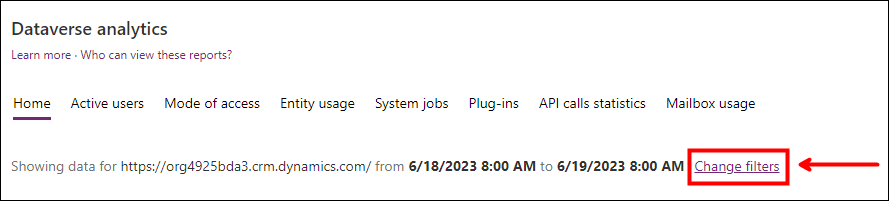

14. Change the **From** date to one week from today’s date and the **To** date to today. Select **Apply**.

   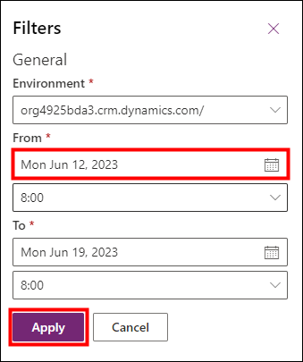

15. The visuals should change to reflect your changes.

   


## Exercise 2: Configure Dataverse logging for a table

In this exercise, you will configure Dataverse logging for a table that requires auditing.

### Task 1: Review audit logging in the environment

1. Navigate to the **Power Apps maker portal** and select the **My Sandbox** environment at the top
    right.
2. Select Solutions and choose the **Fabrikam Project Management** solution to open it.
3. Select **Tables** and select the **Project** table.
4. Select **Columns** under the **Schema** section.


5. Locate and select **Due Date** to open it.
6. Expand the Advanced options section. Check and ensure that **Auditing** is enabled for this column. A
    notice will be underneath the option, informing you that auditing is not enabled for the
    organization. We will fix this in a later step.
7. Select **Cancel** to close the field details pane.
8. Navigate back to the Tables by either selecting the **Tables** on the left side, or by using the
    breadcrumbs at the top.


9. Select the **Project** table, and then select **Properties** from the ribbon up top.
10. Expand the **Advanced options** section.
11. Scroll down to the **For this table** section.
12. Select the **Audit changes to its data** checkbox and select **Save**.


13. Select **All** from the left navigation of the solution.
14. Select **Publish all customizations** and wait for the publishing to be completed. A green banner will
    appear to let you know when it is complete.
15. Navigate to **Power Platform admin center** and select **Environments**.
16. Select the **My Sandbox <Name>** environment and select **Settings** from the ribbon at the top.


17. Expand **Audit and logs** section and select **Audit settings**.
18. Check the **Start auditing** checkbox, set **Retain these logs for** to **Forever** , then select **Save**. Select
    **Cancel** to close.


### Task 2: Test auditing

1. Navigate to the **Power Apps maker portal** and select the **My Sandbox** environment.
2. Select **Apps** and select the **Project Admin** application to launch.
3. If you can see the **Annual Conference** project select it to open it and skip to step 7, if you do not
    see it, continue with the steps below.
4. Create a new project by selecting the green + from the ribbon at the top.
5. For the **Title** , enter **Annual Conference**. Choose the **Due date** as today’s date.


6. Then, select **Save & Close**.
7. From this screen, reopen the **Annual Conference** project.
8. Change the **Due Date** to any date in the future and select **Save**.
9. Change the **Due Date** and save a couple more times.
10. Select **Related** and select **Audit History**.


11. You should see the change history for each of your changes. Select Update to open one of the
    change history records.
12. You should see the **Filed Name** , **Old Value** and **New Value**.
13. Select **Close** to close the update record.

## Exercise 3: Setup the CoE Starter Kit Power BI Dashboard

### Scenario

In this exercise, you will explore some of the apps and analytics that are part of the Power Platform CoE
Starter Kit. We have already installed and configured the starter kit into the tenant you are using for this
lab. As part of configuring, we imported the solution, shared the apps, configured the flows that
synchronize data and published the Power BI report. If you were doing this in your own tenant, you would
follow the instructions to complete these steps.


Now in this exercise, you will explore the following key components:

- Power Platform Admin View app
- Power BI Dashboard
- The business process that is used by the Developer Compliance process.

### Task 1: Explore the Power Platform Admin View app

1. Navigate to **Power Apps maker portal**
2. Select **Power Platform CoE** environment in the environment selector.
3. Select Apps from the left side navigation and you should see a list of available apps in this
    environment – select **Power Platform Admin View.**


4. When the app starts you will land on the Power Platform Dashboard page. This dashboard gives you
    a quick look at the most active makers, and environments.
5. Select **Power Apps** and you will see a list of all apps in all environments without having to visit each
    environment. The Flows navigation link does the same thing for Microsoft Power Automate flows.
6. Select the Device Ordering App in the list to open the app details.


7. In the **Governance** tab you can see the Business Justification provided by the app maker using the
    Developer Compliance Center app. In the bottom part is where you as an admin can provide your
    risk assessment. You can also tag the app to show in the App Catalog and make it featured. You can
    customize the CoE entities to add additional fields here if needed.
8. Select **Environments** in the left navigation. This will show you a list of all the environments in your
    tenant and key metrics like number of apps. To view all your environments, similar to the image
    below, switch the view at the top to **Active Environments**.


9. Select the **User and Team Productivity** environment to open the detail form.
10. Review the data available.
11. Select the **Connectors** link from the left navigation. This shows all the connectors available.
12. In the upper right corner, search for **Microsoft Dataverse**.
13. In the search results, select the **Microsoft Dataverse** connector.


14. The **Used in** tab quickly shows you what apps are using this connector in all environments in your
    tenant.
15. Select **Users,** then **Makers** from the left navigation; this shows you all the people that have built
    apps in your company.
16. Select one of the Makers and explore the detail form.

### Task 2: Power BI Dashboard

1. Navigate in your browser to Power BI and **Sign in** with your lab credentials.
2. When you see the You have an account with us, select Sign In again and then select Start.
3. Select **Start**.
4. When prompted to Invite more people, select **Skip**.
5. On the left side navigation select Workspaces and then Create a workspace. We are going to use this
    workspace to publish our report to from Power BI Desktop. This would allow you to view it from
    PowerBI.com, the mobile app, or even embed it in other places like Microsoft Teams. The workspace
    can also be shared with others so they can see the analytics.


6. When prompted select **Try free**.
7. After the trial has started, you will have to re-navigate to Workspaces and then Create a workspace.
8. On the Create panel, provide a unique name like CoE and your lab admin user number and select
    **Save**.


9. Launch Power BI Desktop on your local computer, if you don’t have it installed you can install it from
    Downloads | Microsoft Power BI
10. Close the popup window.
11. Select Sign-in and provide your lab admin account credentials.
12. Once signed in, select **File** , **open report** , and select **Browse Reports**.
13. Locate the folder containing lab files you downloaded.
14. Change to file type filter to PowerBI template files (.pbit). Select the
    **Production_CoEDashboard.pbit** file.
15. You will be asked to provide your org URL. Let’s go find it.

```
x
```

16. Navigate to Power Platform Admin Center Power Platform Admin Center and select **Environments**.
17. Locate the **Power Platform COE** environment and select the name to show the details page.
18. Right select the **Environment URL** and select **Copy link address**.
19. Back in Power BI Desktop, paste the **OrgURL** and select **Load**.
20. Select **continue**. Follow prompts for credentials if they appear.


21. The report should load automatically once the refresh has completed.
22. Follow the steps below to enable map and filled map visuals:

```
a) Select File at the top right, then select Options and settings > Options.
```
```
b) Select Security from the left.
c) Scroll down to the Map and Filled Map visuals section.
d) Check the Use Map and Filled Map visuals checkbox.
e) Select Okay to close the Options dialog.
```

23. Review the Introduction page.


24. Select the **Overview – Power Apps** tab, notice it gives a good high-level look at our tenant activity.
    If you have multiple locations, it will quickly highlight which users are more engaged with building
    apps. You can also quickly see which environments are most active. Additionally, items that are
    detailed as **(Blank)** indicate that there is no data to reference in the table.
25. Review each page using the navigation at the bottom of the app and review the insights available.
26. Select the **Environments** page.
27. On the Environments page, use the date range picker and see how it affects the other data on the
    page. When you are done leave it set at the max date range.
28. Select the **Apps** tab from the navigation at the bottom of the screen.


29. On the Apps page notice the Creation Trend, this is an effective way to watch adoption progress.
30. Select through the other pages via the tabs at the bottom and review the data available.
31. Select **Publish** from the **Home** tab in the ribbon at the top.
32. Save the report if prompted as **PBI Report (Your Initials),** which will look something like **PBI**
    **Report HR** for example.
33. Select the CoE workspace you created and choose **Select.**
34. Wait for the publishing to complete and select **Open ‘<FileName>.pbix’ in Power BI** or **Got it**.


35. If you selected **Open ‘<File>’** , skip this step. Otherwise, if you selected ‘Got it’, navigate to Power BI.
    Select **Workspaces** and then **CoE Workspace** you created. Otherwise, skip to step 37.
36. Select the **CoE Starter** with the type of **Report** from the list. You’ll notice a few other items have
    generated; these are done by default.
37. Once the report loads, select the Environments page. Use the date slider to ensure the date range
    includes the last month.


#### 38. You have now successfully deployed the Power BI reports that come with the CoE starter kit.


## Exercise 4: Perform a risk assessment of overshared resources

### Scenario

We were going to perform a risk assessment to look for apps that have been over hared in your tenant. To accomplish this, you are going to use the Power BI report that you just published 
to look for apps that are over shared.

### Task 1: Locate Overshared Apps

1. Navigate to the Power BI report you just published.

2. Select the **Apps** page in the report.

3. Select the Show navigation button and select **Apps Risk Assessment**. This will take you to the risk assessment page of the report.

   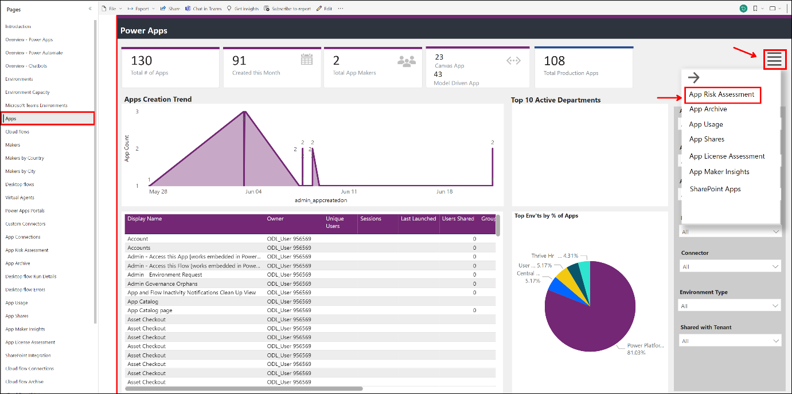

4. The list of apps you'll see now is the ones that qualify for the default criteria. We want to focus on the ones that have been shared with the entire organization and validate that 
   they are appropriate.

   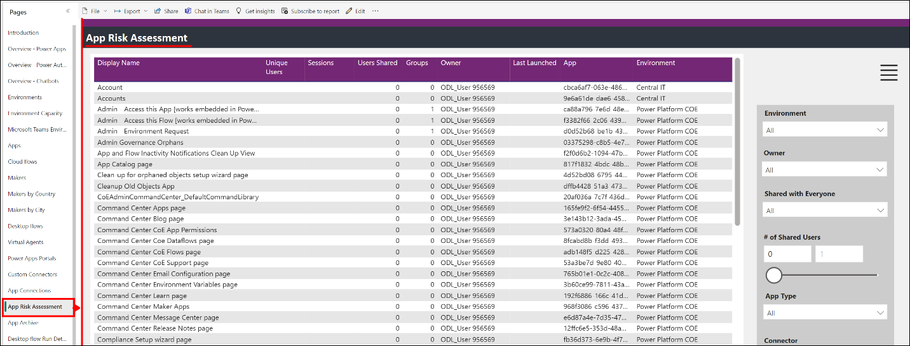

5. In the filter panel, select True in the Shared with Everyone section.

   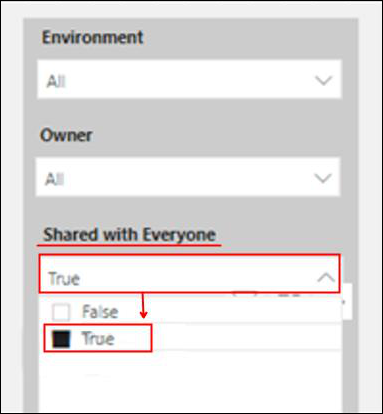

6. The filter will take place immediately and you will see a small list of apps that have been shared with everyone. In many cases, a quick evaluation of the name of the app would 
   indicate whether it was appropriate, but it also allows you to drill down into more details by hovering your mouse pointer over the name of the app. You might also use the owner’s name 
   to contact the person who made the app to get more details to determine if it was appropriate to share with everyone.


## Exercise 5: How much is a connector used in your

## organization

### Scenario

Using the Power BI report, you can easily see what apps and flows are using a connector. In this exercise you will find out who is using the SharePoint connector.

### Task 1: Locate resources that use the SharePoint connector

1. Navigate to the Power BI report you just published.

2. Select the **App Connections** page in the report.

   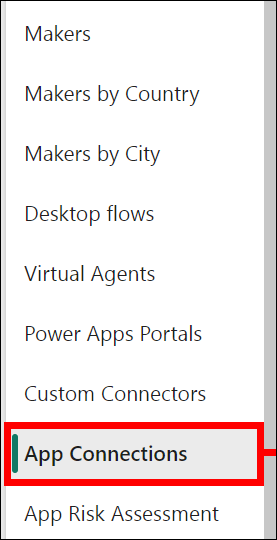

3. In the filter panel, in the **Connector** section search for **Office 365 Groups** and select it.

   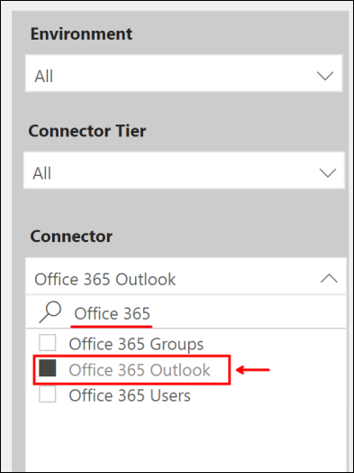

4. The page will now filter on makers, and apps that use Office 365.

5. Using this you could evaluate things like the impact of changing DLP policies or other governance or training that might be needed related to a connector.


## Exercise 6 : Review tenant audit logs (Optional if you have time)

### Scenario

All other auditing of Power Apps and Power Automate flows (other than CDS data modification) are viewed through the Microsoft Purview site.

Prior to use, this must be enabled by a global tenant administrator using these instructions. In the tenant you are using we have already completed that for you as well as granting you 
permission to view the audit log data for the tenant. That was done using the PowerShell command Add-RoleGroupMember “Compliance Management” -Member your user.

In this exercise, you will be using the log search and alert tools to work with the audit data.

### Task 1: Review audit logging in the environment

1. Navigate to https://compliance.microsoft.com/.

2. Locate and select **Audit** on the left side navigation.

   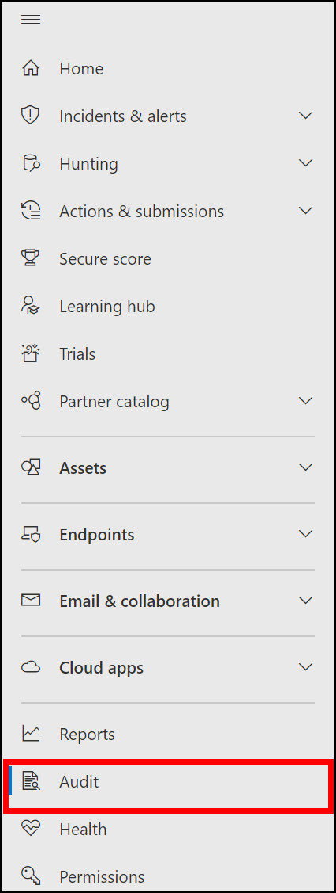

3. Select **Search** using the default search criteria.

   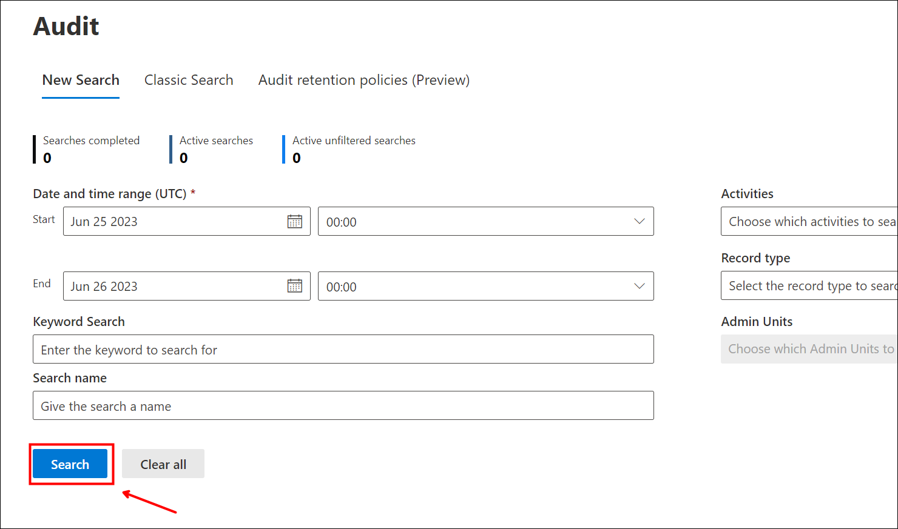

4. Select **Start Search.**

   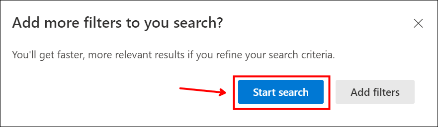

5. The **Job Status** will read as **Queued** once it has been set to process. Refresh the audit every few minutes or so until the status reads as **Completed.**

   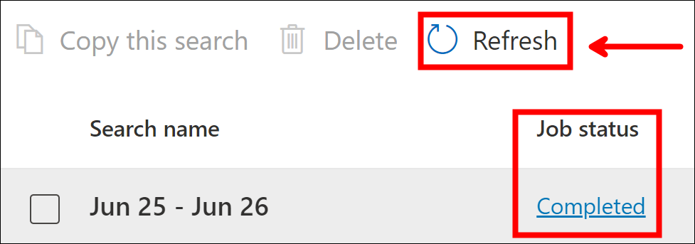

6. Select the Search name, which defaults to the audit date if no name has been inputted.

   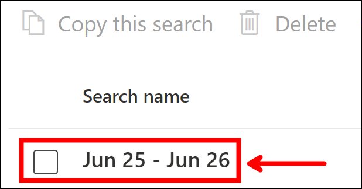

7. Review the items displayed; drill into a few of them to see the type of data available.

   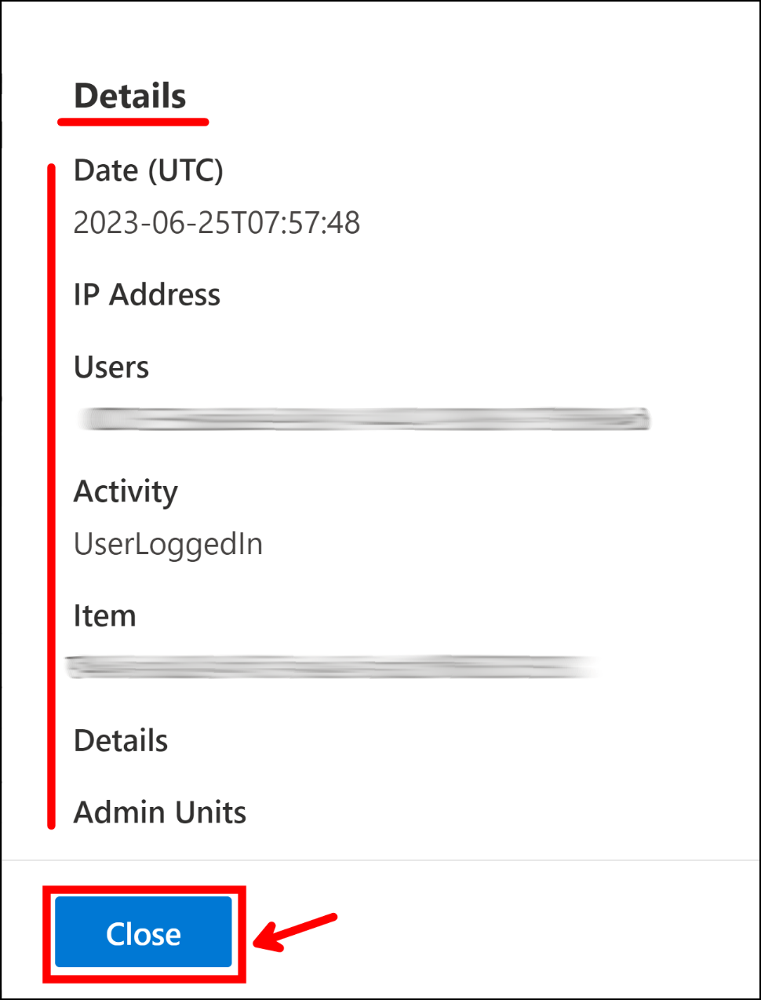

8. Select **Export** if you’d like to download the data for later viewing. Using export, you can open the data in other tools for analysis.

   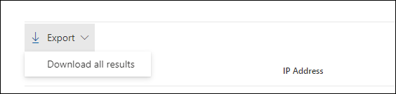

9. The export will begin and may take some time to complete.

    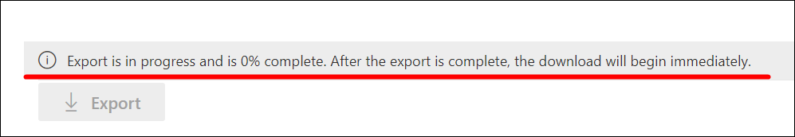

10. Select **Audit search** breadcrumb at the top of the page to navigate back to the search. This will not interrupt the export.

    

11. Select the **Activities** dropdown and select all Power Apps and Power Automate activities.

    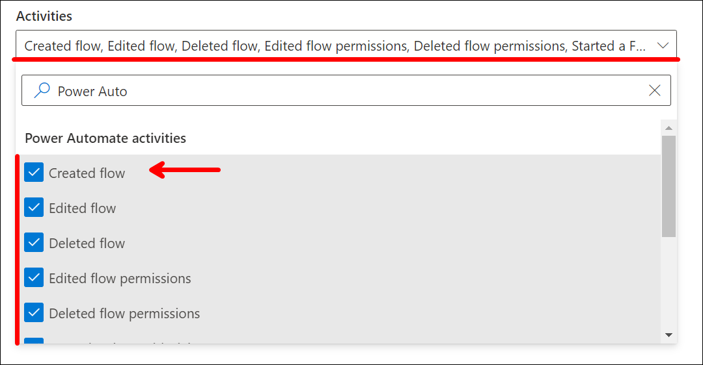

12. Select **Search** again and review the results once the status is Completed.

13. Look for an activity of Edited Flow, select the item to open the detail. Review what data is provided.

14. A common task is to look at all of the activity for a particular user. Copy the user from this Edited flow activity and go back to the Audit search.

15. Paste the user you copied into the Users filter and select search again. Now you are looking at all the activity for a single user.

16. Try selecting an item to view detail. Copy the Item field and then go back to the list and select the filter results. Paste the item info you just copied into the filed. The results 
    list will now only show activities related to that item. For example, you could use this to show all activities for a specific flow.


**Note:** Any information from before auditing was enabled, cannot be retrieved. This can be seen by selecting a date range from before the auditing was enabled.


## Exercise 7 : Get notification of new apps, flows and connectors (Optional if you have time)

### Scenario

In this exercise, you will be using one of the pre-built Power Automate templates that runs on a schedule and looks for newly created canvas apps, flows and connectors and sends you an 
email.

### Task 1: Create the flow from the template

1. Navigate to **https://make.powerautomate.com/** and sign in.

2. Make sure **Power Platform COE** environment is selected. Note: This environment is where the CoE starter kit is installed and is intended to be our dedicated admin environment. Even 
   if you don’t use the starter kit, having a dedicated admin environment can be helpful.

   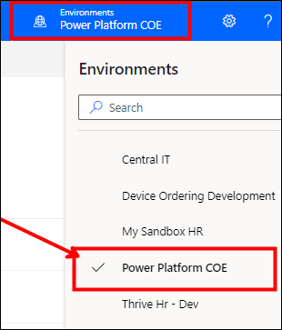

3. Copy and paste the following URL into your browser, and press enter to navigate to it. **https://make.powerautomate.com/galleries/public/templates/0b2ffb0174724ad6b4681728c0f53062/get- 
   list-of-new-powerapps-flows-and-connectors**

4. Select **Sign in** as needed for each of the connectors. Use the lab admin account you’re signed in with.

   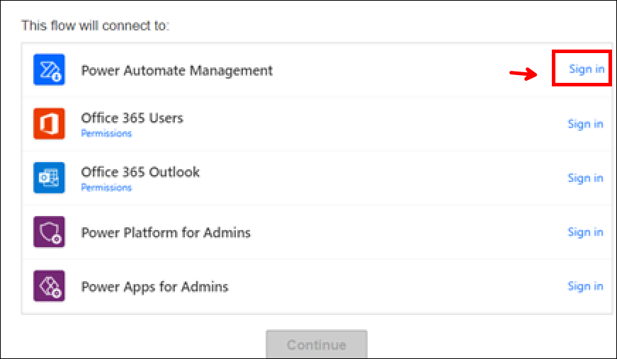

5. Select **Continue** once all of the items display a checkmark.

    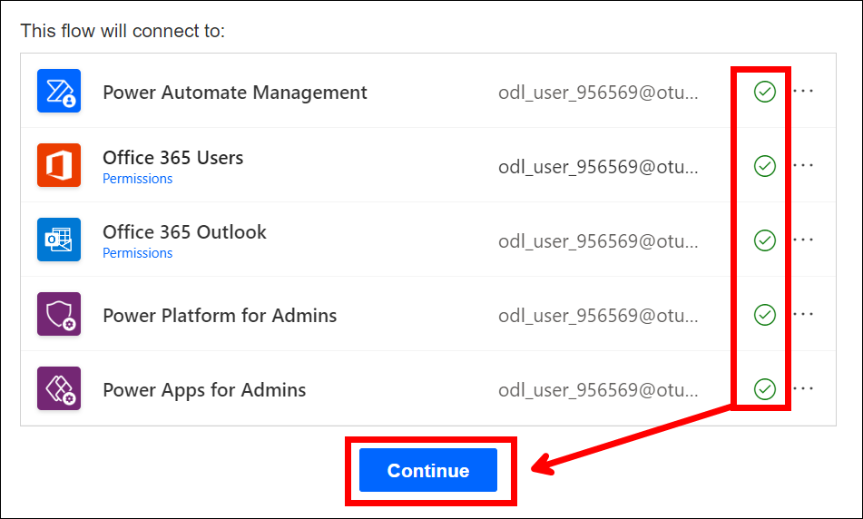

6. Examine the flow steps and then select **Flow Checker**. You may need to adjust the zoom of your browser to see all of the steps (We can’t display the entirety of it here, as any 
   details would be lost).

   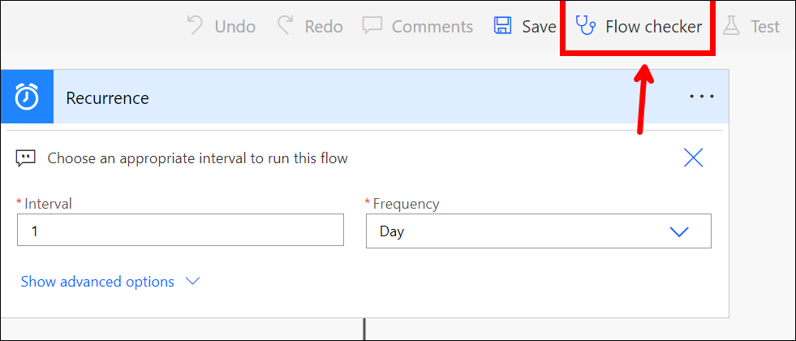

7. There should be no errors or warnings.

    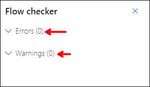

8. Select **Save** , located right next to the flow checker.

   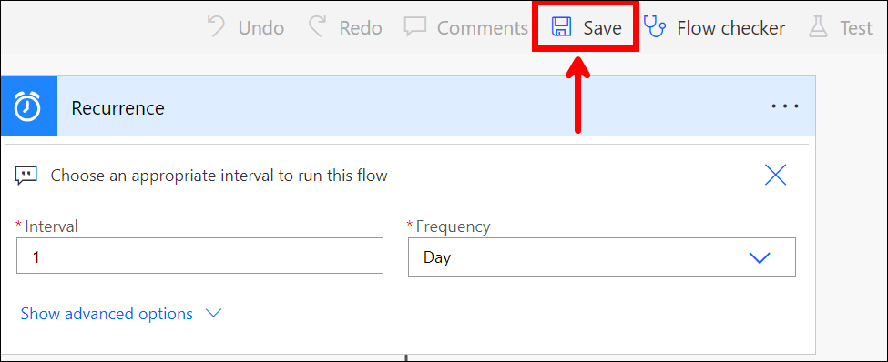

9. Select the back arrow to move to the flow details and run history.

   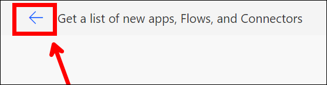

10. The flow should have one run in progress. If you do not see it, select the refresh button at the top right of the run history. This will refresh the information available and bring up 
    the current run. If it does not, please inform your instructor.

    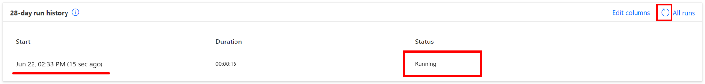

11. Wait for the flow run to complete and then select the run’s start to open it. You can refresh to see the updated status of the flow.

**Note:** This can take up to 45 minutes to complete, as it is iterating the flow over a large amount of data.

   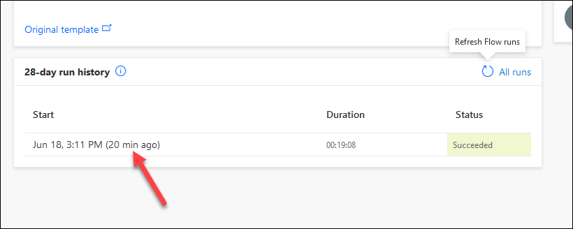

12. Examine the flow run. Expanding individual items will give you more information on what each step performs as the flow runt. Selecting next will allow you to look at the difference in 
    environments as they are processed through the flow.

    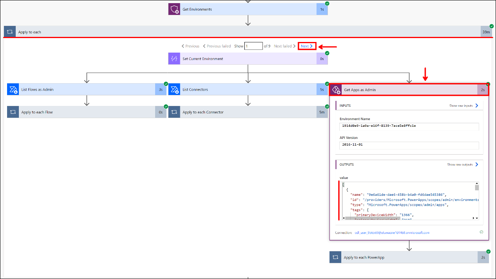

13. Select **App launcher** and select **Outlook**.

    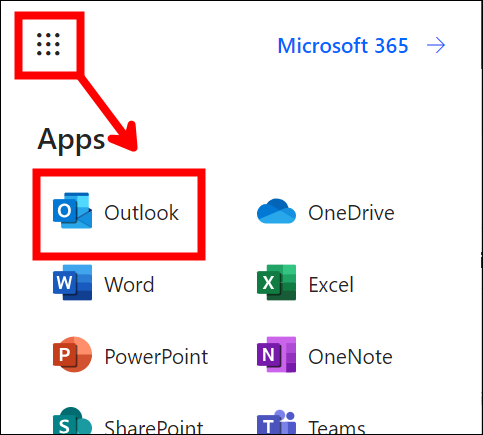

14. Navigate to https://outlook.office.com/

15. You should get an email from the flow. Open the email.

    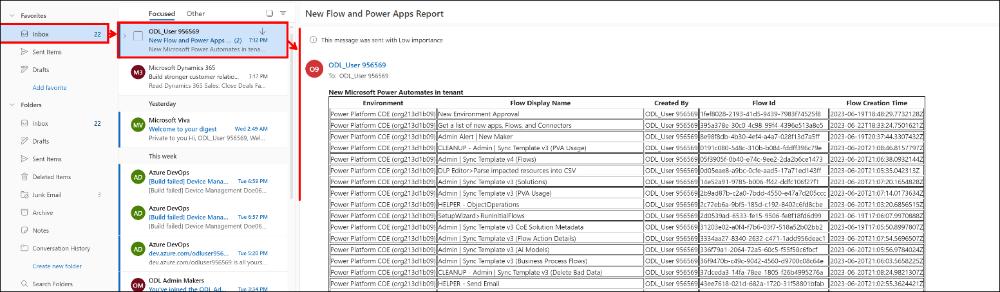

16. The report should list flows, Power Apps, connectors in tables.

    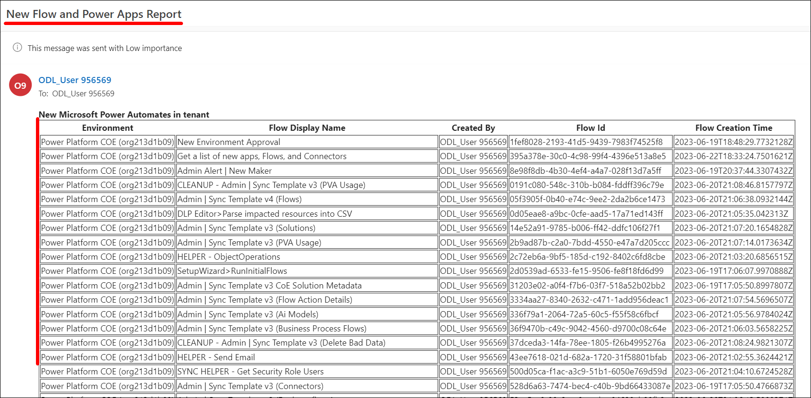

    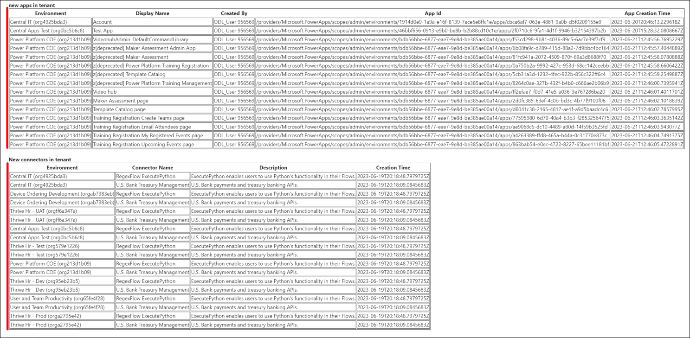


In addition to simply seeing who is building what in your tenant you can also use the list of new connectors to evaluate if you need to adjust your DLP policies.
