## Admin in a day

# M03-HOL-Action through Automation

## Table of Contents

1. Exercise 1 - Create Environment Request Form

   **Scenario**
   
   - Task 1: Create Microsoft Form

2. Exercise 2 – Create Environment on Form Submit

   **Scenario**
   
   - Task 1: Delete your sandbox environment

   - Task 2: Create New Environment Approval Flow
  
   - Task 3: Create a Database and Notify the User
  
   - Task 4: Test the Flow

3. Exercise 3 – Application Compliance Process

   **Scenario**
   
   - Task 1: Complete Developer Compliance
   
   - Task 2: Admin Review

4. Exercise 4 – Welcome New Makers (Optional if you have time)

   **Scenario**
   
   - Task 1: Create Office 365 Group
   
   - Task 2: Import Flow
  
   - Task 3: Edit and Test Flow

#### Hands-on lab

## Lab Scenario

In this hands-on lab, you are an administrator, helping to adapt the Power Platform.

Contoso has decided to control the creation of Power Platform environments by disabling creation unless you are a global or service admin. Contoso doesn’t want to discourage use of the Power 
Platform so they would like you to put an automated process in place to allow users to request an environment and a Microsoft Dataverse database.

In this lab, you will be building a Microsoft Form to allow users to submit their environment requests. Using the Power Platform administrative connectors and the built-in approval 
capabilities of Power Automate you will automate the processing of the requests.

The following is an outline of the process you will be implementing:

- A user submits a request via the form including justification for the environment.
- Form submission triggers flow to run.
- Flow uses the approval connector to ask the admin team for approval.
- If approved, the environment and Dataverse database are created.
- User is notified of the outcome; approved or rejected.

This process could easily be expanded to request approval from the user’s manager as well and the request information along with the environment information could be stored for resource 
usage chargeback.

Contoso has also decided to use the app auditing process from the CoE Starter Kit. You will be seeing how this works by going through the process as both a maker and an admin.

Additionally, you will be installing a pre-created flow that checks for new people building apps adds them to an Office 365 group and sends them a welcome email.

## Lab Test Environment

This hands-on lab is designed to be completed in an environment setup for multiple students to complete the Admin in a day series of hands-on labs.

You will be assigned one or more users to use to complete the hands-on tasks. Because this is a shared environment, some tasks that require a tenant Global Administrator or a Service 
Administrator will already be performed.

This lab does not require you to have completed any of the prior labs.

## Exercise 1: Create Environment Request Form

### Scenario

In this exercise, you will be creating an environment request form using Microsoft Forms. This form could
collect additional information allowing it to be tailored to your individual organization's requirements.

### Task 1: Create Microsoft Form

1. While logged in as the lab admin user navigate to **Microsoft Forms** with https://forms.office.com/ and close the welcome screen.

   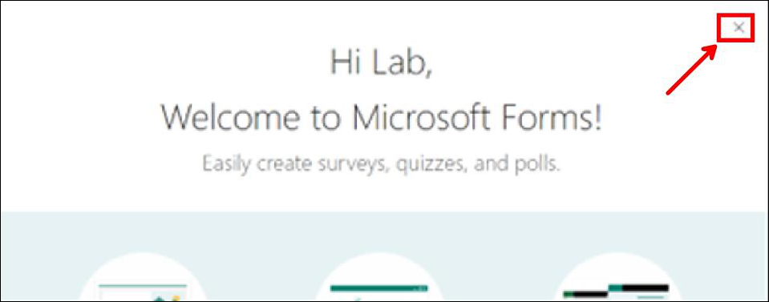

2. Select **+ New Form**.

   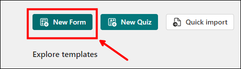

3. Select the **Untitled Form** Header.

   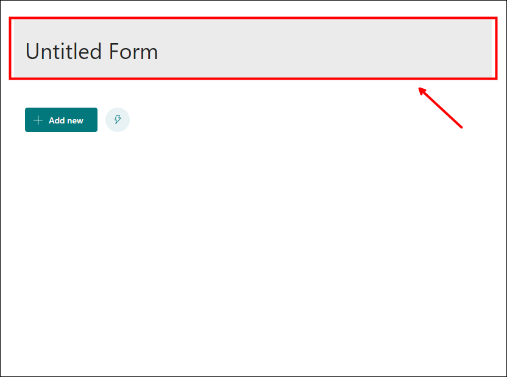

4. Enter **New Environment Approval Request** for title, enter **New environment request** for description, and select **+ Add new**.

   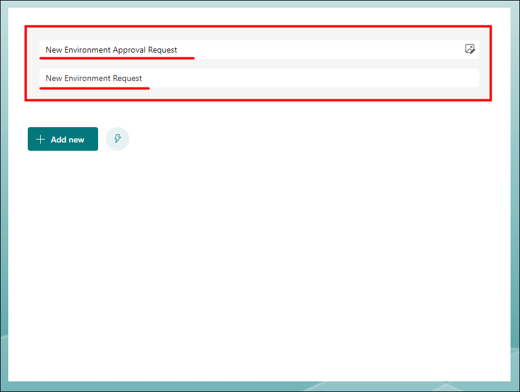

5. Create the Form below, if you need steps, continue the steps here. If you do not need each step, continue to the next exercise.

   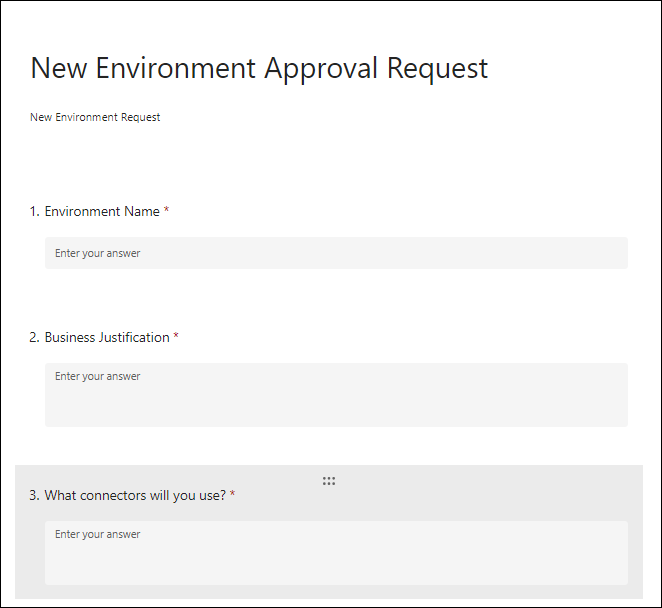

6. Select **Text**.

   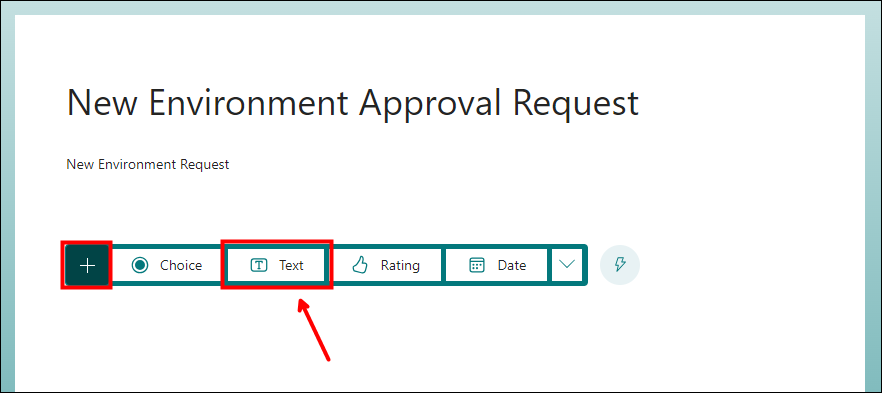

7. Enter **Environment Name**, make the question **Required**, and select **+ Add New**.

   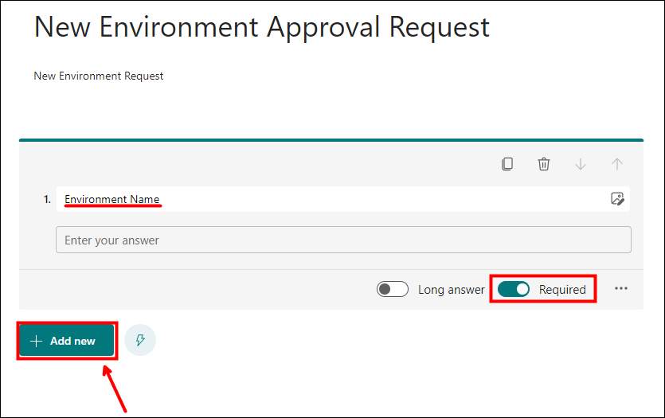

8. Select **Text** again.

9. Enter **Business Justification**, select **Long Answer**, and make it **Required**.

   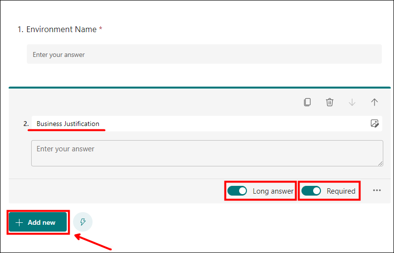

10. Select **+ Add New** and select **Text**.

11. Enter **What connectors will you use?** select **Long Answer** and make it **Required**.

    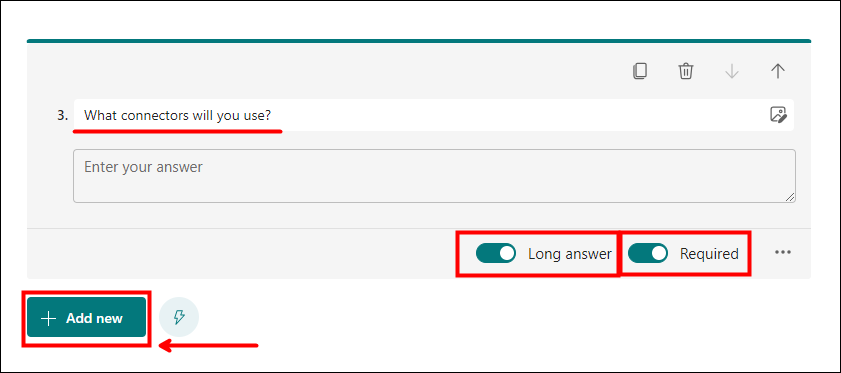

12. The form will be saved automatically.

13. Select **Preview**.

    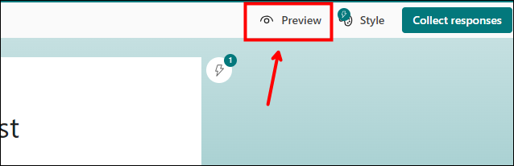

## Exercise 2: Create Environment on Form Submit

### Scenario

In this exercise, you will be building the automated flow to process new form submissions.

**Note**: For this exercise, we have hard-coded the language, currency and environment template. The Power Platform Administration connector has actions allowing you to 
dynamically retrieve these and make the process more flexible. You could allow the user to specify the values, or infer them from the user’s Office 365 profile information using 
the Office 365 connector.

### Task 1: Delete your sandbox environment

1. While logged in as the lab admin user navigate to the Power Platform admin center.

2. Locate and select the sandbox environment that you created in module one named **My Sandbox-<inject key="Deployment ID" enableCopy="false" />** in the list of environments.

3. Select the **Delete** button and confirm the deletion by typing the environment name. We have to delete it to create another Trial environment, which we can only have one at 
   a time.

   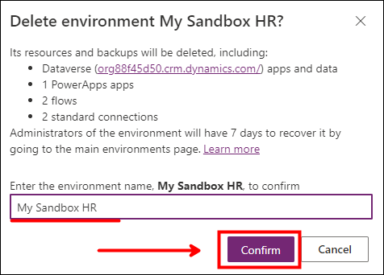

### Task 2: Create New Environment Approval Flow

1. Log in with your **Lab Admin** user, navigate to **Power Automate**, and login with your admin user.

2. Confirm that your environment is set to **Power Platform CoE**.

   Note: This environment is where our CoE starter kit is installed and is intended to be our dedicated admin environment. Even if you don’t use the starter kit, having a dedicated 
   admin environment can be helpful.

   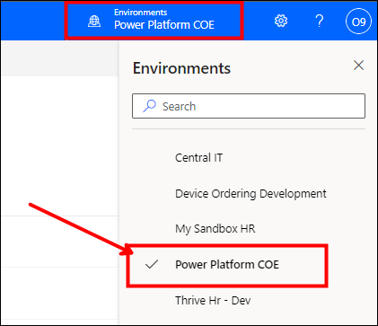

3. Select **My flows**, select **+ New flow** and select **Automated cloud flow**.

   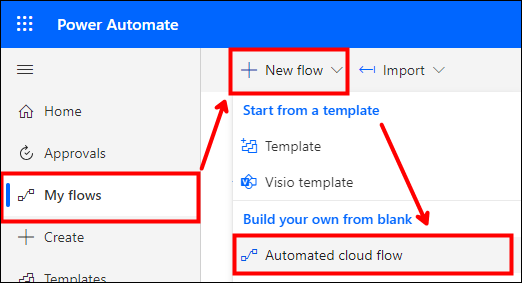

5. Type **New Environment Approval** in the Flow name field. In the **Choose your flow’s trigger** section, search for Microsoft Forms, select **When a new response is submitted**, and select **Create**.

   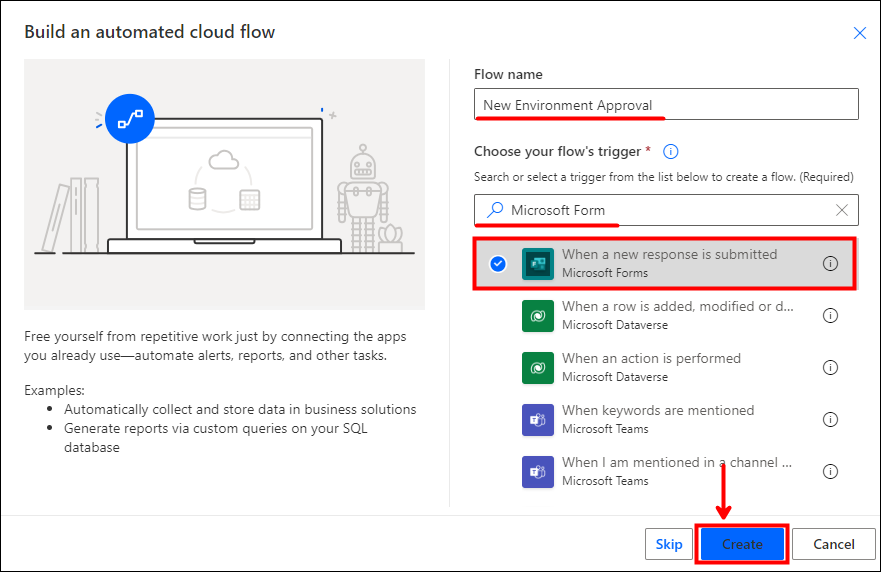

7. For the **Form Id**, select the **New Environment Approval Request** form you created and select **+ New Step**.

   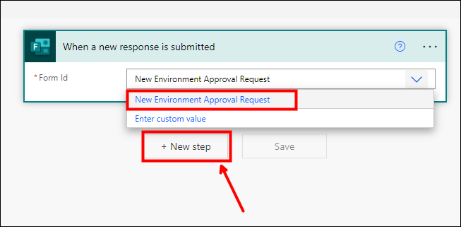

8. Search for **Microsoft Forms** and select **Get response details**.

   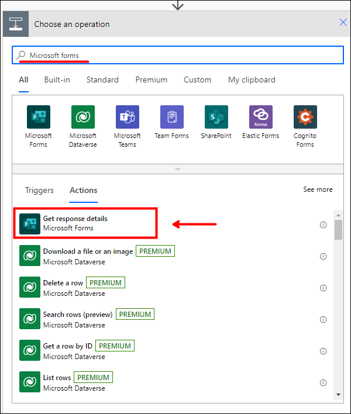

9. Select **New Environment Approval Request** for Form Id and select the **Response Id** from the Dynamic content pane.

    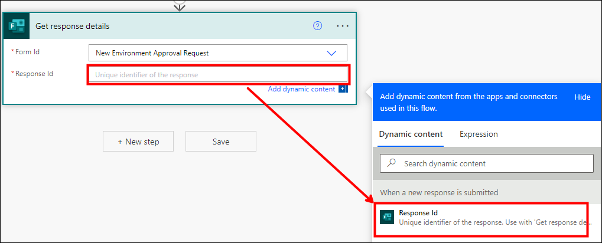

11. Select **+ New step**.

12. Search for **Approvals** and select **Start and Wait for an Approval**.

    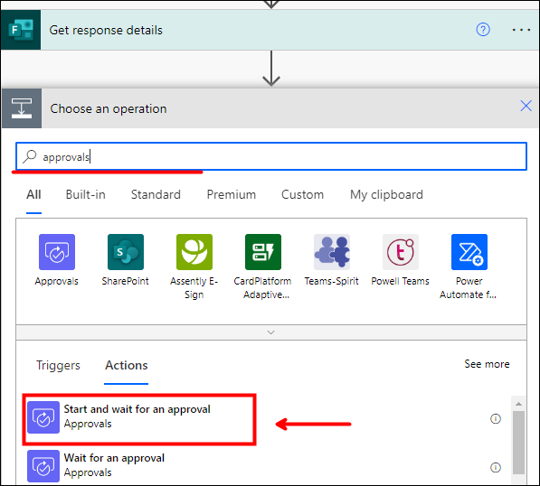

13. Select **Approve/Reject - First to Respond** for Approval type.

    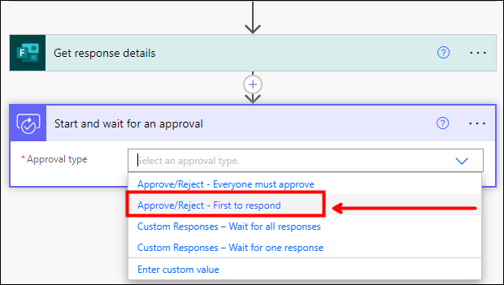

14. Enter **Environment Approval Requested** for Title.

15. Select the user you are logged in as for **Assigned to** by typing the name into the field and selecting the correct dropdown item.

16. Type **New Environment was requested by:** in the **Details** field.

17. Select **Responders Email** from the Dynamic content pane.

    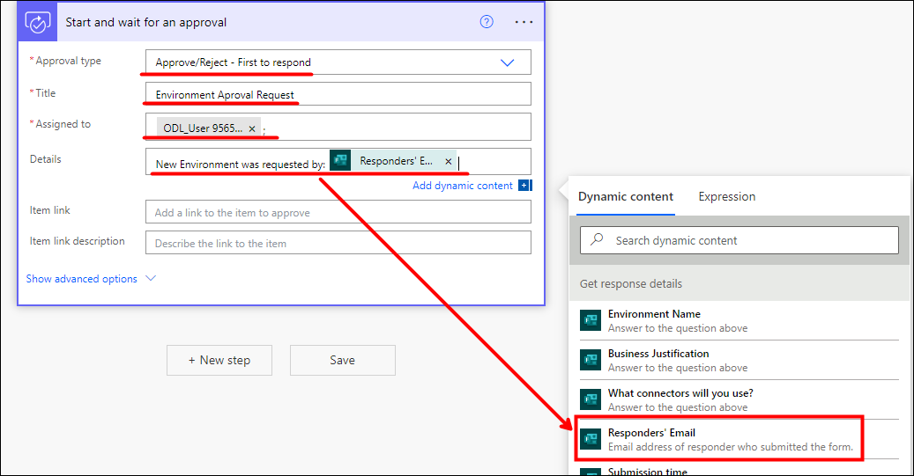

18. Hit the enter key and type **Environment Name:** and select **Environment Name** from the Dynamic content pane.

    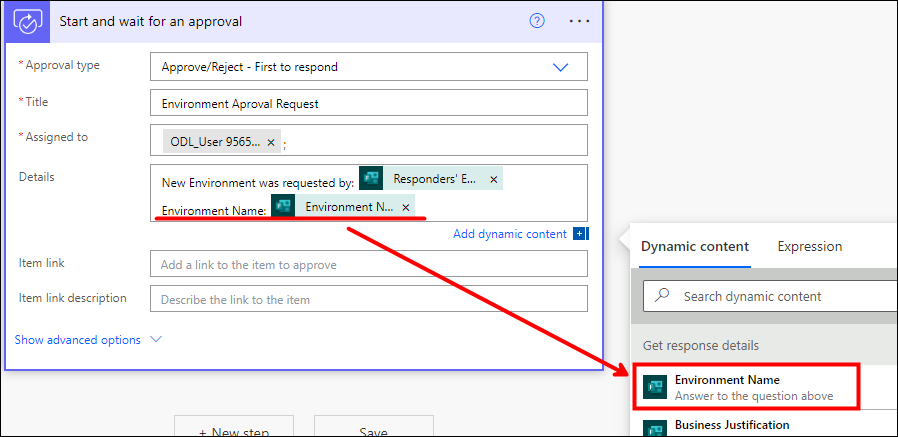

19. Hit the enter key again and type **Business Justification:** and select **Business Justification** from the Dynamic content pane.

    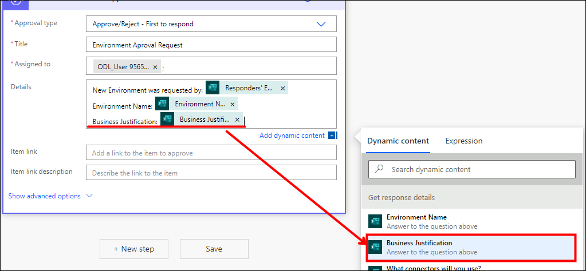

20. Hit the enter key again type **Connectors:** and select **What connectors will you use?** from the Dynamic content pane.

    

21. Select **+ New Step**.

22. Select **Condition** Control.

    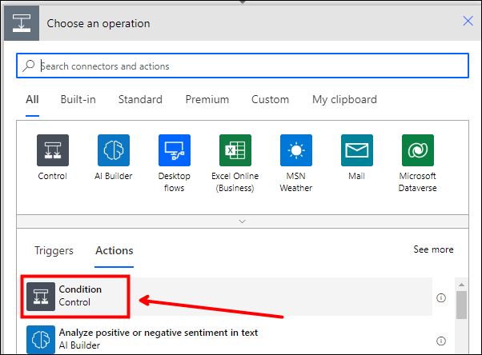

23. Select the Choose a value field and select **Outcome**.

24. Enter **is equals** to for condition, enter **Approve** for value, and select **Add an action** in the **Yes**  branch.

    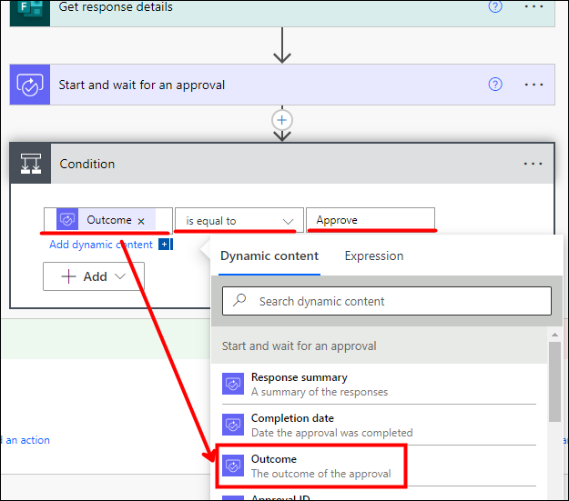

25. Search for **Power Platform** and select **Power Platform for admins**.

    

26. Select **Create Environment**.

    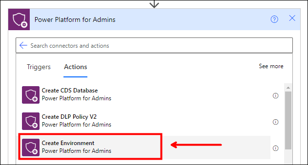

27. Select **United States** for the **location** and select on the **Display Name** field.

    >**Note:** Location determines the region for the environment, in a real process you might allow this to
be auto-determined by the user location or something the requester provides.

28. Select **Environment Name** from the Dynamic content pane.

    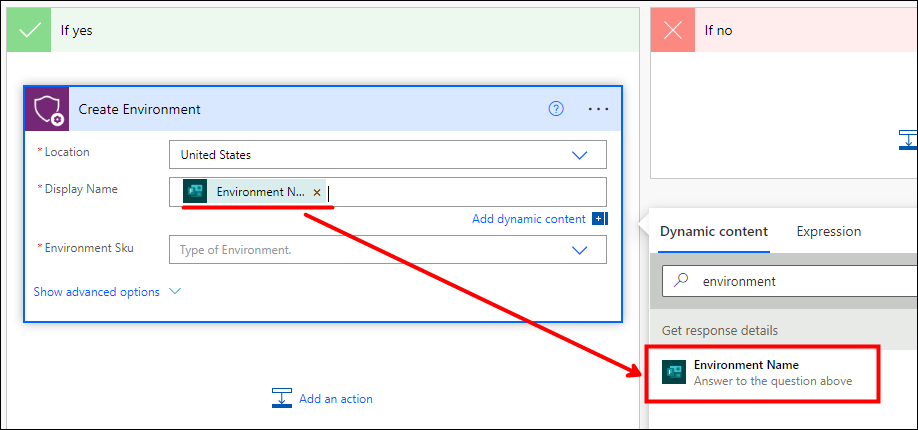

29. Select **Trial** for **Environment Sku**.

    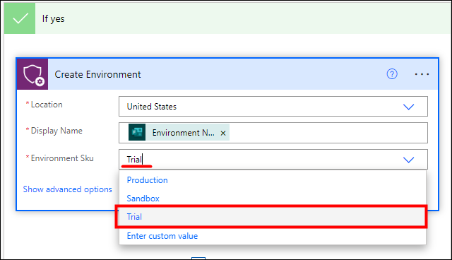

30. Select **Save**. Do not navigate away from this page.

### Task 3: Create a Database and Notify the User

1. Select **Add an action** under Create Environment.

   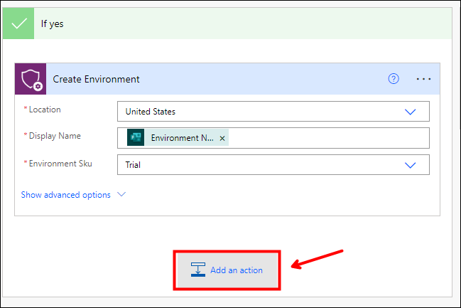

2. Search for **Power Platform for Admin** and select the Power Platform for Admins icon to filter the view.

3. Select **Create CDS Database**.

   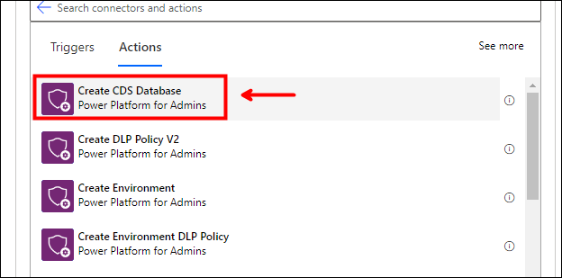

4. Select on the **Environment** dropdown and select **Enter Custom Value**.

   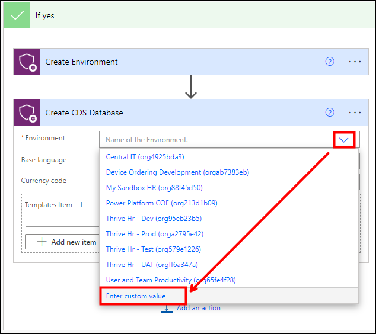

5. Select **Name** from the Dynamic content pane.

   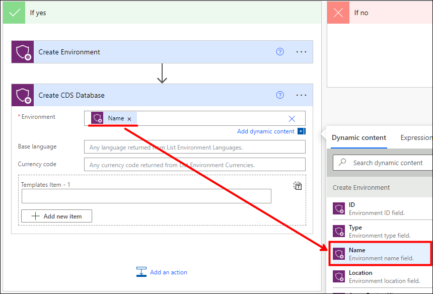

6. Enter **1033** for Base Language and enter **USD** for Currency Code.

7. Enter **D365_CDSSampleApp** for Template Item.

8. Select **Add an action**.

   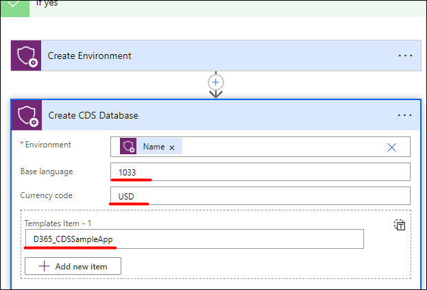

9. Search for **Send Email** and select **Send an email (V2) Office 365 Outlook**.

   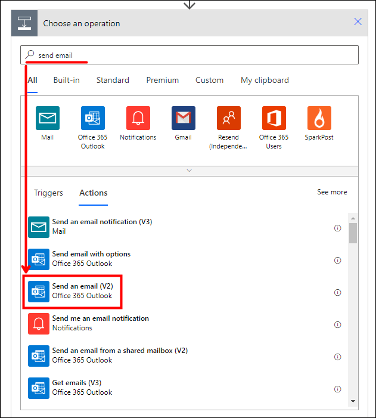

10. Select on the **To:** field and select **Responders Email** for the Dynamic Content pane.

11. Enter **Your environment was created** for **Subject**.

12. Enter **Environment** in the **Body** field and select **Display Name** from the Dynamic Content pane under the **Create Environment** step and add **was created** in the last.

14. Your email should look like the image below.

    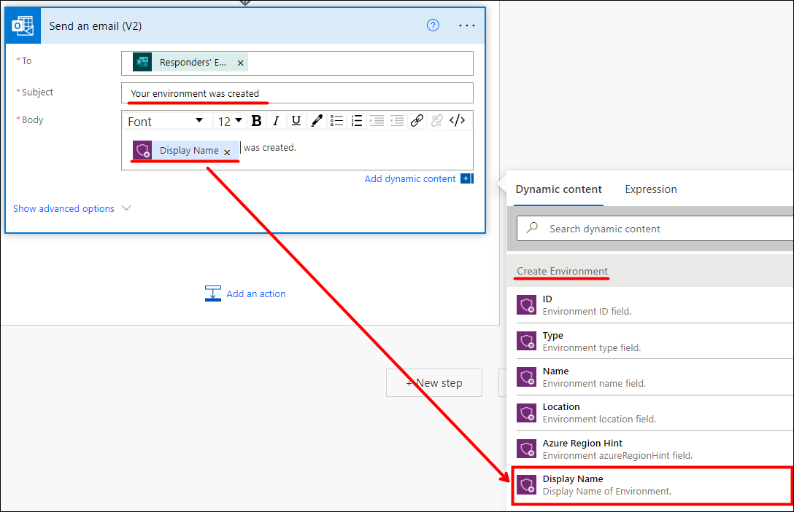

15. Go to the **No** branch and select **Add an Action**.

16. Search for Send email and select **Send an email (V2) Office 365 Outlook**.

17. Select on the **To:** field and select **Responder’s Email** from the Dynamic Content pane.

18. Type **Rejected environment request** for **Subject**.

19. Enter **Your request for new environment was rejected** in the **Body**.

20. Your email should now look like the image below.

    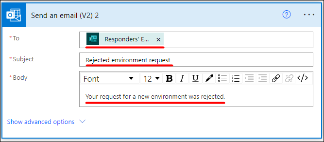

21. Select **Save**.

    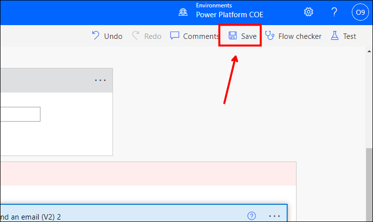

22. Select **Flow checker** and make sure there are no errors.

    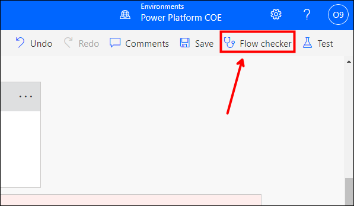

    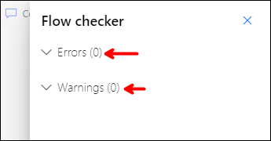

24. Close the **Flow checker** pane with the X to the right of the pane header.

25. Select the **Back** button.

    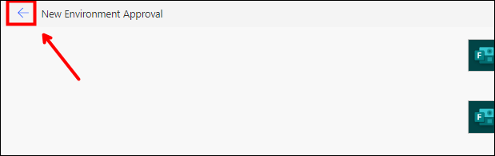

### Task 4: Test the Flow

1. Navigate to Microsoft Forms and open the form you created.

   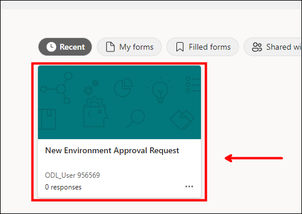

2. Select **Collect responses** and **Copy** the link.

   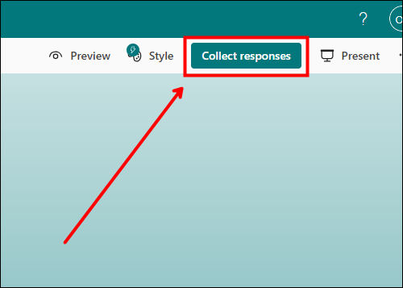

   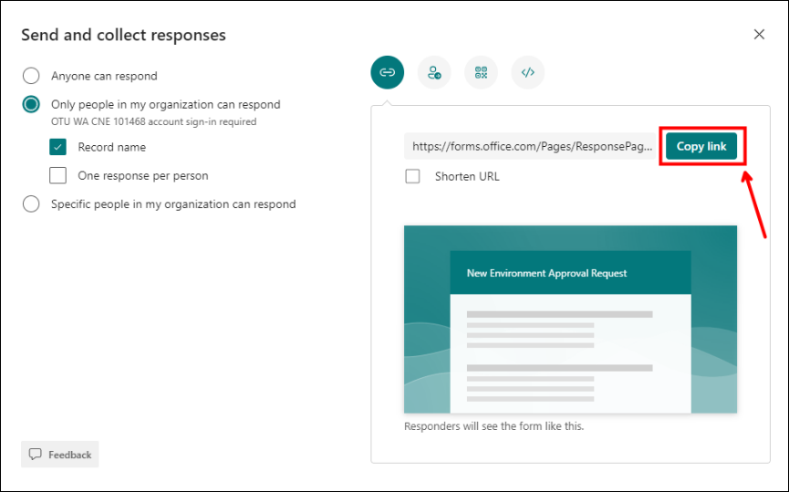

3. Paste the link in the browser and navigate to it.

4. The form should load. Provide an Environment Name of **Central Apps Test**, Business Justification, and the connector Microsoft Dataverse. Note: For this course, we 
   will be using this environment we created here later in another lab to deploy the Device Ordering solution using Azure Dev Ops, for that lab it will serve as the Test environment which 
   is why we are suggesting naming it Central Apps Test. In real word use, most likely it would be a team/project development environment that would be requested using a form like this.

5. Select **Submit**. Once you confirm the submission, you can close the tab.

   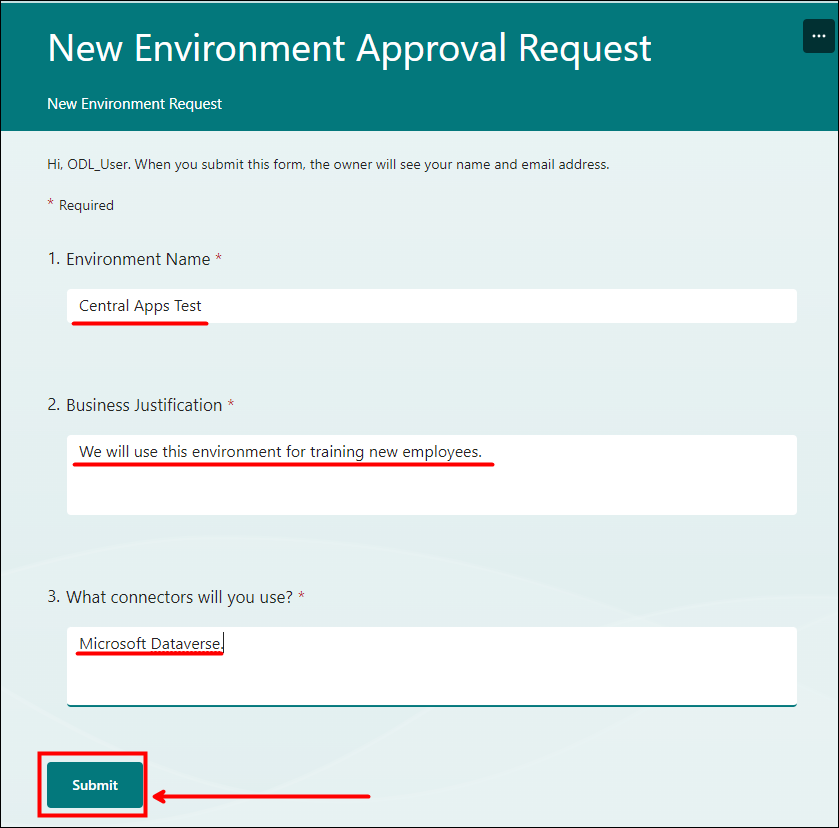

6. Go back to the **My flows** list and open the flow you created.

   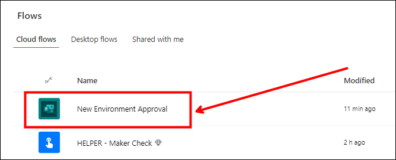

7. You should see the flow running. Select the start date to open it.

   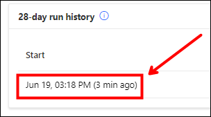

8. The flow is waiting for approval.

   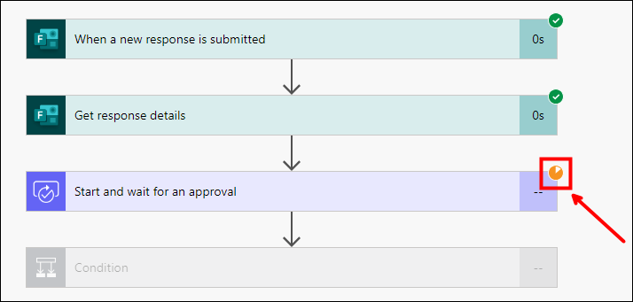

9. Start a new browser tab and navigate to Outlook.

10. You should have an approval request email, select to open it.

    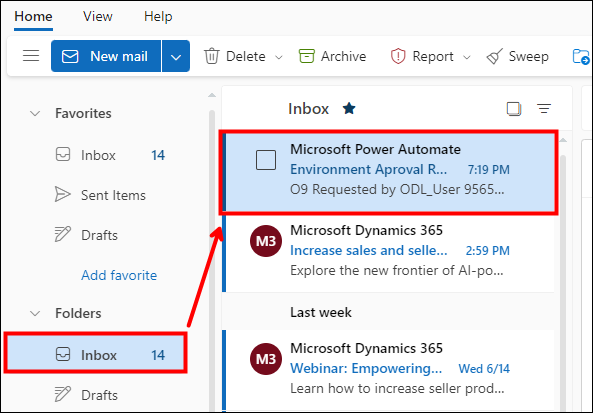

11. Select **Approve**.

    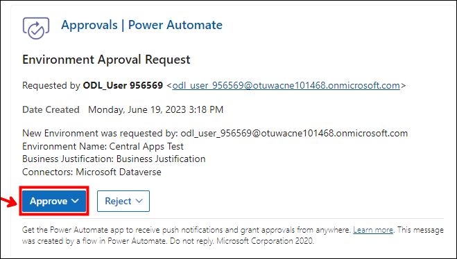

12. Select **Submit**.

13. Go back to the flow browser tab.

14. The flow should succeed.

    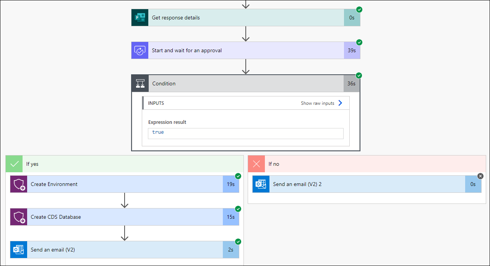

15. Navigate to the Power Platform admin center and select **Environments**. The new environment should be listed there.

    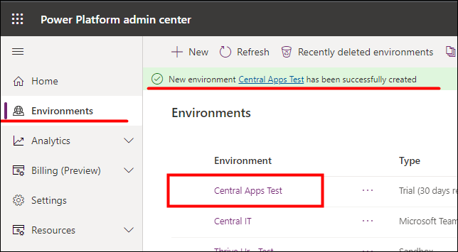

16. You should also get an email.
 
    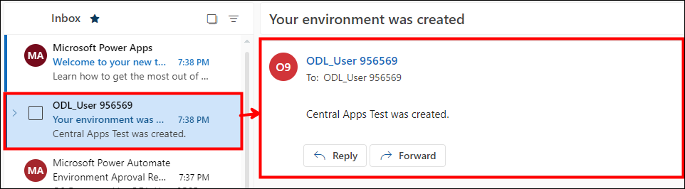

17. You may test for request rejection if you like.

## CoE Environment Management Sample Implementation

#### The CoE starter kit includes a sample implementation of an environment management process you can tailor to your own needs. The following diagram illustrates the high-level process.

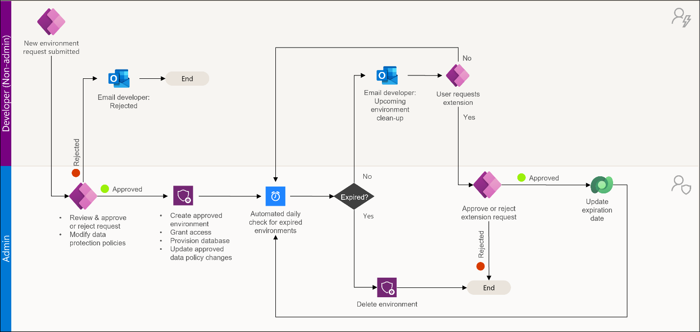

##### You can learn more about the details in How to use the Environment Management components - Power Platform | Microsoft Docs

##### Using the starter kit process can save you time, but as you saw in Exercises 1 and 2 the platform also supports you in building your custom processes.

## Exercise 3: Application Compliance Process

In this exercise, you will be walking through the application compliance process that has been put in place using the CoE Starter Kit. As part of this, you will be playing both the role of 
the application developer and the administrator see both sides of the process.

The goal of this process is to help IT that doesn't know what all these apps are intended for or how to support individual apps when the helpdesk is called, and it's unclear whether all 
the apps are being maintained to any standard. They can see details like the description and number of shared users from the Power Apps for Admins connector, but they need to communicate 
directly with the app owner to fully understand the situation around the apps. Especially in a large organization, it's not feasible for the IT team to be responsible for manually 
reaching out to each app owner individually, and those details can't be stored in email conversations.

To automate this, a flow **Admin | Compliance Detail Request** is used to iterate through all the apps in the tenant and check whether the apps are compliant. If the owner hasn't 
submitted a business justification and the app was shared broadly (in this example, with more than 20 users or at least one group), the flow sends the owner an email to notify them that 
their specific app isn't in compliance with the policy. The email contains a link to the Developer Compliance Center canvas app, where the owner can provide the business justification details 
in a form submission. The Developer Compliance Center app also contains details about the compliance thresholds and has links to the app settings, so the owner can configure the 
description and republish if needed.

This app auditing sample process showcases how your CoE department or IT administrators can automate an auditing process on an app-level basis to gather additional information about an 
app, like business justification and the impact of an outage, from the maker.

### Task 1: Complete Developer Compliance

In this task, you will be performing the role of the developer and completing the application information that will be requested by the automated process.

1. When the full process runs the maker will receive an email like the following, with a link to the Developer Compliance Center. For our exercise, we will briefly review and then we will 
   launch the app from the maker portal.

   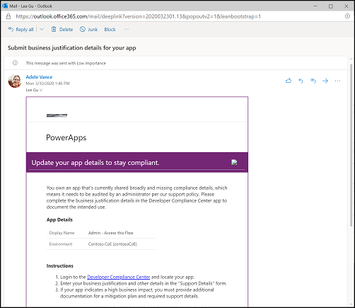

2. Navigate to Power Apps and select the **OTU WA AIW (default)** environment.

   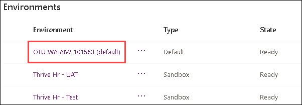

3. Select **Apps** from the left-side navigation.

    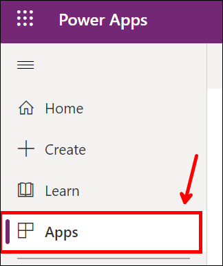

3. Select **Apps (1)**, then **+ New app (2)** > **Start with page design (3)**.

   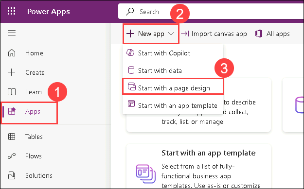

1. Click on **+** on blank canvas app. Make sure **Tablet** is selected.

    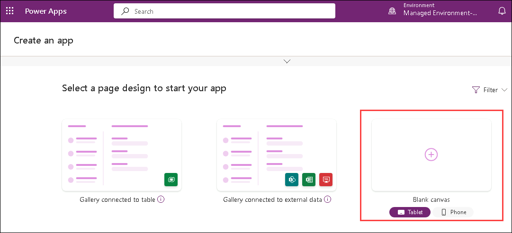

   b. Click on **Save** on the top right corner and enter name as **Test App (Initials)**.

5. Select **Edit** from the menu that appears, or from the ribbon at the top.

   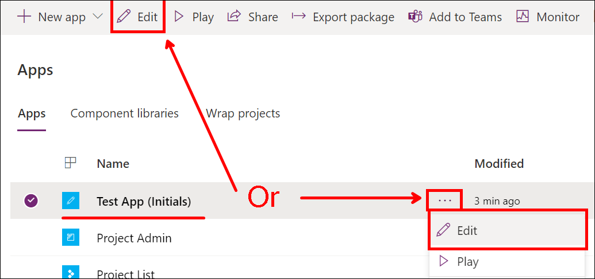

6. Select **Settings** from the ribbon at the top.

    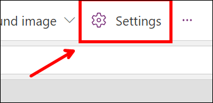

7. Under **General**, locate **Description**, and enter a simple description for a potential app. Then, close the settings with the X at the top right.

    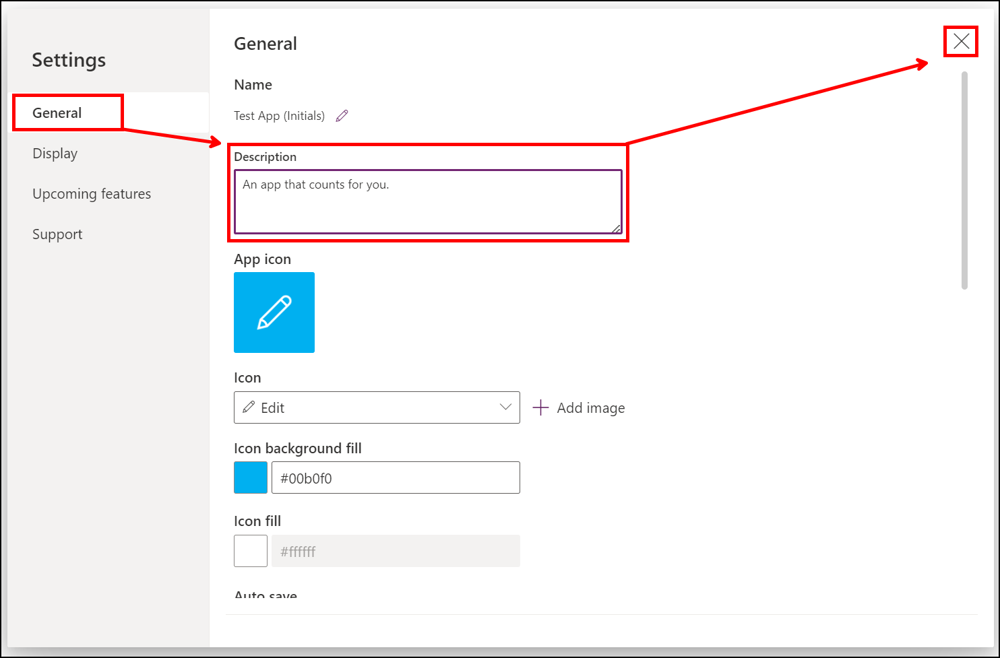

8. Select **Save** at the top right, then select **Publish**.

    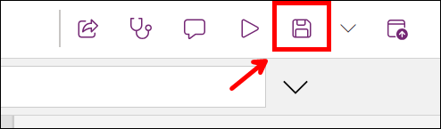

    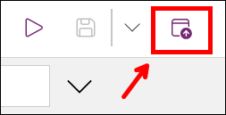

10. From here, we can review the changes we made to the description as well as the app name and icon associated with it. Select **Publish this version**.

    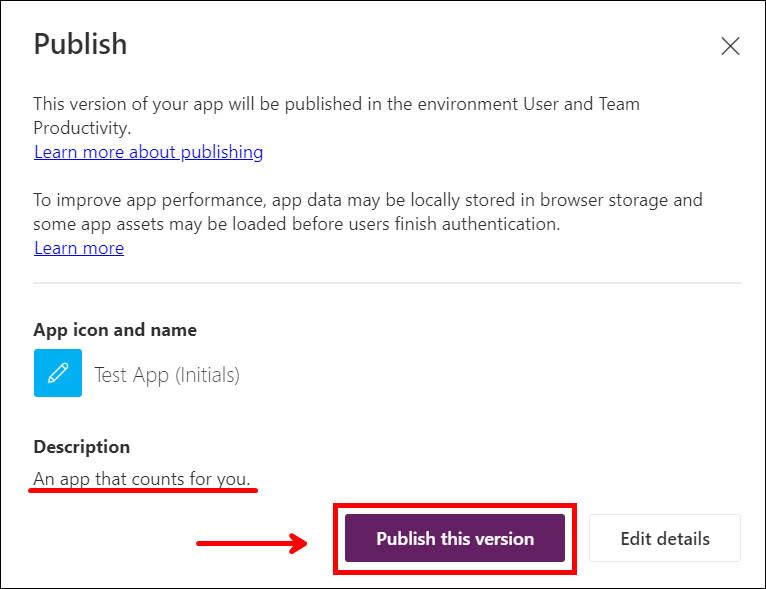

11. Wait for the publishing to complete, then select the **Back** button.

     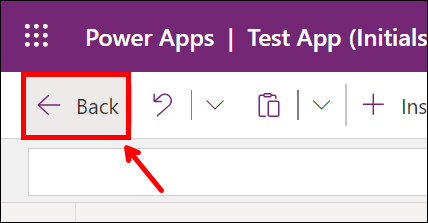

12. Switch to the **Power Platform COE** environment.

     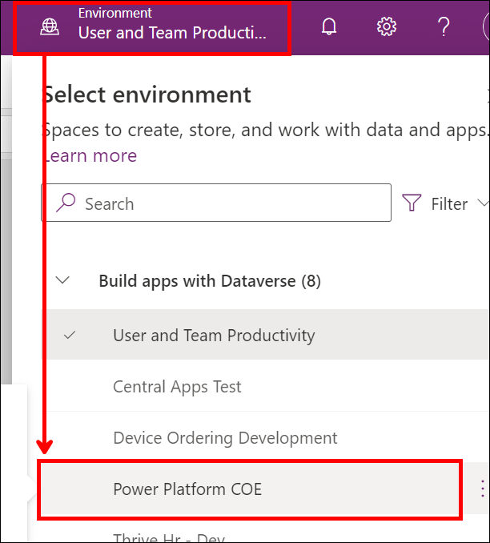

13. Select **Solutions** from the left-side navigation, then the **Center of Excellence – Core Components** solution.

     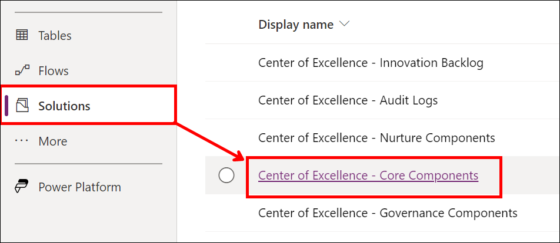

14. Select **Objects > Apps** from the menu on the left,

     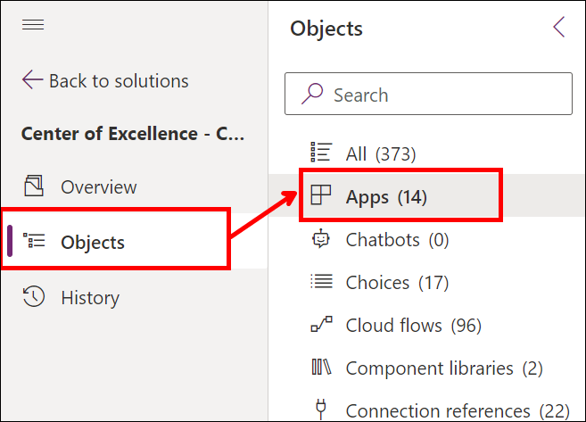

15. Select the **∙∙∙** next to the **Power Platform Admin View** model-driven app and select **Play**.

     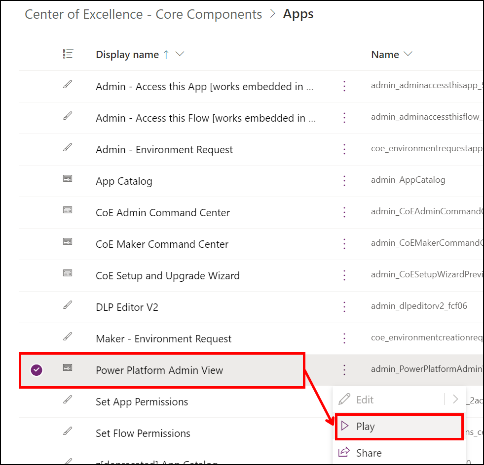

16. Select **PowerApps Apps** and search in the box at the top right for the **Lab Admin X** app, where X is your lab user number or the test app we created. Select the appropriate result.

     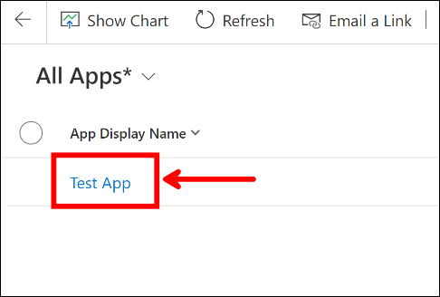

17. Select the **Governance** tab and set the **Admin Risk Assessment State** to **Requested**.

     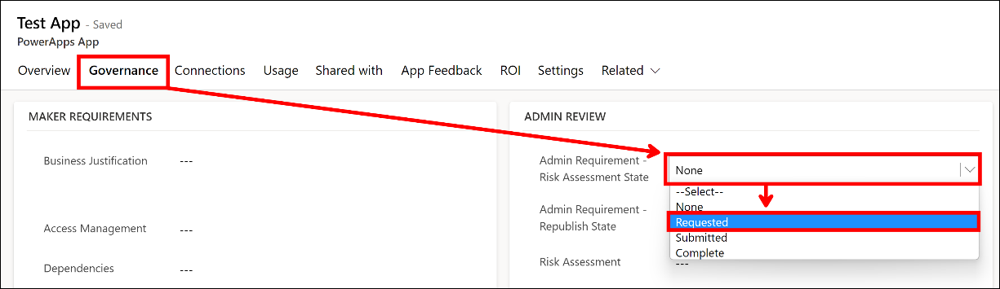

18. **Save & Close** at the top left.

     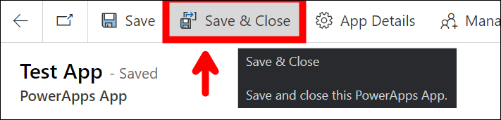

19. Close the **Power Platform Admin View** application.

20. Navigate back to Solutions via the left-side navigation and select the **Center of Excellence –** **Governance Components**.

     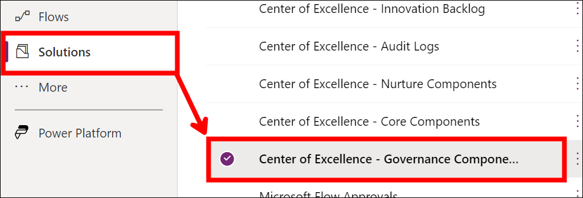

21. Select Apps from the **Objects** menu, then select **Developer Compliance Center**.

    

22. The application will list all the apps that you are the owner of. The information at the bottom of each card will indicate what is preventing your app from reaching full compliance.

23. You should see at least one app that has the name lab admin and your number or the **Test App** name. Select the card to review the details of the app.

     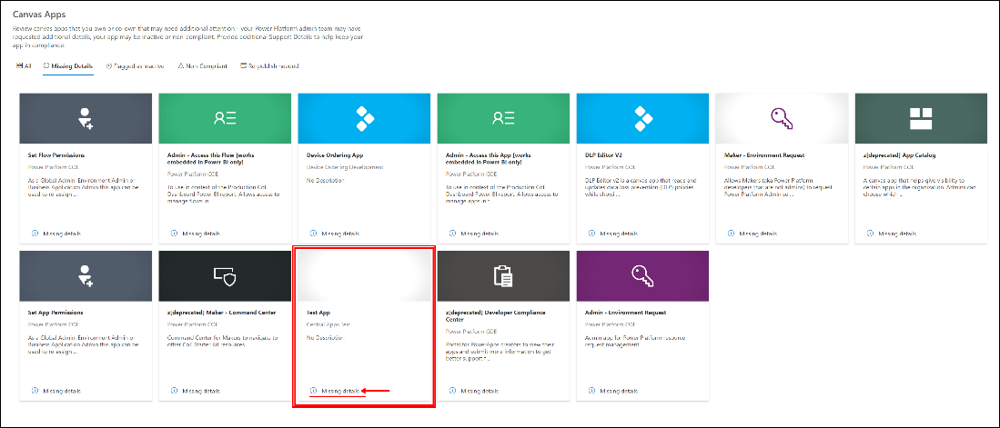

24. Review the App Compliance section which gives clear guidance on what needs to be updated. Select the icon next to **Missing support details** to open the **Support Details** panel.

     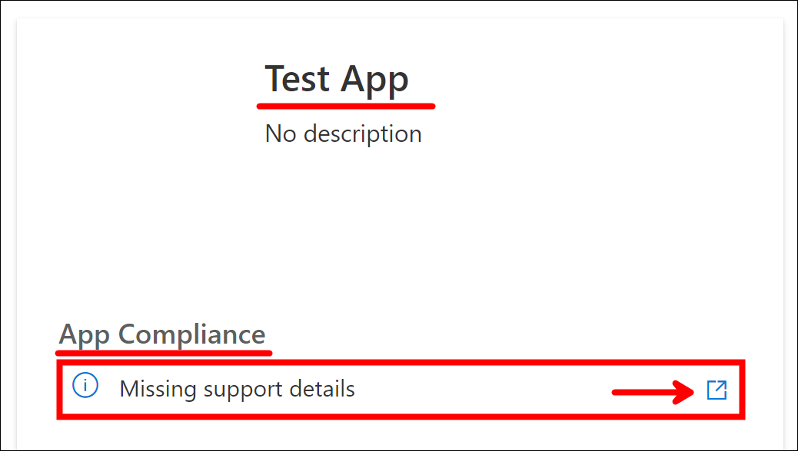

25. In the **Support Details** section fill in all the fields with information about your application, you can make it as detailed as you want but submit information for each field in 
    this section.

26. Normally we would also adjust the description by editing the app, but for this lab will skip that.

27. Select **Save** to save the information about the application and close the Support Details panel.

     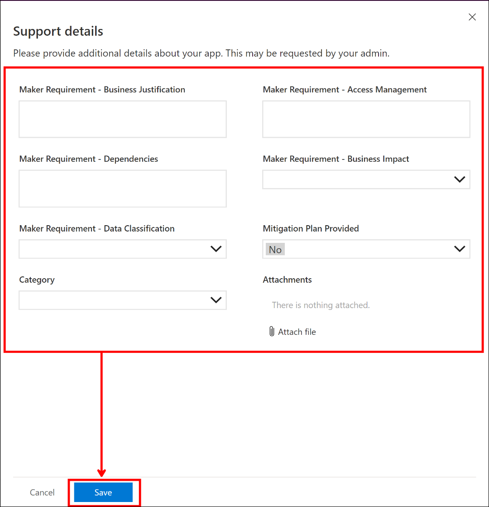

### Task 2: Admin Review

In this task, you will be performing the administrative review of the application details that were submitted by the developer.

1. In the maker portal, with the **Power Platform CoE** environment selected, select Apps.

2. Launch the **Power Platform Admin View** app.

   a. Select PowerApps Apps in the left navigation and change the view to **Compliance-Submitted**.

   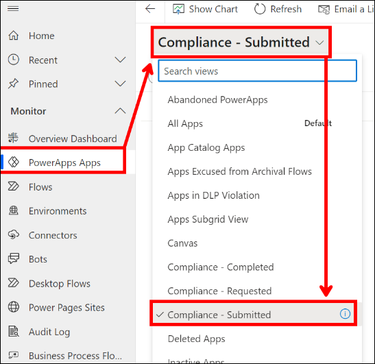

3. Locate your application. It will be Lab Admin and your # or Test App and your initials and select it to open it.

   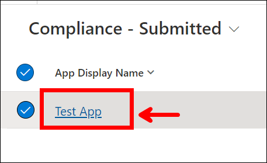

4. Select **Validate Maker Business Requirements** in the process guide. This shows you the current stage of the review process and highlights the progress. Notice it says the maker 
   provided the business requirements. Set **Confirm Business Impact** to **Low Risk** and close by selecting the X at the top right of the card.

   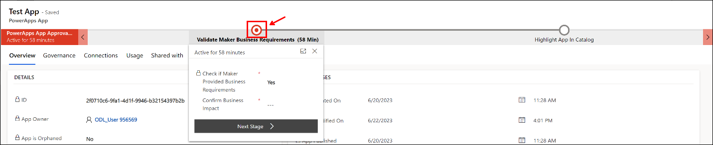

5. Review the information provided by the maker by selecting the **Governance** tab.

   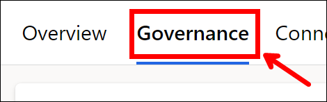

6. In the Admin section change the Risk Assessment to Minor.

   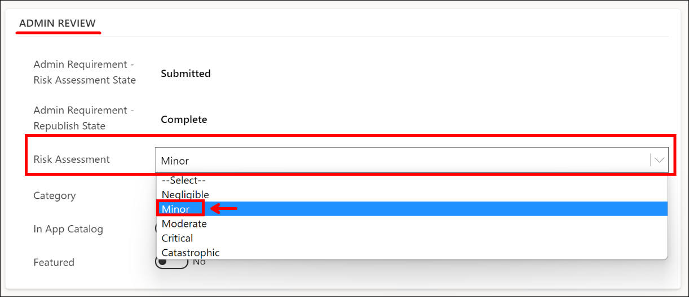

7. After reviewing you can advance the process to the next stage by selecting the Next Stage.

   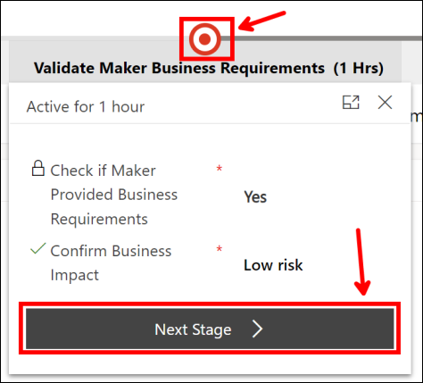

8. The process guide will now have either a Mitigation plan as the active stage or an Access risk depending
    on if the maker indicated the app is critical or not, select Next Stage again to advance.

9. In the final stage you can choose a category for the app in the catalog and indicate if it was featured.
    Make your selections and then select Finish.

10. You have now completed the full review process. This is an example that is provided with the starter kit you can tailor the process to your own organization's needs including adding 
    stages and steps to the process and requiring additional data from the maker.

## Exercise 4: Welcome New Makers (Optional if you have time)

In this exercise, you will be importing a pre-built flow that is designed to identify new app makers and welcome them by sending an email with some information for new makers. 
Additionally, the flow will add the user to an Office 365 group, so you have an easy way to communicate with all the makers in the company.

### Task 1: Create Office 365 Group

1. Navigate to the Azure portal and select **Microsoft Entra ID**.

   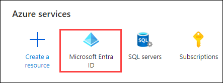

3. Select **Groups**.

   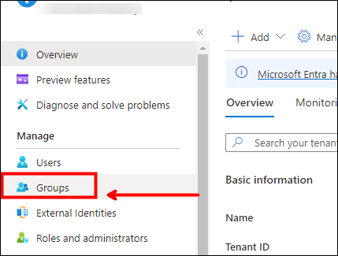

4. Select **+ New group**.

   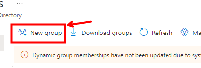

5. Select **Microsoft 365** for Group Type, enter **Lab Admin Makers** for Group Name, set the **Azure AD Roles** to **No**, and select **Create**.

   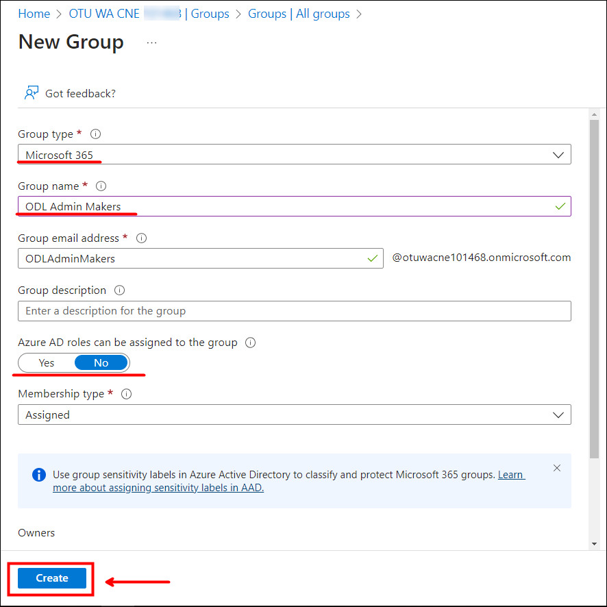

6. Open the group after it gets created.

   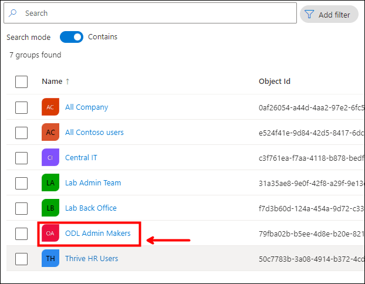

7. Select **Properties** and copy the **Object id**.

   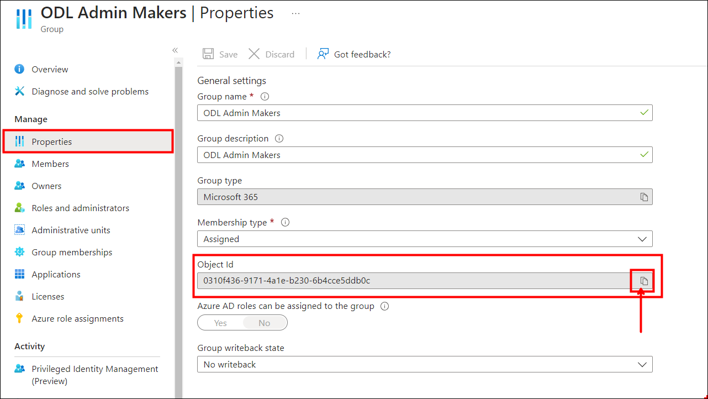

8. Paste the object ID to a notepad, you will need it in future steps.

### Task 2: Import Flow

1. Navigate to **Power Automate**.

2. Make sure **Power Platform COE** environment is selected. Note: While we are using this here, in your tenant you might do this in an admin-focused environment or where you have 
   installed the CoE Starter Kit.

   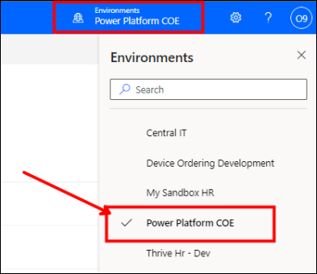

3. Select **My Flows** and click **Import** and select **Import Package (Legacy)**. (For this step, you may not be able to access the content while you are in Incognito mode. If this is the case, simply 
   switch to your normal browser).

   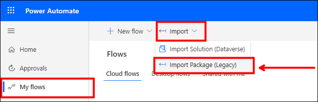

4. Select **Upload**.

5. Select the **Send Welcome Email** zip file and select **Open**. This will be in your lab resource files you downloaded named **SendWelcomeEmailToNewPowerAppsMakers_20190529192359.zip**.

   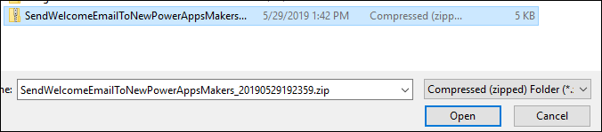

6. Select Configure for the flow.

   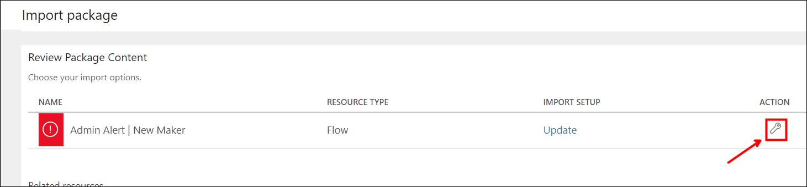

7. Select **Create as new** and select **Save**.

   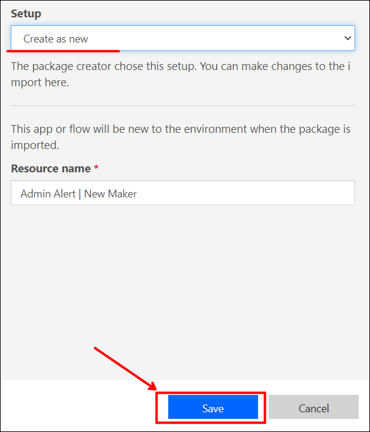

8. Select **Configure** for **Power platform for Admins Connection**.

    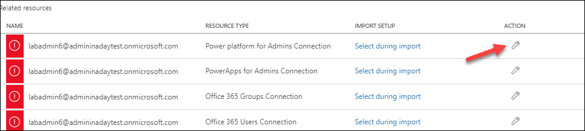

9. Select the available connection and select **Save**.

   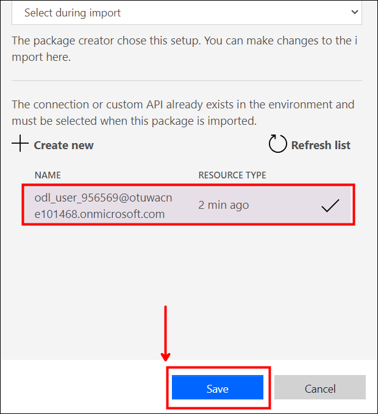

10. Select Action for **Office 365 Outlook Connection**.

11. Select the available connection and select **Save**.

12. Select **Configure** for **PowerApps for Admins Connection**.

    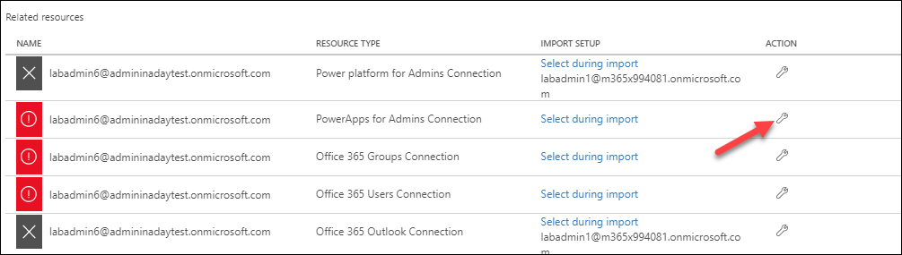

13. Select to select the available connection and select **Save**.

    

14. Select **Configure** for **Office 365 Group Connection**.

15. Select **+ Create new**.

    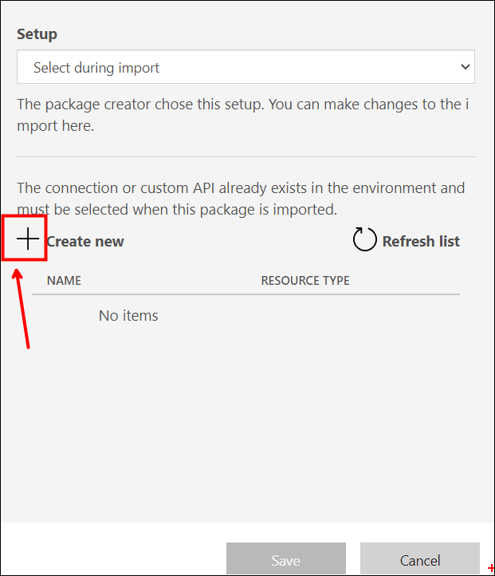

16. Select **+ New connection**.

    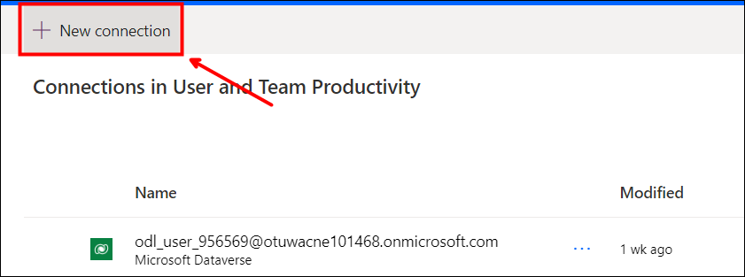

17. Search for **Office 365 Groups** and select **Add**.

    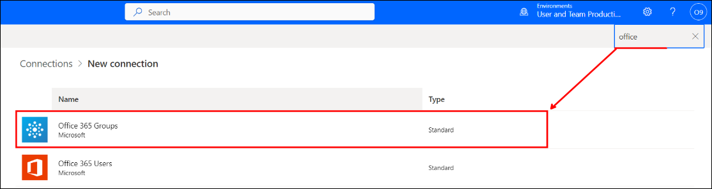

18. Select **Create**.

19. Login with your maker credentials.

20. You should now have the connections listed in the image below.

    

21. Go back to the Flow import.

22. Select **Refresh list**, select the connection you just added, and select **Save**.

    

23. Select Action for **Office 365 Users Connection**.

24. Select the available connection and select **Save**.

25. Repeat this for the **Office 365 Outlook Connection**.

26. Select **Import** and wait for the import to complete.

    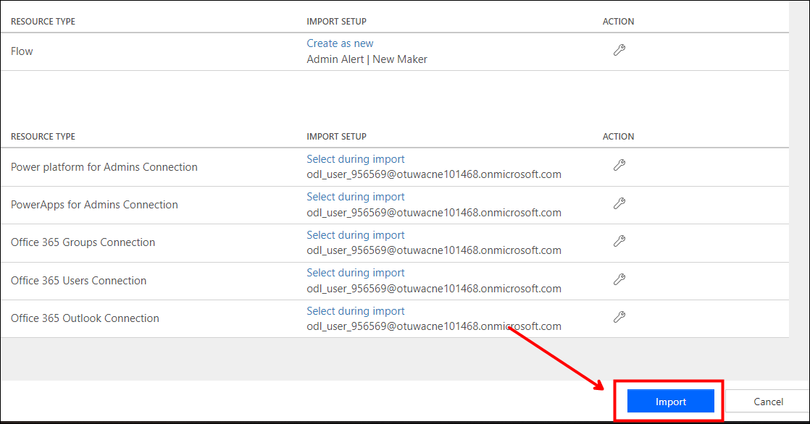

27. The flow should import successfully.

    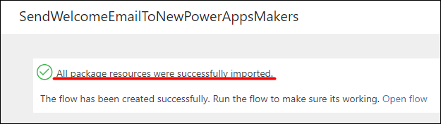

### Task 3: Edit and Test Flow

1. Navigate to the maker portal https://make.powerapps.com and select the **Central Apps Test** **environment**.

   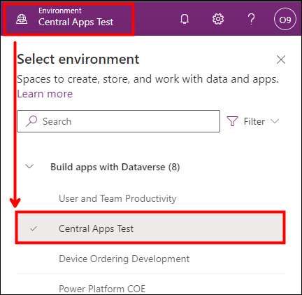

1. Select **Apps (1)**, then **+ New app** > **Start with a page design (2)**.

   

1. Click on **+** on blank canvas app. Make sure **Tablet** is selected.

   

4. Enter **Test app** for App name, select **Tablet** for format, and select **Create**.

   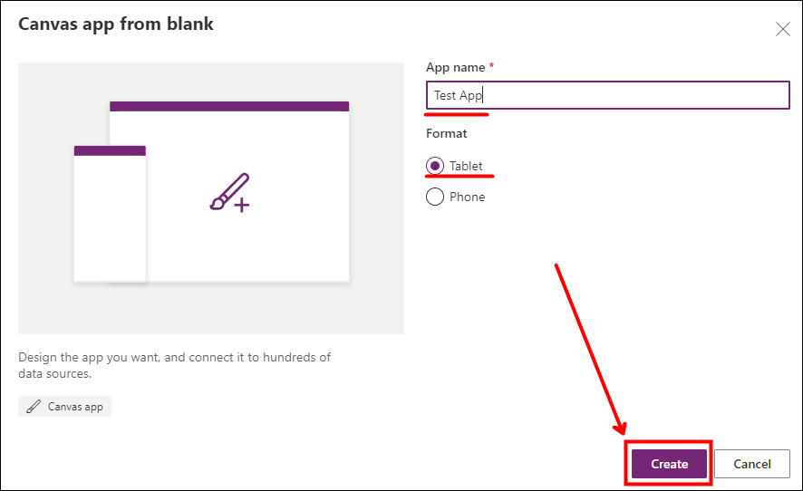

5. The app designer should open. Select **Save** at the top right of the page.

   

6. Select on the **Back** button.

   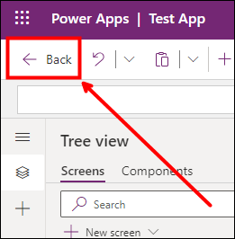

7. Go back to the app maker main page by selecting the **Back** button.

8. Select **Solutions**.

9. Select **Publish all customizations** and wait for the publishing to complete.

   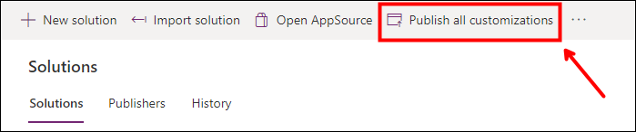

10. Navigate to Power Automate and select the **Power Platform CoE** environment.

11. Select **My Flows**.

12. Locate the flow you imported and select **Edit**.

    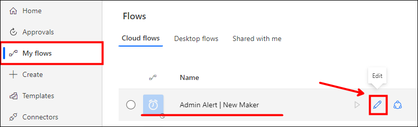

13. Expand the **Recurrence** and make sure the flow is set to run once a day.

    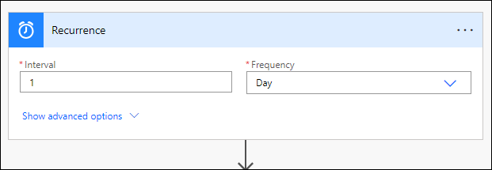

14. Expand the **Office Group ID** step.

15. Clear the current **Group ID**.

16. Copy the **Group ID** from your notepad and paste it here.

    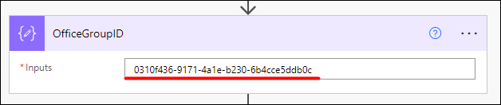

17. You may examine the steps of the flow.

18. Select **Save**.

19. Select on the back button.

    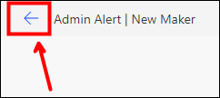

20. **Turn on** the flow if needed.

21. Select **Run**.

    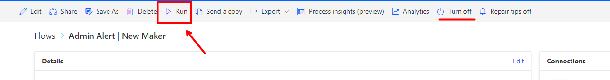

22. Select **Run Flow**.

    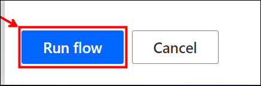

23. Select **Done**.

24. **Refresh** every few seconds until the flow status changes.

25. Your flow run should succeed.

    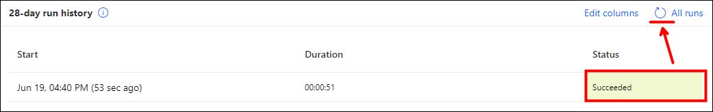

26. Go back to the Azure portal

27. Select **Microsoft Enta ID**.

28. Select **Groups** and open the group you created.

    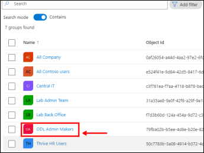

29. Select **Members**. You should have at least one member.

    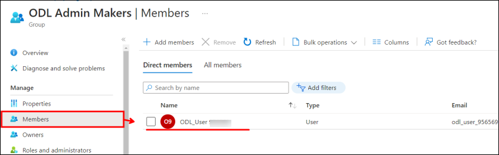
    
31. Navigate to Outlook.

32. You should get a welcome email. Open the email. If you don’t get an email, it is probably because you didn’t create an application in the past 24 hours, create a new Power App and run 
    the flow again.
    
    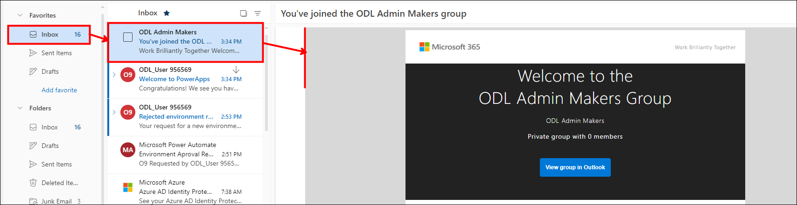
