## Admin in a day

# M04-HOL-Application Lifecycle Management – Managed Environments and Pipelines

## Table of Contents


1. Exercise 1 - Managed Environments

   **Scenario**
   
   - Task 1: Create a Managed Environment  

   - Task 2: Review the Features of the Managed Environments

2. Exercise 2 – Power Platform Pipelines

   **Scenario**
   
   - Task 1: Configure a deployment pipeline

   - Task 2: Run the pipeline
  


##### Hands-on lab

## Lab Scenario

In this hands-on lab, you are an administrator, helping to adopt the Power Platform.

Contoso wants to exert finer control over their environments and expand the functionality of an environment by enabling managed environments. They’ve asked you to apply the features of 
a managed environment to a currently unmanaged environment.

In addition, the team building the Device Order Management app is now ready for you to transport their solution from their development environment to the test environment for testing.

In this lab, you will be using the Managed Environments feature and the Pipelines features included with the Power Platform in order to apply new controls and features to an environment 
and deploy the app through the Dev>Test>Prod cycle.

Because this is the first deployment to test, you will have to do some setup to configure the path for the pipeline and the solution package.

## Lab Test Environment

This hands-on lab is designed to be completed in an environment setup for multiple students to complete the Admin in a day series of hands-on labs.


You will be assigned one or more users to use to complete the hands-on tasks. Because this is a shared environment, some tasks that require a tenant Global Administrator or a Service 
Administrator will already be performed.


### Exercise 1 : Managed Environments

In this exercise, you will be shifting a pre-made environment from an unmanaged state to a managed state. A managed environment can greatly expand the level of control for administrators.

#### Task 1: Create a Managed Environment

1. Navigate to the Power Platform Admin Center (https://aka.ms/ppac).

2. Select Environments, then select **+New** to create a new environment.

   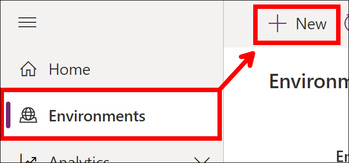

3. Input **Managed Environment-<inject key="Deployment ID" enableCopy="false" />** for the name, set the region to your region, set the **Type** as Sandbox, and select the toggle to 
   enable adding a Dataverse data store, then select **Next**.

   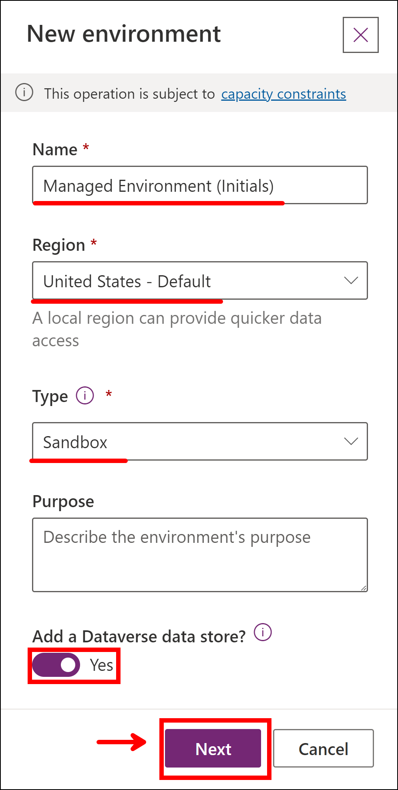

4. Set the **Security group** to **None (1)** , then enable **Dynamics 365 apps (2)** , and select **Save (3)**.

   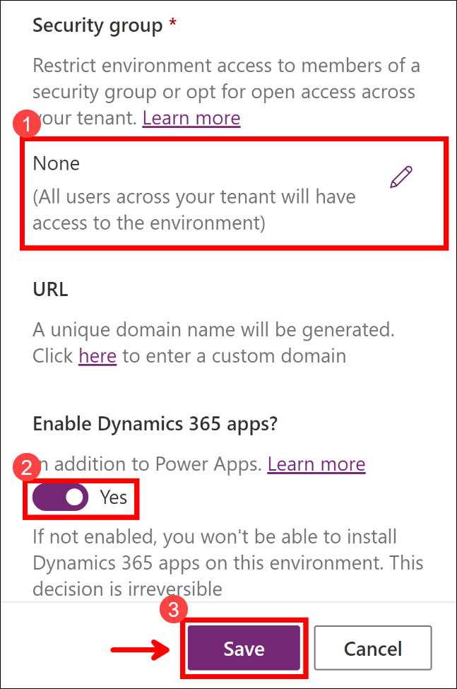

5. Wait for the environment to be provisioned and marked as Ready.

6. Once the environment has provisioned, select the circle next to **Managed Environment-<inject key="Deployment ID" enableCopy="false" />**.

7. Select the three dots to view all the ribbon options, then select **Enable managed environment** to start the configuration process for this environment.

   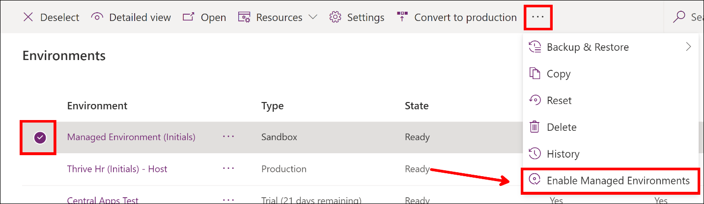

8. Administrators seeking to create or edit managed environments must have the Global Administrator role, Power Platform Administrator role, or the Dynamics 365 admin Azure Active            Directory role. Delegated admins, or Environment Admins will not be able to enable or edit managed environments. At the top of the panel that appears, the system informs you that a 
   particular license is required in order to use the resources. While an unmanaged environment will allow users to interact with resources freely, a managed environment prevents them 
   from doing so if they do not have the correct license for the respective areas. To learn more about Managed Environment licensing, see [Licensing](https://nam10.safelinks.protection.outlook.com/?url=https%3A%2F%2Flearn.microsoft.com%2Fen-us%2Fpower-platform%2Fadmin%2Fmanaged-environment-licensing&data=05%7C01%7Cabhilash.r%40spektrasystems.com%7Cb66b4d860a32451dc5d308db9e70097d%7C6d7e0652b03d4ed2bf86f1999cecde17%7C0%7C0%7C638277976316671495%7CUnknown%7CTWFpbGZsb3d8eyJWIjoiMC4wLjAwMDAiLCJQIjoiV2luMzIiLCJBTiI6Ik1haWwiLCJXVCI6Mn0%3D%7C3000%7C%7C%7C&sdata=Kg6C6YSZI3XoOEQBG31SK5GDmoizIDP0XzYn67xfaY8%3D&reserved=0) and [Licensing overview for Microsoft Power Platform](https://nam10.safelinks.protection.outlook.com/?url=https%3A%2F%2Flearn.microsoft.com%2Fen-us%2Fpower-platform%2Fadmin%2Fpricing-billing-skus&data=05%7C01%7Cabhilash.r%40spektrasystems.com%7Cb66b4d860a32451dc5d308db9e70097d%7C6d7e0652b03d4ed2bf86f1999cecde17%7C0%7C0%7C638277976316671495%7CUnknown%7CTWFpbGZsb3d8eyJWIjoiMC4wLjAwMDAiLCJQIjoiV2luMzIiLCJBTiI6Ik1haWwiLCJXVCI6Mn0%3D%7C3000%7C%7C%7C&sdata=eRaW6iY%2FBo6V4wLptyfDFMObVLjKsEO%2BaOMHVGBA3GE%3D&reserved=0)”

    a. In Limit Sharing, choose **Exclude sharing with security group**s. Once this is enabled, you can restrict the users the app gets shared to.

    b. Select the **Limit individuals…** checkbox and set the limit number to **3**. 

    c. Set Solution Checker to **Warn**. This will validate any custom solutions being imported to the environment. 

    d. Leave the **Usage insights** checked. This item is selected by default. 

    e. For **Maker welcome content**, copy and paste the following into the text box: 

        
       ## Welcome to Contoso Power Apps 
       ### Let's get started with data 
       Before you start using Power Apps, please refer to our company guidance.
       1. **Get trained:** [Learning Videos]() and [training guides]() 
       2. **Contribute ideas:** Submit an idea for a new app or flow idea at [Suggestion box]() 
       3. **Learn from others:** [Top tips]() by expert makers at Contoso

      • This will be used to greet users when they log in or switch to the environment. This can either be written in plain text, or as Markdown, as seen above.

    f. Leave data policies as is. We will alter and review these later. 

      

    g. Select Enable once complete.

      

9. A green banner will appear at the top notifying you of the successful update.

   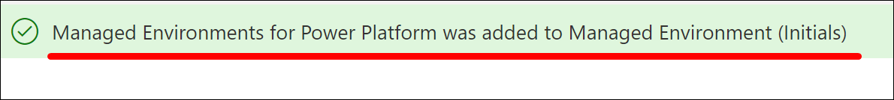

10. Do not navigate away from this page.


#### Task 2: Review the Features of the Managed Environments

Now that you have created a managed environment, it's time to review the newly enabled features. Managed environments have several features which can be used to expand the functionality 
of an environment.

##### Feature 1: Solution Checking

The solution checker will enforce static analysis checks on any imported custom solutions against a set of best practice rules and identify problematic patterns in the solution. The 
solution being imported must have run the solution checker in its native environment, and it must have been run within a 90 - day window of the import. For more details on the solution 
checker enforcer, follow this link (https://learn.microsoft.com/en-us/power-apps/maker/data-platform/use-powerapps-checker).


1. The solution checker comes with three options for the setting, explained below:

   a. None: This option will turn off automatic solution validating and will not give any experience or behavioral changes to authoring, exports, and imports for solutions.

   b. Warn: All custom solutions being imported will be automatically verified, but if there are any highly critical issues, you will receive a notice, but the import will not halt. 
          After the solution is imported, a message will appear showing the validation issues that occurred upon import.

   c. Block: Similar to the Warn feature, however when highly-critical issues occur, the import process is cancelled, rather than continuing. This will not cause any changes to the 
      environment, since this occurs during the actual import process. For both the Warn and Block options, Power Platform environment admins will receive a summary email with of 
      the solution validation.

   - To test this feature, you'll need to import a solution with known errors.

2. Navigate to Power Apps (http://make.powerapps.com).

3. Ensure you're in the **Managed Solution (Initials)** environment by checking the environment navigator at the top right of the page.

   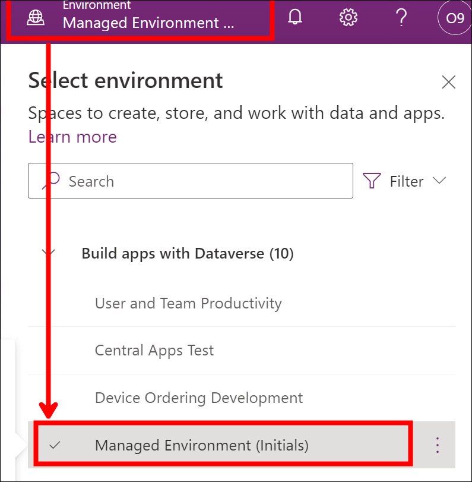

4. Select **Solutions (1)** from the left-side navigation and click on **Import Solution (2)**.

   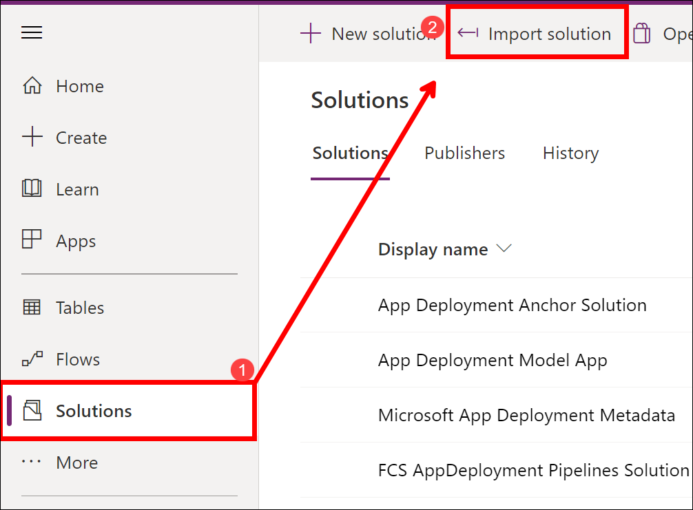

5. Select **Browse**.

   

6. Locate and open the **CriticalErrorSolution_1_0_0_0_managed.zip** file from your file explorer.

   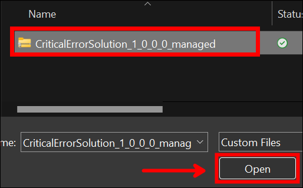

7. Select **Next.**

   

8. Review the details and select **Import.**

   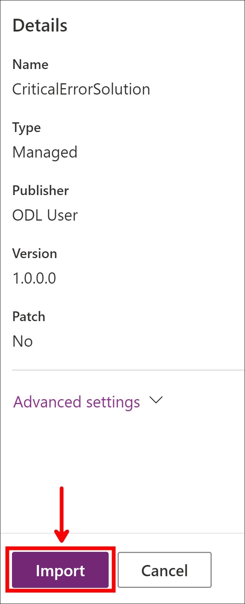

9. Once the solution imports, a warning notification will appear at the top of the page informing you of the issues that the solution contains.

    

10. Do not navigate away from this page.

11. We’ll look at the difference between the Warn and Block option.

12. Open a new tab and navigate back to Power Platform Admin Center.

13. Select **Environments** , then select the circle icon next to **Managed Environment (Initials).**

14. Select **Edit Managed Environments** from the ribbon at the top of the page.

    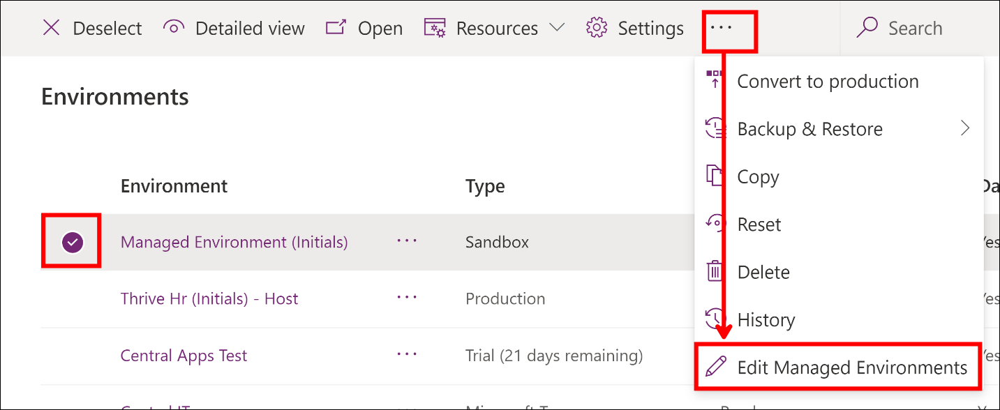

15. Change the **Solution checker** slider to **Block (1),** then select **Save (2)**.

    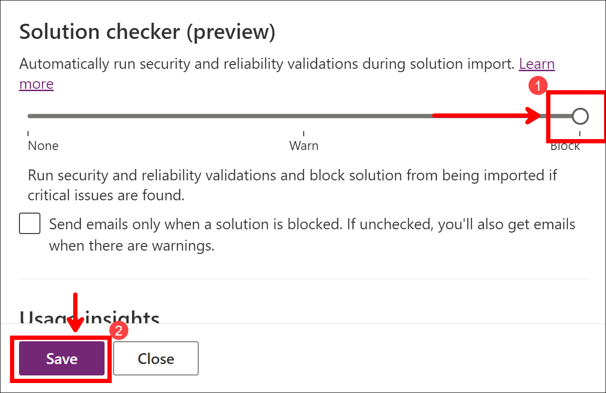

16. Navigate back to the Power Apps solutions page.

    a. You will need to delete the imported solution from the environment to ensure the solution checker is working correctly.

17. Select the three dots next to our imported solution, **Critical Error Solution** and select **Delete.**
 
    

18. Select **Delete** again. Since this is a managed app, you will not need to delete the app, deleting the solution will do that for you.

    

19. Wait for the process to complete, then re-import the solution file with steps 5 - 9.

20. You should receive an error notification at the top of the page.

    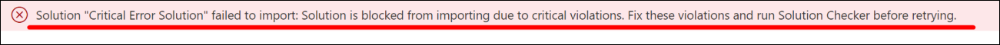


##### Feature 2: Data Policies

A managed environment allows administrators to add additional data policies in place on a specific environment, rather than on the entire tenant being used.

1. Navigate to the Power Platform Admin Center (https://aka.ms/ppac), if it is not open.

2. Select **Environments** , then select the circle icon next to **Managed Environment (Initials).**

3. Select **Edit Managed Environments.**

   

4. Under **Data policies** , select the link to navigate to the current data policies applied to the managed environment. Here is where you will see any data policies applied to the 
   environment, including any tenant-wide policies.

   

   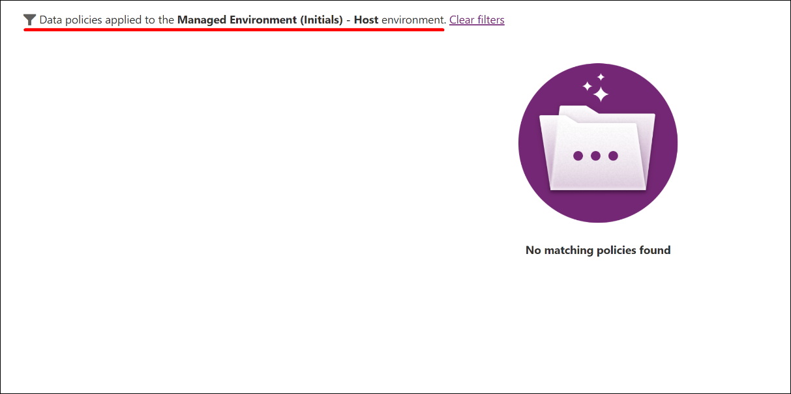


5. (Optional) Since we have not created any nor have any data policies which are applied to the entire tenant, this page will prompt you to create a new data policy. Feel free to create a 
   policy named DLP 1, which blocks the SQL server connector with a scope of all environments. The policy will then appear on the filtered view.


##### Feature 3: Usage Insights

Usage insights provide insights about your managed environments via a weekly digest provided to administrators. This includes analytics of the top apps in the managed environments, the 
most impactful makers, and inactive resources which can be cleaned up safely. For this to operate, tenant-level analytics must be enabled, which was enabled in a previous tenant for this 
module.

**Note:** You will not receive a weekly digest in this course, as the digest is delivered at the end of the business week. The images below are examples of the digest.

##### Feature 4: Maker Welcome

The maker welcome content will replace the default popup that appears when makers sign into Power Apps and can provide them with helpful information on getting started, and any necessary 
information for the makers associated with the environment.

1. Navigate to the Power Platform Admin Center, if it is not open.

2. Select **Environments** , then select the circle icon next to **Managed Environment (Initials).**

3. Select **Edit Managed Environments.**

   

4. Under **Maker welcome content** , select **Preview in new tab.**

   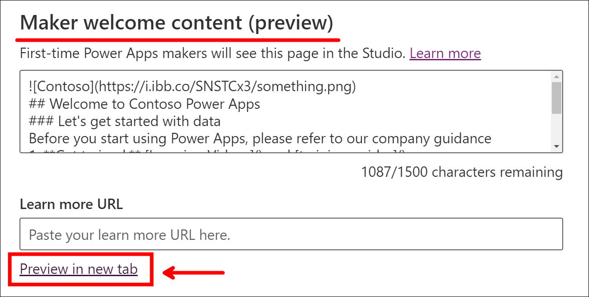

5. This will create an overlay on your screen of the content in the text box of the setting.

   

6. (Optional) Modify the content of the textbox with Markdown or with Plain text and preview again to review the results.


##### Feature 5: Limiting Sharing

Share Limiting can prevent makers from sharing **Canvas apps** to everyone in the tenant, other security groups or to a certain amount of individuals. For Dataverse for Teams Environments 
are not impacted by sharing rules when sharing to a team bound to the environment, however the sharing rules are enforced when a user attempts to share the app with individuals or groups 
in a team that is not bound to the environment.


**Important:** After being enabled, the sharing rules may not be enforced for up to an hour afterwards.

1. Navigate to Power Apps.

2. Ensure you’re in the correct environment by checking the Environment Selector at the top right.

   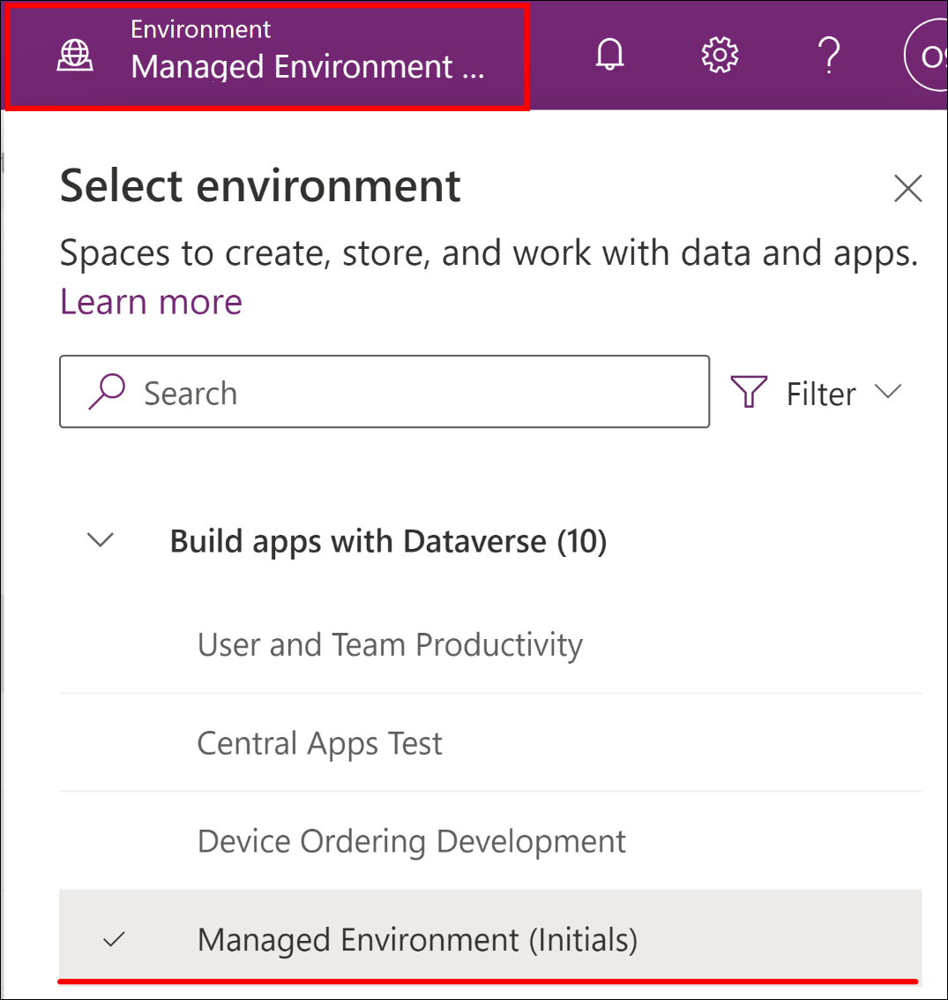

3. Select **Apps (1)** , then **+ New app** > **Canvas App. (2)**

   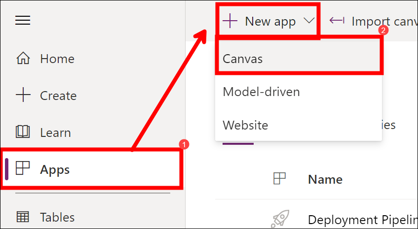

4. Name the app **Play with Sharing (Initials)** , set the format to **Tablet** , and then select **Create**.

   

5. Once the app loads, **select Add item from the Insert pane** on the view window and select **Rectangle**.

   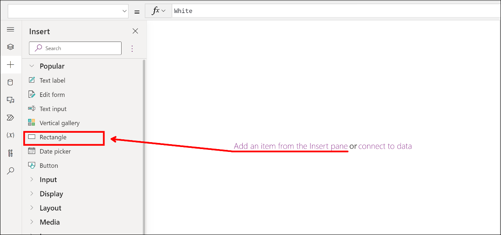

6. **Save (1)** the app at the top right, and then select **Publish (2)** right next to it.

   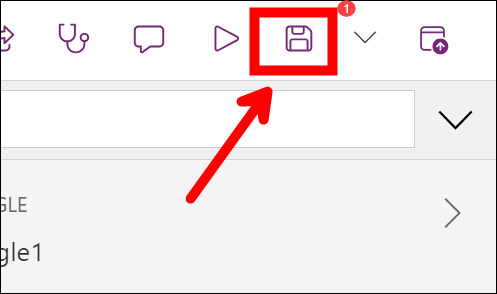

   

7. Select **Share**. This will open a new tab where you can share this app with other users.

   

8. Search Lab User and choose a user.

   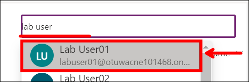

9. Repeat this process two more times until you have three users to add and select Share.

    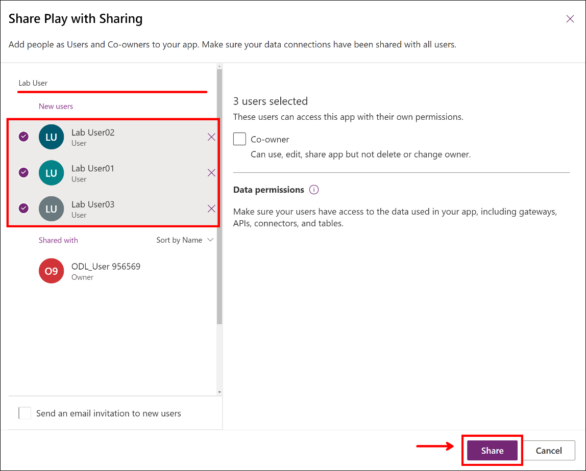

10. A banner will appear at the top of the panel, which will show the sharing rules are enabled, and being enforced. This is because the owner is counted with the number of individuals 
    the app can be shared with.

   

11. Remove a user from the chosen users, then select Share.

   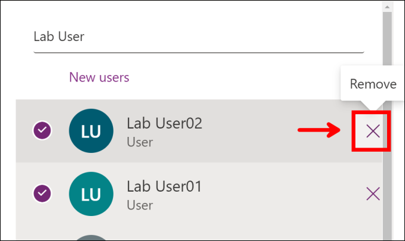

   

12. Once complete, a banner should appear notifying you of the success.

   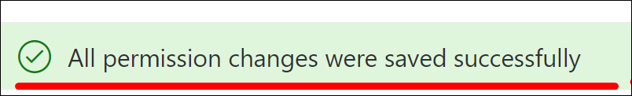


### Exercise 2: Power Platform Pipelines

### Scenario

Another feature of a managed environment is the ability to utilize the in-platform pipelines to democratize application lifecycle management (ALM) by bringing the ALM automation and 
continuous integration and continuous delivery (CI/CD) capabilities to the service. Included with these is the ability to view out of the box analytics within a central location and 
Power BI reports. Pipelines can deploy solutions, connections, connection references, and environment variables to environments of the same region as the host environment.


1. Navigate to Power Platform admin center by using below URL and select environments if not already opened.

    ```
    https://admin.powerplatform.microsoft.com/environments
    ```

2. For this lab, we will use this structure for our environments, following the guidelines for Application Lifecycle Management (ALM).

     | Pipeline Stage | Environment Name | Type |
     | -------------- | ---------------- | ---- |
     | Host           | Managed Environment (Initials) | Default |
     | Development    | Thrive Hr - Dev  |  Sandbox |
     | Test           | Thrive Hr - Test | Sandbox |
     | Production     | Thrive Hr- prod  | Production |
   

  
  >*Note:* Host Environments act as storage and management for pipeline configurations, run histories, and security settings. Should this environment be deleted, all pipelines and run        data will be deleted as well and cannot be recovered. Host environments can only have development and target environments that exist within the same region as the host environment. For 
  this reason, some tenants may have multiple host environments.
  

3. Select **Managed Environment (Initials)** to open a detailed view for the environment.

    

4. In the **Details** pane, select **Edit.**

    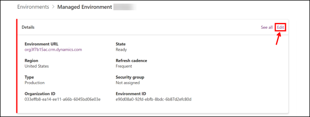
  
5. Clear out the existing name and replace it with **Thrive Hr - Host (1)** to remain in line with the naming convention of the other environments and select **Save (2)**.

    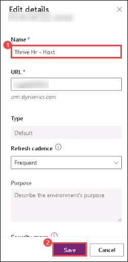


6. To finish up the setup, you will need to enable managed environments for each of the associated environments in the pipeline. Navigate back to the **Environments** page with the
   breadcrumbs at the top or the left side navigation.

    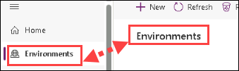

7. Select the circle next to **Thrive Hr - Dev (1)** and select **Enable Managed Environment (2)**.

    

8. For the purposes of this lab, we will not be configuring each of the associated environments for other features (e.g., Limit Sharing, Usage insights, etc.). Select **Enable** at the       bottom of the panel.

    

9. Repeat this process for **Thrive Hr - Prod** and **Thrive Hr - Test** environments in the setup .

10. Now, you need to install the pipelines app onto the host environment. In the Resources Panel, select **Dynamics 365 apps.** A list of apps currently installed for the environment 
    will appear.
  
    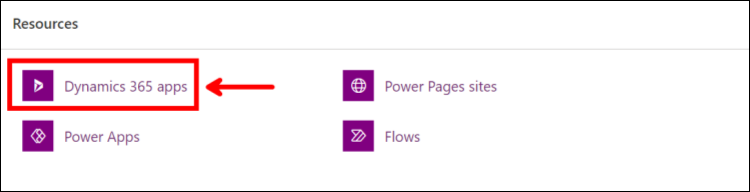

11. Select **Install App** from the ribbon at the top.

     

12. Scroll down to locate **Power Platform Pipelines (1)** and select the name, then click on **Next (2)**.

    

13. Select the **checkbox (1)** to agree to the Terms of Service, then select **Install (2)**.

    

14. Confirm that the app is being installed onto the environment by checking that the **Status** reads as **Installing**.

    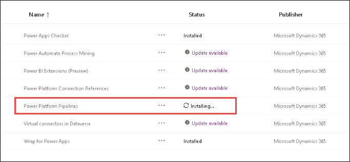

15. **Do not navigate away from this page.**


#### Task 1: Configure a deployment pipeline


##### 1A: Add the environments to the database.

1. While waiting for the app to install, you'll need to gather the environment IDs of all development and target environments that will be linked to the pipelines.

2. To do this, navigate back to the **Environments** page of the Power Platform Admin site from the left-side navigation.

   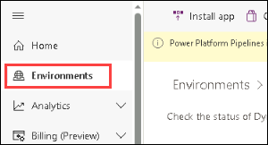

3. Select the **... (1)** to the right of to **Thrive Hr - Dev** , then select **Detailed View (2)** to get the environment information.

   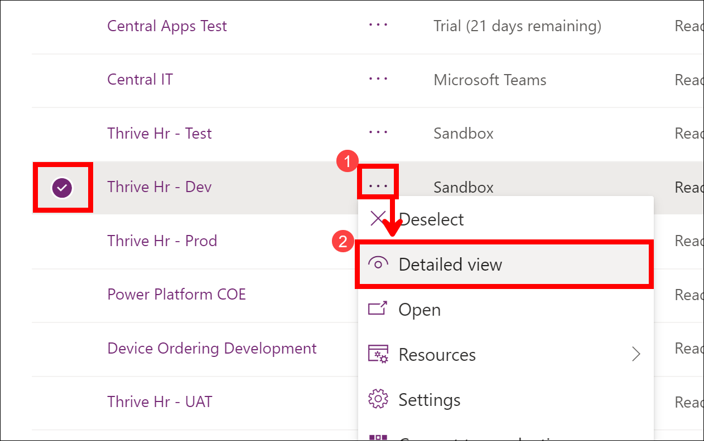

4. Locate the **Environment ID** in the details pane and copy it to a notepad for later.

   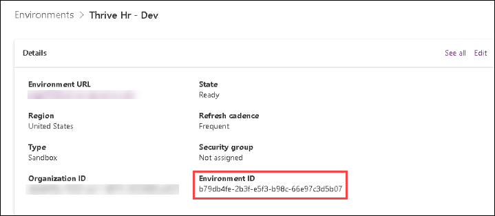

5. Repeat this process with **Thrive Hr – Test** and **Thrive Hr – Prod** , copying the IDs to the same notepad.

6. Navigate to Power Apps and set the environment to the **Thrive Hr – Host** environment.

   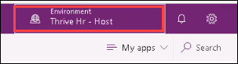

7. Navigate to **Apps (1)** and select **Deployment Pipeline Configuration (2)**, then select **Play** from the ribbon at the top.

   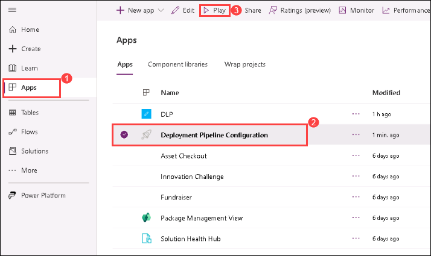

8. Select **Environments (1)** on the left pane, and then click on **+ New** symbol.

   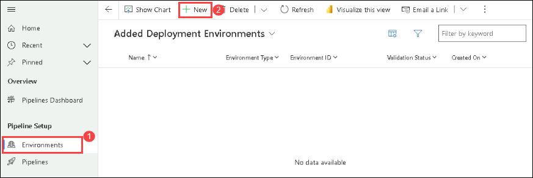

9. You’ll need to add the Dev, Test, and Prod environments as our deployment environments to create the environment records in Dataverse:

    a. Name : **Thrive Hr - Dev (1)**

    b. Environment Type : **Development Environment (2)**

    c. Environment Id : Paste the **Environment ID (3)** you copied from earlier here.

     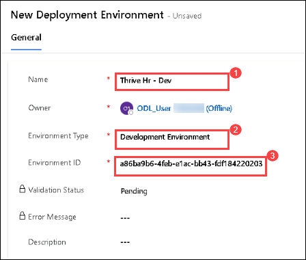

10. Select **Save**

11. **Refresh (1)** the form, then verify **Validation Status** equals **Success (2)**.

    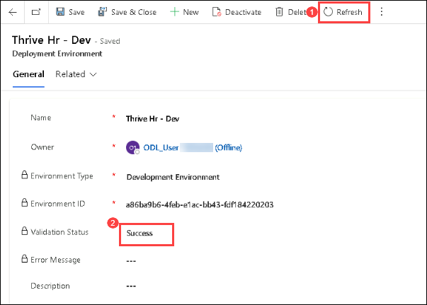

12. Select **Save and Close**.

    

13. Repeat steps 3-11 for **Thrive Hr - Test** and **Thrive Hr - Prod,** setting the type as **Target Environment** respectively.

14. You should have three environments listed now.

    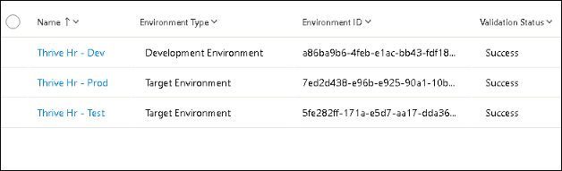


##### 1B. Create a pipeline.


1. Select **Pipelines (1)** on the left navigation pane, and then select **+ New (2)** to create a new deployment pipeline.

   

2. Set the **Name** to be **Thrive Hr Standard Deployment Pipeline (1)** and select **save (2)** to show the rest of the content available..

   

3. Now we need to add the environments we've created to the pipeline. In the **Linked Developments** section, Select **Add Existing Deployment Environment**.

   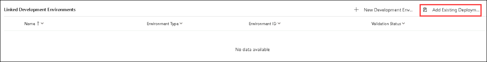

4. Select the **Thrive HR - Dev** to add the environments to the list and clcik on **Add**.

   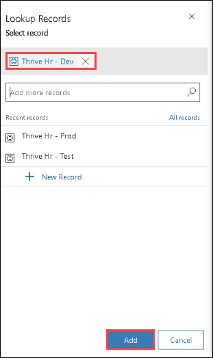

5. Locate the **Deployment Stages (Deployment Pipeline)** section, select **New Deployment stage.**

   

6. Set the **Name** to **Deploy to Test (1).**

7. Set the **Description** to **Deploy the completed development content to the Test phase (2).**

8. Since this is the first stage of our deployment, the **Previous Deployment Stage** field will be left blank for this one.

9. Set the **Target Development Environment** to the **Thrive HR - Test (3).**

10. Leave the predeployment condition unselected. To learn more about predeployment conditions,
    follow this link.

11. Confirm that your setup reflects the image below.

    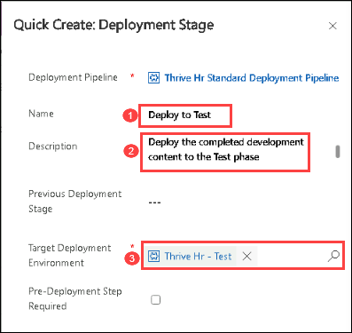

12. Select the arrow next to **Save and Close** and select **Save and Create New.**

    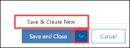

13. Set the **Name** to **Deploy to Prod (1).**

14. Set the **Description** to **Deploy the completed development content to the Production phase (2).**

15. Set the **Previous Deployment Step** to **Deploy to Test (3)**

16. Set the **Target Development Environment** to the **Thrive HR - Prod (4).**

17. Select **Save and Close (5)**.

18. Confirm that your setup reflects the image below.

    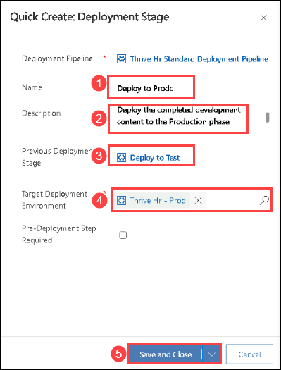

19. Do not navigate away from this page.


#### Task 2: Run the pipeline

1. Navigate to Power Apps in a new tab.

2. Ensure you are in the Thrive HR - Dev environment at the top right.

   

3. Select **Solutions (1)** from the left-side navigation, then select **Import Solution (2)** from the ribbon at the top.

   

4. Select Browse and locate  **PipelineExample_1_0_0_1.zip** in **Labfiles**

5. Select **Next.**

6. Review the details and select **Import**. This is the solution we will be deploying through our pipeline. Any solutions sent through a pipeline must be unmanaged.

   

7. Once the solution has been imported, select it from the available solutions.

   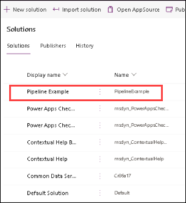

8. Select **Pipelines** from the left side navigation. From here we can view the current deployment stage, and what stage we will be deploying to next.

   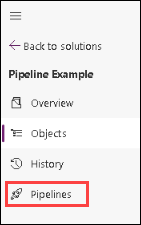

9. Select **Deploy here**.

    

10. This is where you can schedule deployments or deploy immediately. Set the deployment schedule to **Now** and select **Next.**

    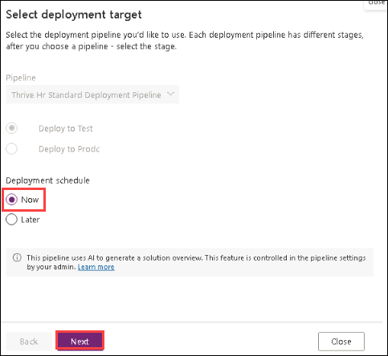

11. Add any appropriate deployment notes and select **Deploy.**

    

12. The solution is now being processed, validated, and deployed to the Thrive Hr - Test environment.

    

13. Once the deployment is complete, the option to deploy to production appears. Select **Deploy** **here** for the **Deploy to Prod** stage.

    

14. This time, we'll schedule the deployment. To do so, select **Later** from the radial menu, and set the deployment time closest to your current time (ex. Your current time is 4:53 PM, 
    select 5:00  PM. then select **Next.**

    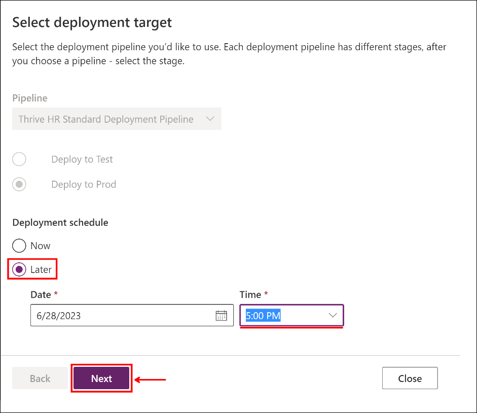

15. Review any details and optionally add deployment notes, then select **Deploy.**

16. If needed, administrators can change the time of or cancel a deployment from this screen by selecting the **Cancel Deployment** button, or by selecting the Run History tab, and 
    selecting the three dots next to the Start time. From here, you can also view the run information, such as any notes or comments.

    

     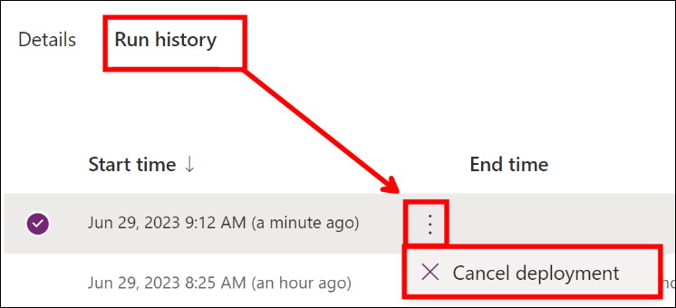


17. Administrations can also make changes to the run record from the Deployment Pipeline Configuration app, such as altering the starting time and deployment notes. Return to the 
    **Deployment Pipeline Configuration App** in the host environment and select **Run history**.

    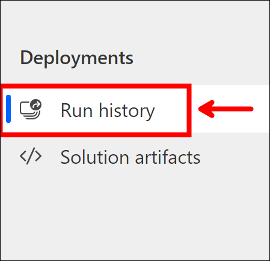

18. Select the scheduled deployment and select **Edit** at the top right.

    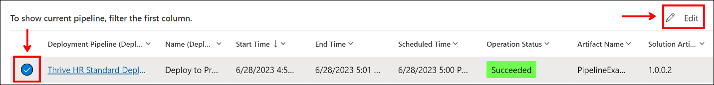

19. Locate the **Scheduled Time** and select the clock next to the selected time.

    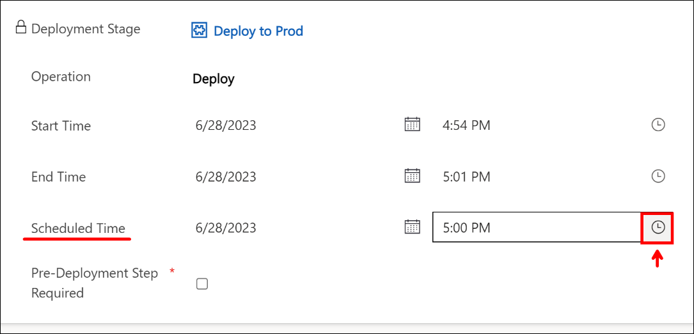

20. Select the new time, and then select **Save and Close.**

    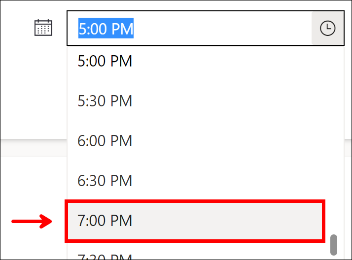

    


