## Admin in a day

# M04-HOL- Managed Environments

### Estimated Duration: 80 minutes

## Lab Scenario

In this hands-on lab, you are an administrator helping Contoso adopt and manage Power Platform more effectively. Contoso wants to gain finer control over their environments by enabling managed environments, and they have asked you to apply these features to an existing unmanaged environment. Additionally, the team developing the Device Order Management app is ready to move their solution from the development environment to the test environment. In this lab, you will use the Managed Environments and Pipelines features in Power Platform to apply new controls, configure the deployment path, and move the solution package through the Dev > Test > Prod cycle, beginning with the initial setup for deployment to the test environment.

## Lab Objectives

In this lab, you will complete the following exercises:

- Exercise 1 - Managed Environments
- Exercise 2 – Power Platform Pipelines

### Lab Test Environment

This hands-on lab is designed to be completed in an environment setup for multiple students to complete the Admin in a day series of hands-on labs.

You will be assigned one or more users to use to complete the hands-on tasks. Because this is a shared environment, some tasks that require a tenant Global Administrator or a Service 
Administrator will already be performed.

### Exercise 1: Managed Environments

In this exercise, you will be shifting a pre-made environment from an unmanaged state to a managed state. A managed environment can greatly expand the level of control for administrators.

#### Task 1: Create a Managed Environment

1. Navigate to the **Power Platform Admin Center** (https://aka.ms/ppac).

1. Select **Environments (1)**, then select **+ New (2)** to create a new environment.

   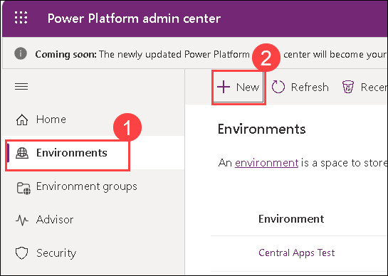

1. On the **New Environment** page,

   - Input **Managed Environment-<inject key="Deployment ID" enableCopy="false" /> (1)** for the name
   - Set the region as **United States - Default (2)**
   - Set the Type as **Sandbox (3)**
   - Select the toggle to 
   enable adding a Dataverse data store **(4)** - Then select **Next (5)**

     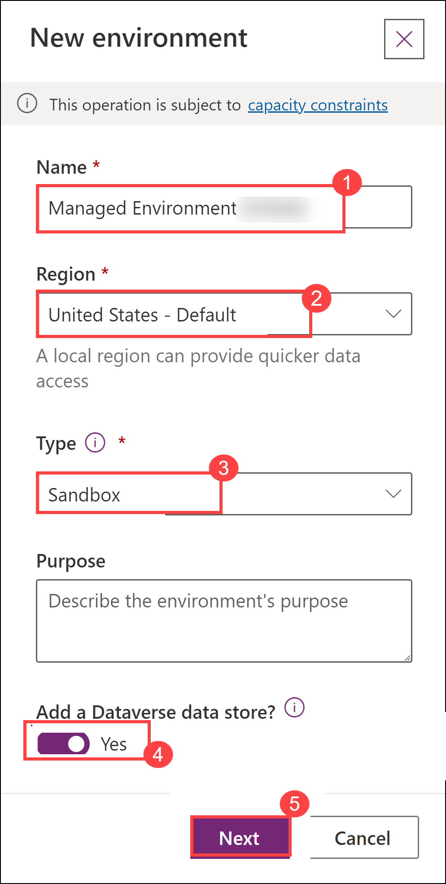

1. On the **Add Dataverse** page, click on **+ Select** under **Security group**.

   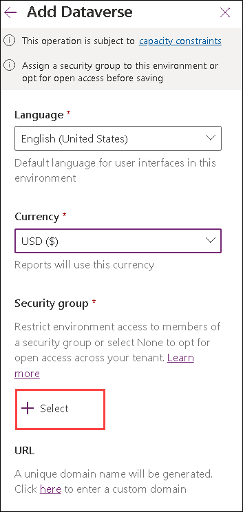

1. Set the **Security group** to **None (1)** then select **Done (2)**.

   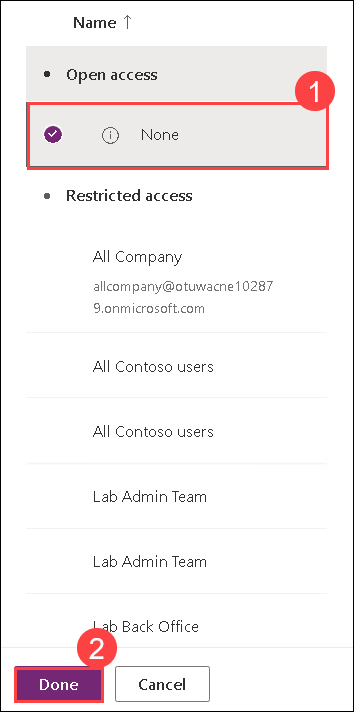

1. Enable **Dynamics 365 apps (1)**, and select **Save (2)**.

   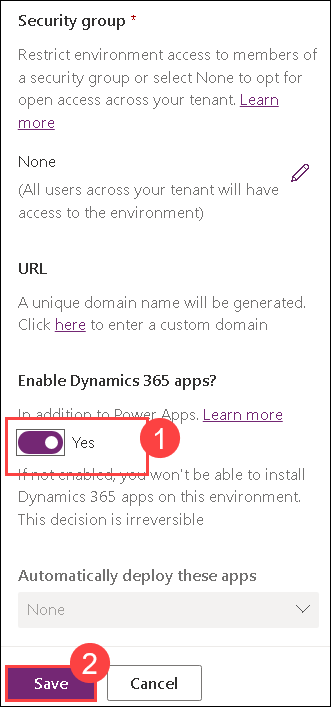

1. Wait for the environment to be provisioned and marked as Ready.

1. Click on the **Environment (1)** then select **Managed Environment-<inject key="Deployment ID" enableCopy="false" />** Environment.

   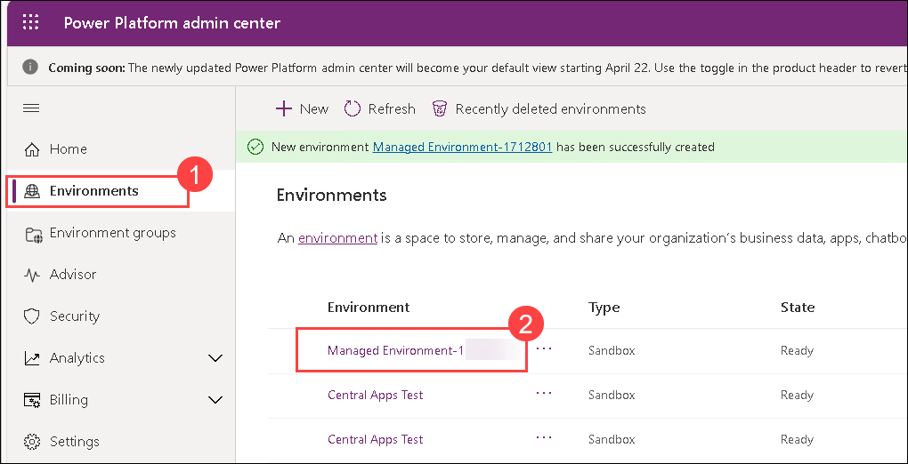

1. Select **Enable managed environment** to start the configuration process for this environment.

   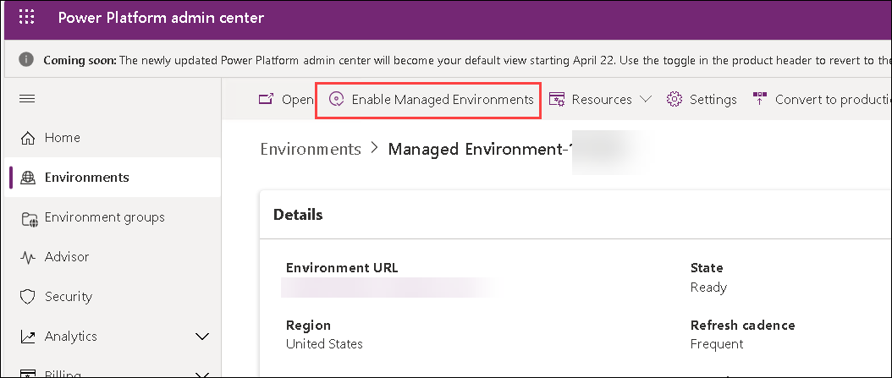

    >**Note**: Administrators seeking to create or edit managed environments must have the Global Administrator role, Power Platform Administrator role, or the Dynamics 365 admin Microsoft Entra ID    Directory role. Delegated admins or Environment Admins will not be able to enable or edit managed environments. At the top of the panel that appears, the system informs you that a 
   particular license is required to use the resources. While an unmanaged environment will allow users to interact with resources freely, a managed environment prevents them 
   from doing so if they do not have the correct license for the respective areas. To learn more about Managed Environment licensing, see [Licensing](https://nam10.safelinks.protection.outlook.com/?url=https%3A%2F%2Flearn.microsoft.com%2Fen-us%2Fpower-platform%2Fadmin%2Fmanaged-environment-licensing&data=05%7C01%7Cabhilash.r%40spektrasystems.com%7Cb66b4d860a32451dc5d308db9e70097d%7C6d7e0652b03d4ed2bf86f1999cecde17%7C0%7C0%7C638277976316671495%7CUnknown%7CTWFpbGZsb3d8eyJWIjoiMC4wLjAwMDAiLCJQIjoiV2luMzIiLCJBTiI6Ik1haWwiLCJXVCI6Mn0%3D%7C3000%7C%7C%7C&sdata=Kg6C6YSZI3XoOEQBG31SK5GDmoizIDP0XzYn67xfaY8%3D&reserved=0) and [Licensing overview for Microsoft Power Platform](https://nam10.safelinks.protection.outlook.com/?url=https%3A%2F%2Flearn.microsoft.com%2Fen-us%2Fpower-platform%2Fadmin%2Fpricing-billing-skus&data=05%7C01%7Cabhilash.r%40spektrasystems.com%7Cb66b4d860a32451dc5d308db9e70097d%7C6d7e0652b03d4ed2bf86f1999cecde17%7C0%7C0%7C638277976316671495%7CUnknown%7CTWFpbGZsb3d8eyJWIjoiMC4wLjAwMDAiLCJQIjoiV2luMzIiLCJBTiI6Ik1haWwiLCJXVCI6Mn0%3D%7C3000%7C%7C%7C&sdata=eRaW6iY%2FBo6V4wLptyfDFMObVLjKsEO%2BaOMHVGBA3GE%3D&reserved=0)”

1. On the **Enable Managed Evironment** page,

    a. Under **Manage sharing**, expand **Power Apps (1)** choose **Exclude sharing with security groups (2)**. Once this is enabled, you can restrict the users the app gets shared.

    b. Select the **Limit individuals… (3)** checkbox and set the limit number to **3 (4)**

     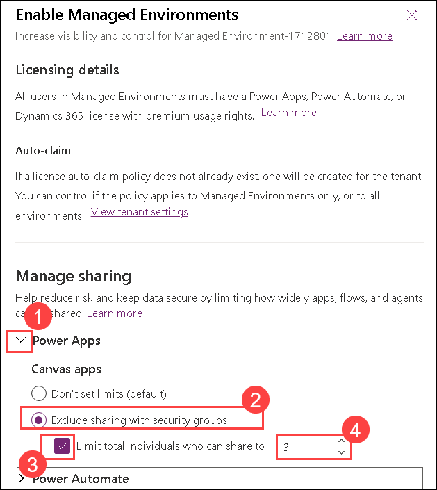    

    c. Set Solution Checker to **Warn**. This will validate any custom solutions being imported to the environment. 

       

    d. Leave the **Usage insights** checked. This item is selected by default. 

    e. For **Maker welcome content**, copy and paste the following into the text box: 

        
       ## Welcome to Contoso Power Apps 
       ### Let's get started with data 
       Before you start using Power Apps, please refer to our company guidance.
       1. **Get trained:** [Learning Videos]() and [training guides]() 
       2. **Contribute ideas:** Submit an idea for a new app or flow idea at [Suggestion box]() 
       3. **Learn from others:** [Top tips]() by expert makers at Contoso

      • This will be used to greet users when they log in or switch to the environment. This can either be written in plain text, or as Markdown, as seen above.

      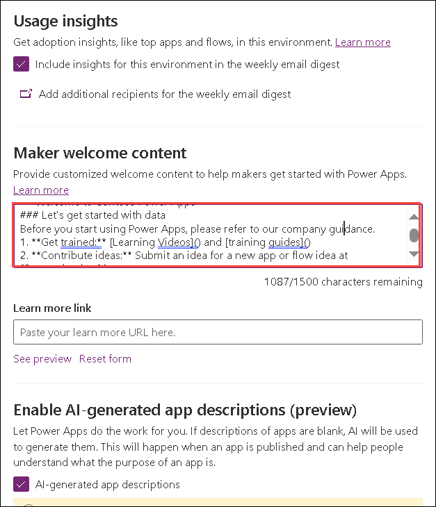 

    f. Leave data policies as is. We will alter and review these later. 

      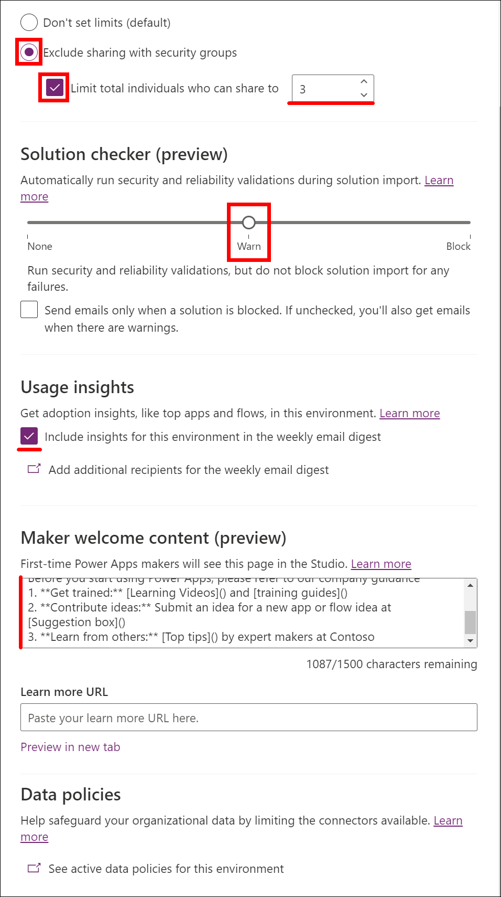

    g. Select **Enable** once complete.

      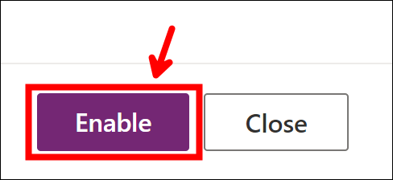

1. A green banner will appear at the top notifying you of the successful update.

   

1. Do not navigate away from this page.

### Task 2: Review the Features of the Managed Environments

Now that you have created a managed environment, it's time to review the newly enabled features. Managed environments have several features which can be used to expand the functionality 
of an environment.

### Feature 1: Solution Checking

The solution checker will enforce static analysis checks on any imported custom solutions against a set of best practice rules and identify problematic patterns in the solution. The 
solution being imported must have run the solution checker in its native environment, and it must have been run within a 90-day window of the import. For more details on the solution 
checker enforcer, follow this link (https://learn.microsoft.com/en-us/power-apps/maker/data-platform/use-powerapps-checker).

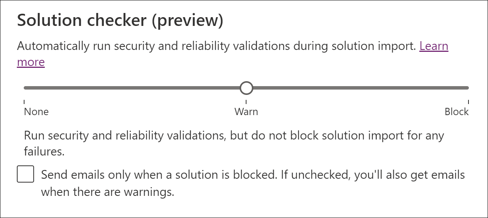

1. The solution checker comes with three options for the setting, explained below:

   a. **None:** This option will turn off automatic solution validating and will not give any experience or behavioural changes to authoring, exports, and imports for solutions.

   b. **Warn:** All custom solutions being imported will be automatically verified, but if there are any highly critical issues, you will receive a notice, but the import will not halt. 
          After the solution is imported, a message will appear showing the validation issues that occurred upon import.

   c. **Block:** Similar to the Warn feature, however when highly-critical issues occur, the import process is cancelled, rather than continuing. This will not cause any changes to the 
      environment, since this occurs during the actual import process. For both the Warn and Block options, Power Platform environment admins will receive a summary email with of 
      the solution validation.

   - To test this feature, you'll need to import a solution with known errors.

1. Navigate to **Power Apps** (http://make.powerapps.com).

1. Ensure to select **Managed Environment-<inject key="Deployment ID" enableCopy="false" />** environment by checking the environment navigator at the top right of the page.

   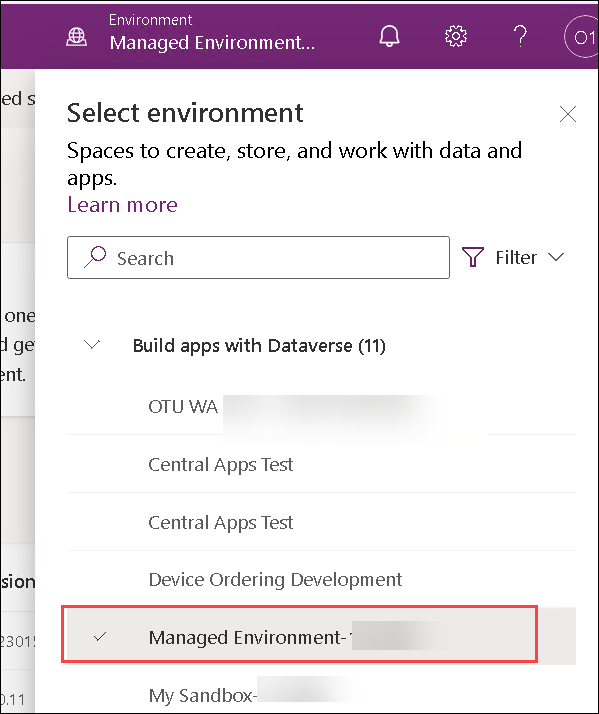

1. Select **Solutions (1)** from the left-side navigation and click on **Import Solution (2)**.

   

1. Select **Browse**.

   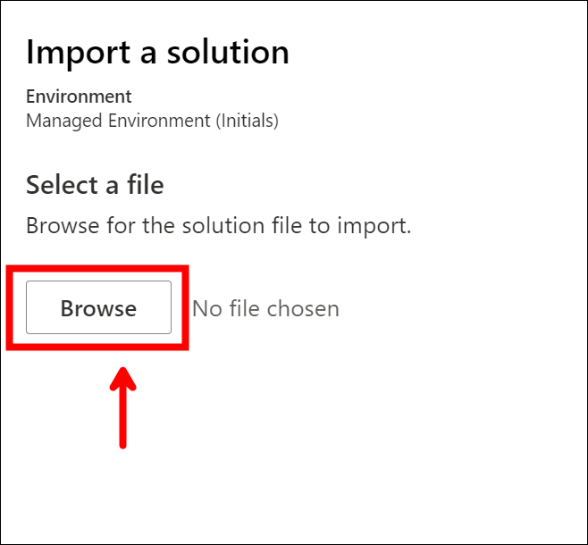

1. Navigate to `C:\LabFiles\PPAdminAttendee%20(1)\PPAdminAttendee\M04 - HOL - Managed Environments\Resources` **(1)**, select the **CriticalErrorSolution_1_0_0_0_managed.zip (2)** file from your file explorer and the click on **Open (3)**

   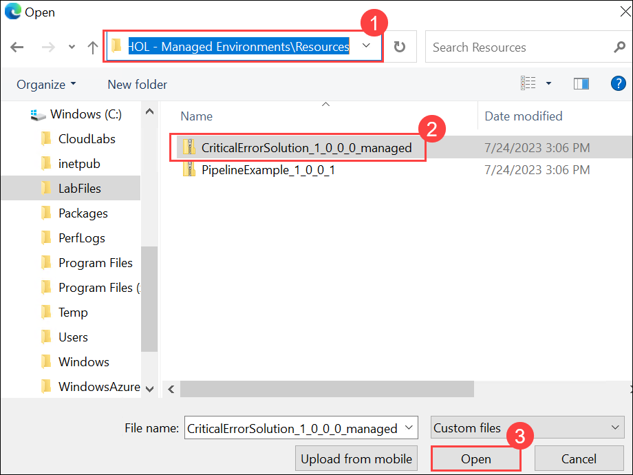

1. Select **Next**.

   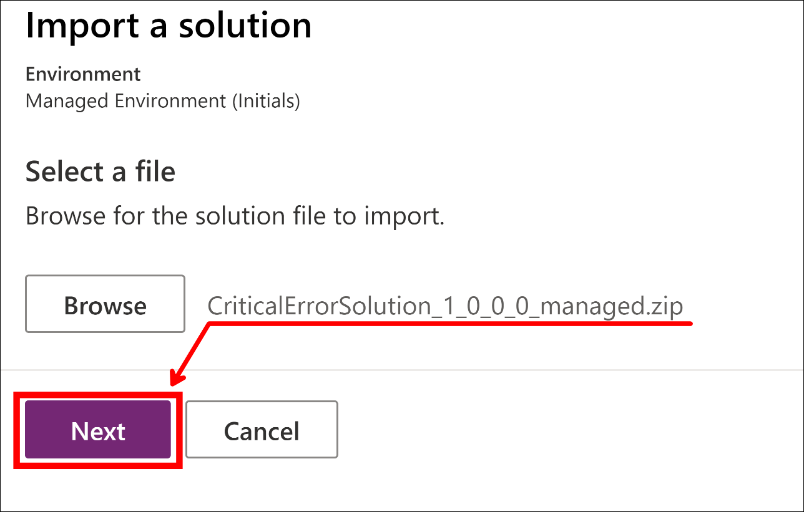

1. Review the details and select **Import**.

   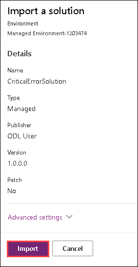

1. Once the solution is imported, a warning notification will appear at the top of the page informing you of the issues that the solution contains.

    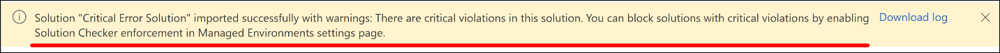

1. Do not navigate away from this page.

1. We’ll look at the difference between the Warn and Block options.

1. Open a new tab and navigate back to the **Power Platform Admin Center**.

1. Select **Environments**, then select the circle icon next to **Managed Environment-<inject key="Deployment ID" enableCopy="false" />**.

   

1. Select **Edit Managed Environments** from the ribbon at the top of the page.

   

1. Change the **Solution checker** slider to **Block (1)**, then select **Save (2)**.

    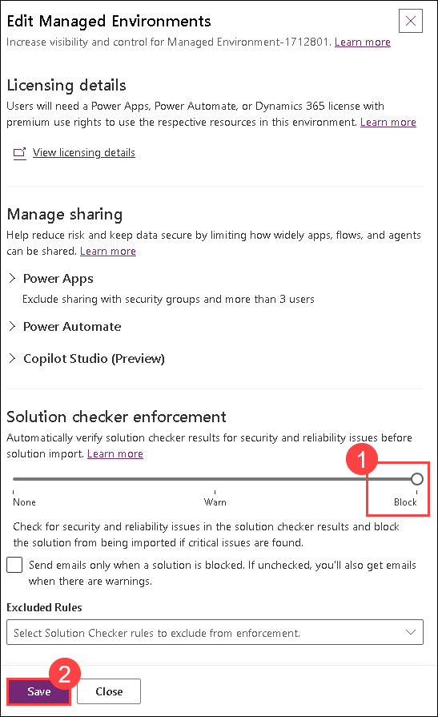

1. Navigate back to the Power Apps solutions page.

    a. You will need to delete the imported solution from the environment to ensure the solution checker is working correctly.

1. Select the three dots next to our imported solution, **Critical Error Solution** and select **Delete**.
 
    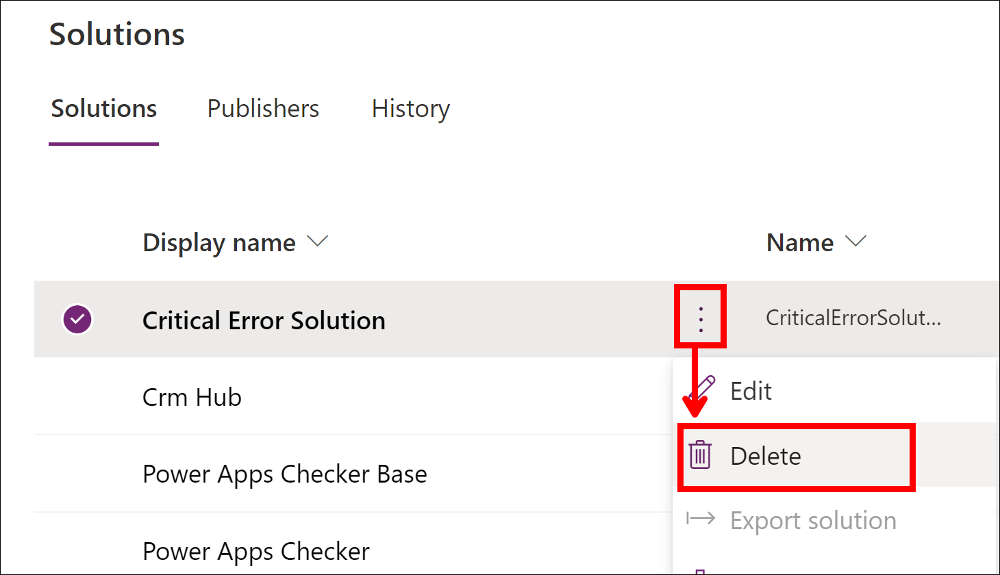

1. Select **Delete** again. Since this is a managed app, you will not need to delete the app, deleting the solution will do that for you.

    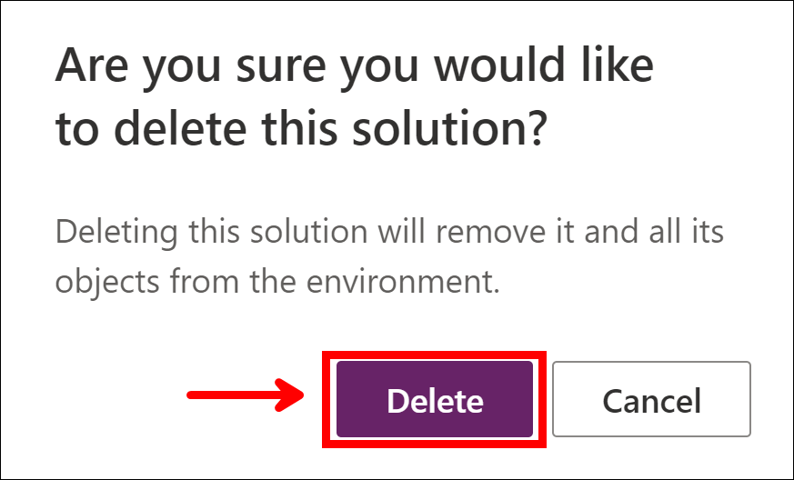

1. Wait for the process to complete, then re-import the solution file with steps 4 - 8.

1. You should receive an error notification at the top of the page.

    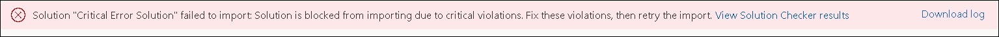

### Feature 2: Data Policies

A managed environment allows administrators to add additional data policies in place on a specific environment, rather than on the entire tenant being used.

1. Navigate back to the **Power Platform Admin Center** (https://aka.ms/ppac).

1. Select **Environments (1)**, then select the circle icon next to **Managed Environment-<inject key="Deployment ID" enableCopy="false" /> (2)**.

   

1. Select **Edit Managed Environments**.

   

1. Under **Data policies**, select the link to navigate to the current data policies applied to the managed environment. Here is where you will see any data policies applied to the 
   environment, including any tenant-wide policies.

   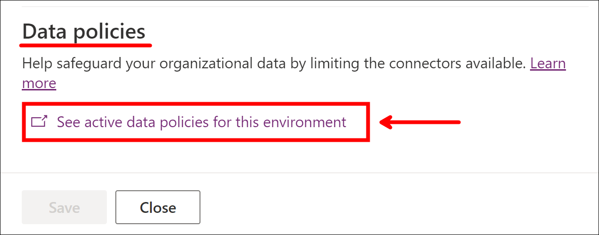

   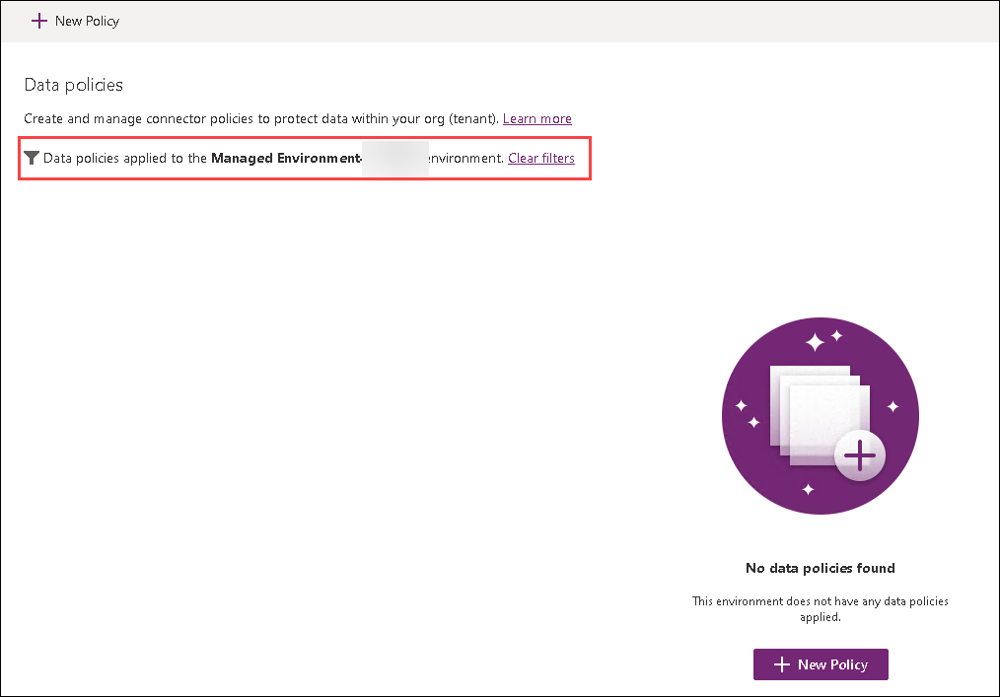

1. (Optional) Since we have not created any nor have any data policies which are applied to the entire tenant, this page will prompt you to create a new data policy. Feel free to create 
   a policy named DLP 1, which blocks the SQL server connector with a scope of all environments. The policy will then appear on the filtered view.

### Feature 3: Usage Insights

Usage insights provide insights about your managed environments via a weekly digest provided to administrators. This includes analytics of the top apps in the managed environments, the 
most impactful makers, and inactive resources which can be cleaned up safely. For this to operate, tenant-level analytics must be enabled, which was enabled in a previous tenant for this 
module.

>**Note:** You will not receive a weekly digest in this course, as the digest is delivered at the end of the business week. The images below are examples of the digest.

### Feature 4: Maker Welcome

The maker welcome content will replace the default popup that appears when makers sign into Power Apps and can provide them with helpful information on getting started, and any necessary 
information for the makers associated with the environment.

1. Navigate back to the **Power Platform Admin Center.**

1. Select **Environments**, then select the circle icon next to **Managed Environment-<inject key="Deployment ID" enableCopy="false" />**.

   

1. Select **Edit Managed Environments**.

   

1. Under **Maker welcome content**, select **See Preview**.

   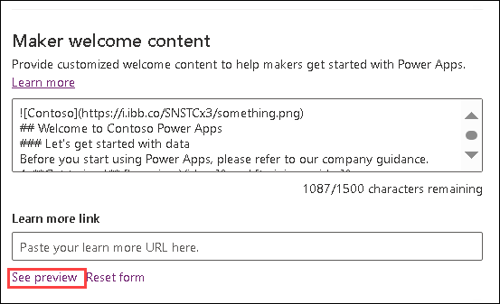

1. This will create an overlay on your screen of the content in the text box of the setting.

   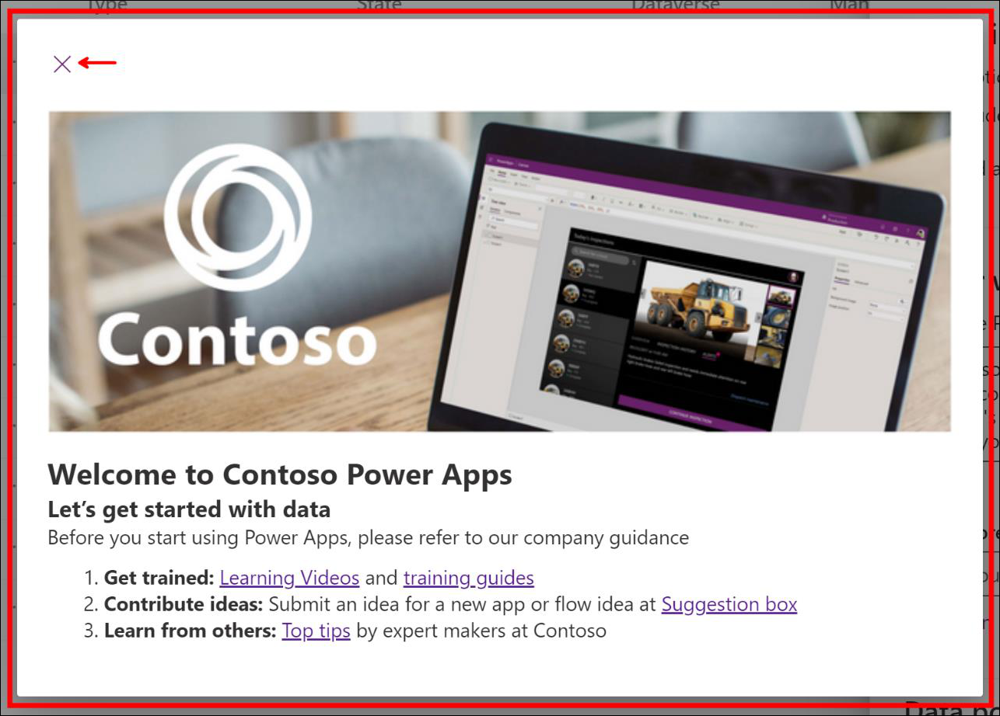

1. (Optional) Modify the content of the textbox with Markdown or with Plain text and preview again to review the results.

### Feature 5: Limiting Sharing

Share Limiting can prevent makers from sharing **Canvas apps** to everyone in the tenant, other security groups or to a certain amount of individuals. For Dataverse for Teams Environments 
are not impacted by sharing rules when sharing to a team bound to the environment, however, the sharing rules are enforced when a user attempts to share the app with individuals or groups 
in a team that is not bound to the environment.

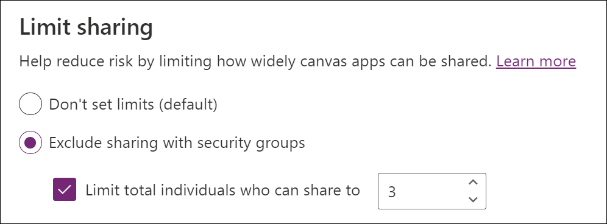

**Important:** After being enabled, the sharing rules may not be enforced for up to an hour afterwards.

1. Navigate to **Power Apps**.

1. Ensure you’re in the correct environment **Managed Environment-<inject key="Deployment ID" enableCopy="false" />** by checking the Environment Selector at the top right.

   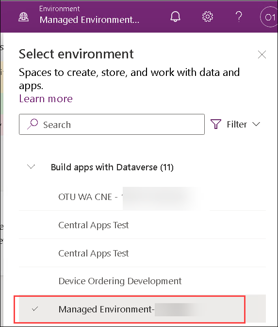

1. Select **Apps (1)**, then **+ New app (2)** > **Start with a page design (3)**.

   

1. Click on **+** on blank canvas app. Make sure **Tablet** is selected.

   

1. Once the app loads, select **+ (1)** on the view window and select **Rectangle (2)**.

    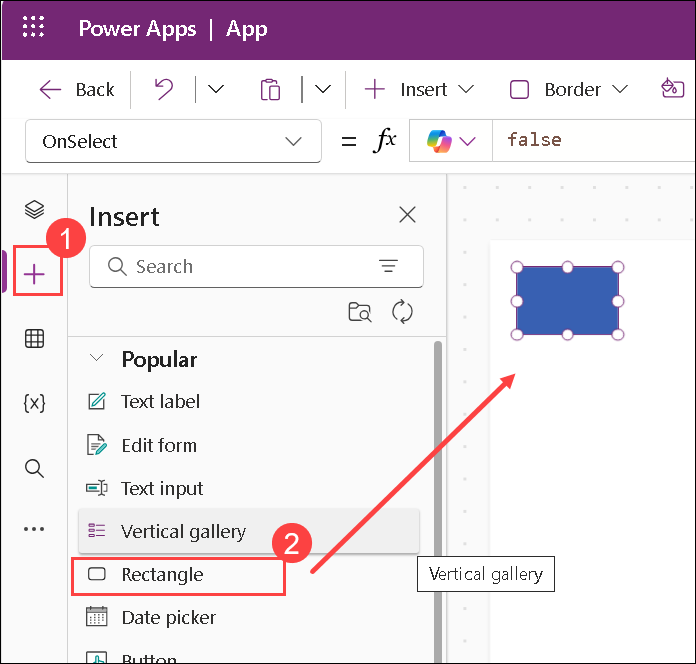

1. Enter the App name as **Play with Sharing**, set the format to **Tablet**, and then select **Create**.

   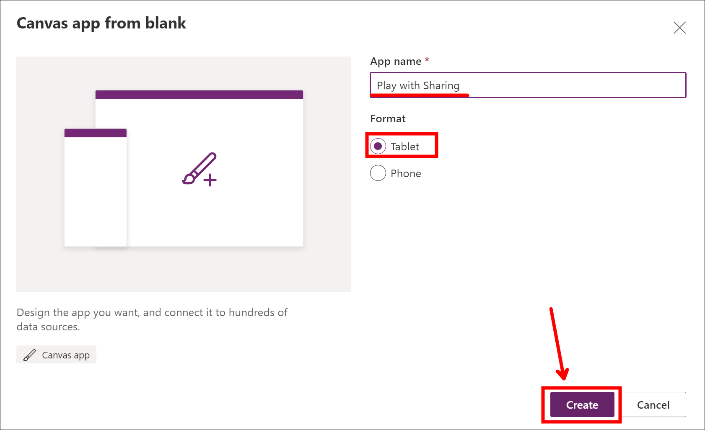

1. Select **Publish** right next to it.

   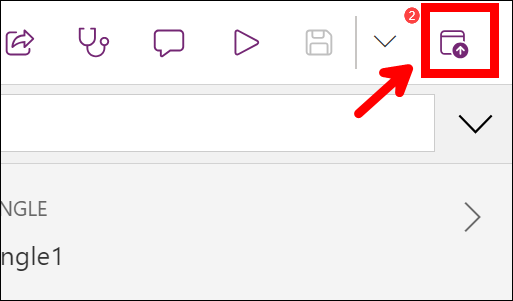

1. Select **Share**. This will open a new tab where you can share this app with other users.

   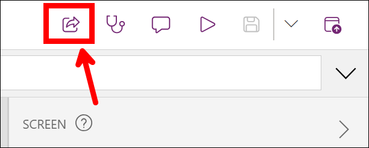

1. Search **Lab User01** and choose a user.

   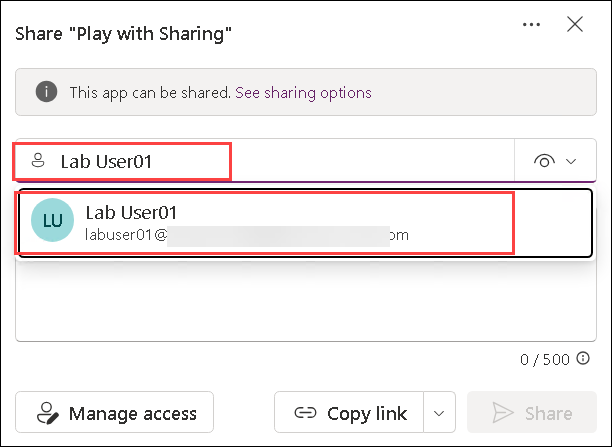

1. Repeat this process for **Lab User02**, **Lab User03** until you have three users to add and select Share.

    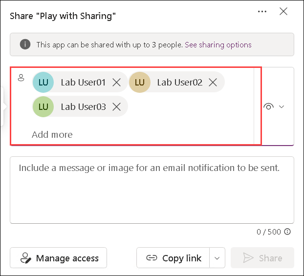

1. Click on **Manage Access**.

    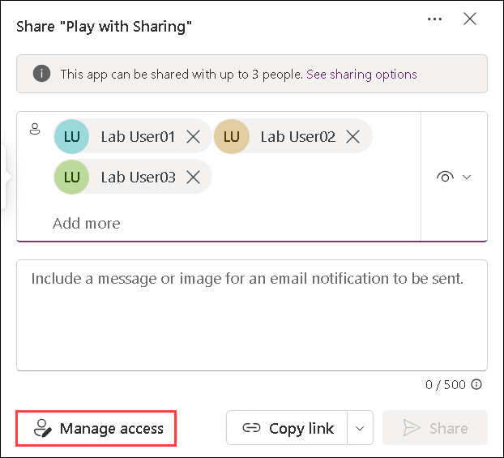

1. Navigate to **Pending invites (1)**, select all the three users **(2)** and the click on **Share (3)**.

    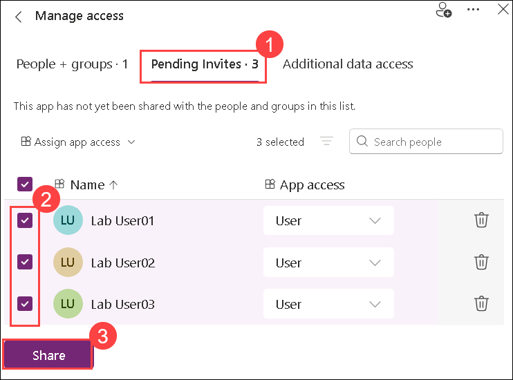

1. A banner will appear at the top of the panel, which will show the sharing rules are enabled, and being enforced. This is because the owner is counted with the number of individuals 
    the app can be shared with.

   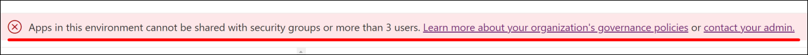

1. Remove a user from the chosen users.

    

1. Then select **Share**.    

    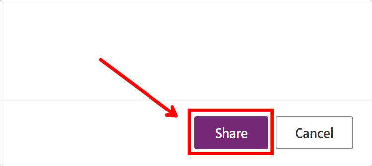

12. Once complete, a banner should appear notifying you of the success.

    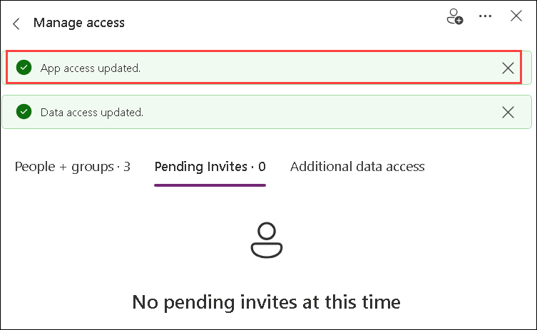

### Exercise 2: Power Platform Pipelines

### Scenario

Another feature of a managed environment is the ability to utilize the in-platform pipelines to democratize application lifecycle management (ALM) by bringing ALM automation  
continuous integration and continuous delivery (CI/CD) capabilities to the service. Included with these is the ability to view out-of-the-box analytics within a central location and 
Power BI reports. Pipelines can deploy solutions, connections, connection references, and environment variables to environments of the same region as the host environment.

1. Navigate to the **Power Platform admin center**.
  
1. Clik on **Environmnent (1)** then select **Managed Environment-<inject key="Deployment ID" enableCopy="false" />** to open a detailed view for the environment.

    

1. In the **Details** pane, select **Edit**.

    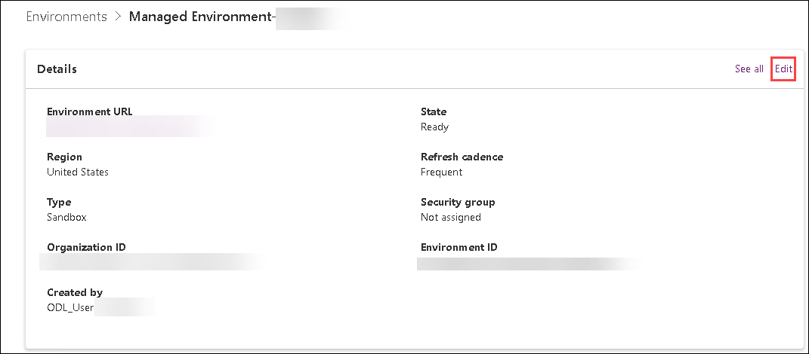
  
1. Clear out the existing name and replace it with **Thrive Hr (Initials) - Host (1)** to remain in line with the naming convention of the other environments and select **Save (2)**.

    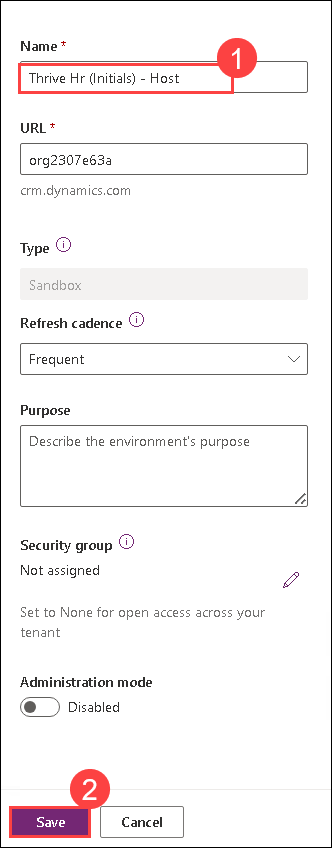

1. To finish up the setup, you will need to enable managed environments for each of the associated environments in the pipeline. Navigate back to the **Environments (1)** page with the breadcrumbs at the top of the left-side navigation. Select the **Thrive Hr - Dev (2)**.

    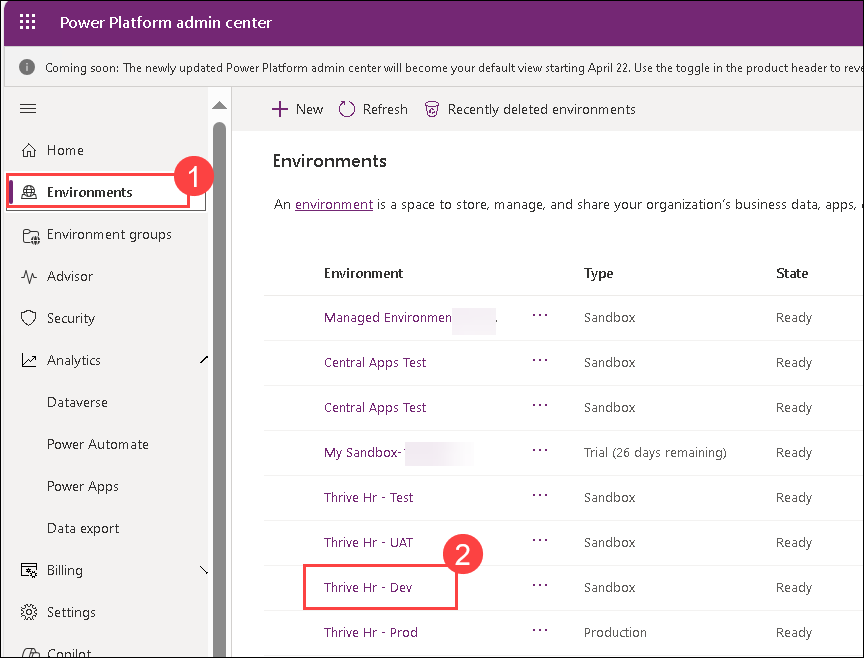

1. Select **Enable Managed Environment**.

    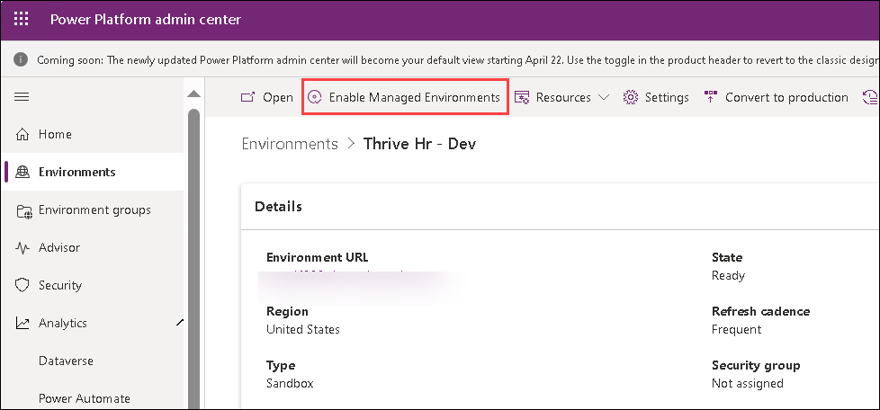

1. For this lab, we will not be configuring each of the associated environments for other features (e.g., Limit Sharing, Usage insights, etc.). Select **Enable** at the bottom of the panel

    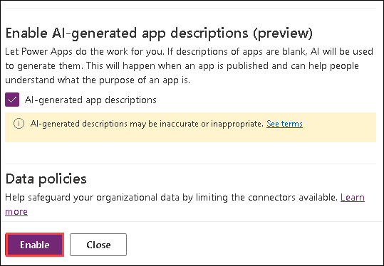

1. Repeat this process for **Thrive Hr - Prod** and **Thrive Hr - Test** environments in the setup .

1. Click on the **Environment (1)** then select **Thrive Hr- Host (2)**.

    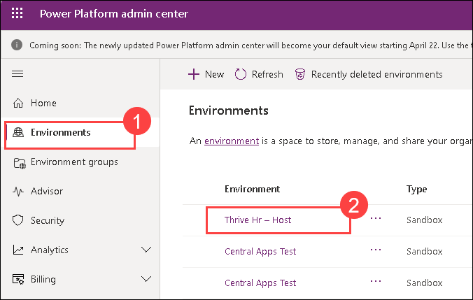

1. Now, you need to install the pipelines app onto the host environment. In the Resources Panel, select **Dynamics 365 apps**. A list of apps currently installed for the environment 
    will appear.
  
    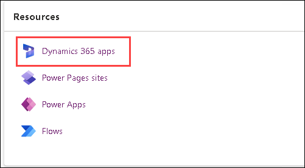

1. Select **Install app** from the ribbon at the top.

     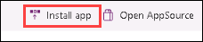

1. Scroll down to locate **Power Platform Pipelines (1)** and select the name, then click on **Next (2)**.

    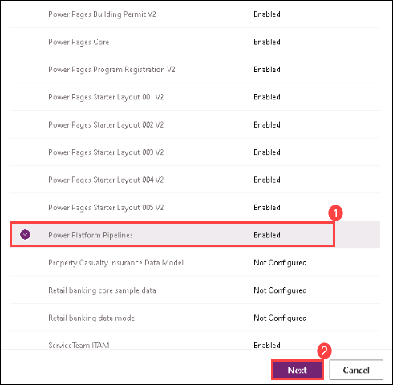

1. Select the **Checkbox (1)** to agree to the Terms of Service, then select **Install (2)**.

    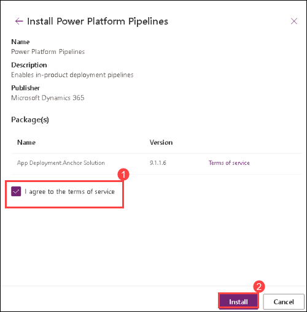

1. Confirm that the app is being installed onto the environment by checking that the **Status** reads as **Installing**.

    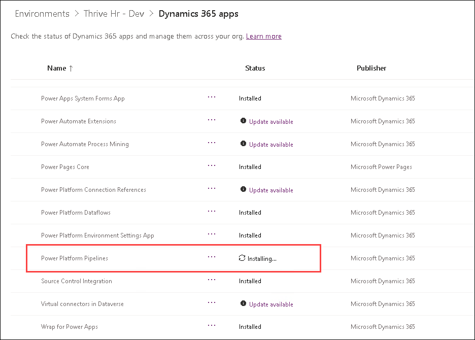

   >**Note**: Wait until the Installation is complete, it may take around 20 - 25 mins. Then only you can see the App in Next task.

1. Do not navigate away from this page.

### Task 1: Configure a deployment pipeline

#### 1A: Add the environments to the database.

1. While waiting for the app to install, you'll need to gather the environment IDs of all development and target environments that will be linked to the pipelines.

1. To do this, navigate back to the **Environments (1)** page of the Power Platform Admin site from the left-side navigation. Select the **... (2)** to the right of to **Thrive Hr - Dev**, then select **Detailed View (3)** to get the environment information.

   

1. Locate the **Environment ID** in the details pane and copy it to a notepad for later.

   

1. Repeat this process with **Thrive Hr – Test** and **Thrive Hr – Prod**, copying the IDs to the same notepad.

1. Navigate to **Power Apps** and set the environment to the **Thrive Hr– Host** environment.

   

1. Navigate to **Apps (1)** and select **Deployment Pipeline Configuration (2)**, then select **Play (3)** from the ribbon at the top.

   

    >**Note**: App will not be available until the **Power Platform Pipelines** installation complete in previous step.

1. Select **Environments (1)** on the left pane, and then click on **+ New** symbol.

   

1. You’ll need to add the **Dev, Test**, and **Prod** environments as our deployment environments to create the environment records in Dataverse. Add the following records and then select **Save (4)**

   - Name: **Thrive Hr - Dev (1)**

   - Environment Type: **Development Environment (2)**

   - Environment ID: Paste the **Environment ID (3)** you copied from earlier here.

     

1. **Refresh (1)** the form, then verify **Validation Status** equals **Success (2)**.

    

1. Select **Save and Close**.

    

1. Repeat steps `7-10` for **Thrive Hr - Test** and **Thrive Hr - Prod**, setting the type as **Target Environment** respectively.

1. You should have **three** environments listed now.

    

#### 1B. Create a pipeline.

1. Select **Pipelines (1)** on the left navigation pane, and then select **+ New (2)** to create a new deployment pipeline.

   

1. Set the **Name** to be **Thrive Hr Standard Deployment Pipeline (1)** and select **Save (2)** to show the rest of the content available..

   

1. Now we need to add the environments we've created to the pipeline. Scroll down, in the **Linked Developments (1)** section, click on the **elipses(...) (2)** and then elect **Add Existing Deployment Environment (3)**.

   

1. Select the **Thrive HR - Dev (1)** to add the environments to the list and clcik on **Add (2)**.

   

1. Locate the **Deployment Stages (Deployment Pipeline)** section, select **+ New Deployment Stage**.

   

1. **On the New Deployment Stage** section provide the following details and then select **Save (4)**.

   - Name: **Deploy to Test (1)**

   - Description: Enter **Deploy the completed development content to the Test phase (2)**

   - Since this is the first stage of our deployment, the **Previous Deployment Stage** field will be left blank for this one

   - **Target Development Environment ID**: Enter **Thrive Hr - Test** and then **Thrive Hr - Test (3)**

   - Leave the pre-deployment condition unselected. To learn more about pre-deployment conditions,
    follow this link

     

1. Select **+ New**.

   

1. Again **On the New Deployment Stage** section provide the following details and then select **Save Aand close (6)**.

   - Name: **Deploy to Prod (1)**

   - Description: Enter **Deploy the completed development content to the Production phase (2)**

   - Deployement pipeline: Select **Thrive Hr Standard deployment pipeline (3)**

   - Previous Deployment Stage: **Deploy to Test (4)**

   - Target Development Environment ID: **Thrive Hr - Prod (5)**

        

1. Do not navigate away from this page.

### Task 2: Run the pipeline

1. Navigate to **Power Apps** in a new tab.

1. Ensure to select **Thrive HR - Dev** environment at the top right.

   

1. Select **Solutions (1)** from the left-side navigation, then select **Import Solution (2)** from the ribbon at the top.

   

1. Select **Browse**.

   

1. Navigate to `C:\LabFiles\PPAdminAttendee%20(1)\PPAdminAttendee\M04 - HOL - Managed Environments\Resources` **(1)**, select  **PipelineExample_1_0_0_1.zip (2)** and the click on **Open (3)**.

   

1. Select **Next**.

   

1. Review the details and select **Import**. This is the solution we will be deploying through our pipeline. Any solutions sent through a pipeline must be unmanaged.

   

1. Wait for the solution to get imported, once the solution has been imported, navigate to **Solutions (1)** and then select **Pipeline Example (2) (2)**.

   

1. Click on the three horizontal line from the top left corner **(1)** and the select **Pipelines (2)** from the left side navigation. From here we can view the current deployment stage, and what stage we will be deploying to next.

   

1. Select **Deploy here**.

    

1. This is where you can schedule deployments or deploy immediately. Set the deployment schedule to **Now (1)** and select **Next (2)**.

    

1. Add any appropriate deployment notes and select **Deploy**.

    

1. The solution is now being processed, validated, and deployed to the **Thrive Hr - Test** environment.

    

1. Once the deployment is complete, the option to deploy to production appears. Select **Deploy** **here** for the **Deploy to Prod** stage.

    

1. This time, we'll schedule the deployment. To do so, select **Later (1)** from the radial menu, set the date to todays date **(2)** and set the deployment time closest to your current time **(3)** (ex. Your current time is 4:53 PM, select 5:00  PM. then select **Next (4)**.

    

1. Review any details and optionally add deployment notes, then select **Deploy**.

    

1. If needed, administrators can change the time of or cancel a deployment from this screen by selecting the **Cancel Deployment** button, or by selecting the **Run History** tab and selecting the **three dots** next to the Start time. From here, you can also view the run information, such as any notes or comments.

    

    

1. Select the **Thrive Hr– Host** environment.

   

1. Select **Solutions (1)** and then select **Deployment Pipeline Configuration App (2)**.   

   

1. Administrations can also make changes to the run record from the Deployment Pipeline Configuration app, such as altering the starting time and deployment notes.

1. Select **Run history view**.

   

1. Select the scheduled deployment **(1)** and select **Edit (2)** at the top right.

    

1. Locate the **Scheduled Time** and select the clock next to the selected time.

    

1. Select the new time.

    

1. Then select **Save and Close**.    

    

   > **Congratulations** on completing the task! Now, it's time to validate it. Here are the steps:
   - Hit the Validate button for the corresponding task.
   - If you receive a success message, you can proceed to the next task.
   - If not, carefully read the error message and retry the step, following the instructions in the lab guide.
   - If you need any assistance, please contact us at cloudlabs-support@spektrasystems.com. We are available 24/7 to help you out.
 
   <validation step="2cafbfde-046f-4e7f-b645-7543771cb755" />     

### Review

In this lab, you have accomplished the following:

- Exercise 1 - Managed Environments
- Exercise 2 – Power Platform Pipelines

### You have successfully completed this lab.
