# Admin in a day

# M05A-HOL-Power Apps in Teams

### Estimated Duration: 45 minutes

## Lab Scenario

In this hands-on lab, you will create a new team in Microsoft Teams and build a Power App within it. You will also learn how to configure team ownership and publish the app for collaboration within the team. In this hands-on lab, you will create a Power App in a team and see how to publish it to your team. You will also share with colleagues outside your team to see how broad distribution apps work.

## Lab Objectives

In this lab, you will complete the following exercises:

- Exercise 1 - Teams setup
- Exercise 2 - Create your first app 
- Exercise 3 - Share your app

## Exercise 1 : Teams setup

### Task 1: Create a team

1. Navigate to **Microsoft Teams**, using the following link https://teams.microsoft.com/v2/. 

1. If prompted, log in with the lab credentials.

1. Click on the **Chat (1)**, select the dropdown **(2)** and then click on **New team (3)**.

   

1. On the **Create a team** page, provide the following details and then click on **Create (4)**:

   - Team name: Enter **Central IT (1)**
   - Team type: **Private (2)**
   - Name the first channel: Enter **Central IT channel (3)**

     

1. On the **Add members to Cental IT**, search for **lab user (1)** and select **Lab User01 (2)**.

   

1. Search for **lab user** again and select **Lab User02**.

1. Do the same for the rest of the users up to **Lab User10** and then select **Add**. (You will have **Lab User01 - Lab User05** selected to be added to the Team).

1. Change all the users to have the role of **Owner (1)** to make them **co-owners** of the team and then click on **Create (2)**

   

### Task 2: Create an app

1. From the left navigation pane, click on **Apps (1)**, search for **Power Apps (2)** then select **Open (3)**.

   

1. Select **Open**.

   

1. Select **Start now** from the main card.

   

1. Select the **Central IT (2)** team and then select **Create (2)**.

   

1. Click on **Close**.

   

    >**Note**: As your creating the App for the first time t might take around 10-15 minutes to create please wait.

1. Please keep checking on the **Activity (1)** section, where you will get the notification once the App is ready then you can build the app **(2)**.

   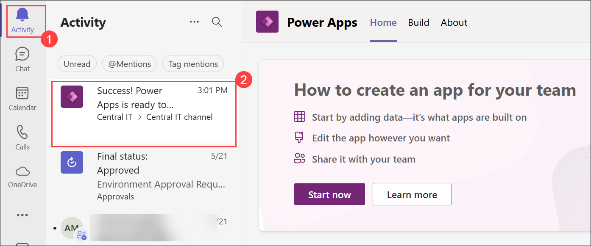

> **Congratulations** on completing the task! Now, it's time to validate it. Here are the steps:
 
- Hit the Validate button for the corresponding task. If you receive a success message, you can proceed to the next task. 
- If not, carefully read the error message and retry the step, following the instructions in the lab guide.
- If you need any assistance, please contact us at cloudlabs-support@spektrasystems.com. We are available 24/7 to help you out.

   <validation step="2d8c92b8-a1b7-4905-b5a4-5550f3c9c011" />

## Exercise 2: Create your first app

### Task 1: Add Power Apps and pin it

In this task, you will add the Power Apps app, and then pin it to your pinned apps.

1. Select the **ellipsis (...) (1)** from the navigation bar to the left of the screen then select **Power Apps (2)**.

   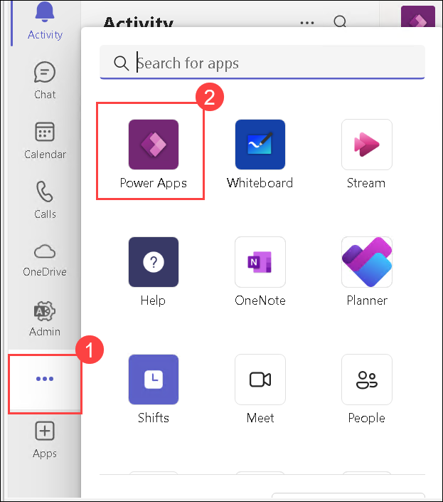

1. Within the navigation bar, right-click on the **Power Apps (1)** app and select **Pin (2)**.

   

1. Do not navigate away from this page.

### Task 2: Create an application and table

In this task, you will create an application, and a table, and add new columns to the table.

1. Select **Power Apps (1)** from the navigation bar, then select the **Home (2)** tab and choose **Start now (3)**.

   

1. Select the **Central IT (1)** team and then select **Create (2)**.

   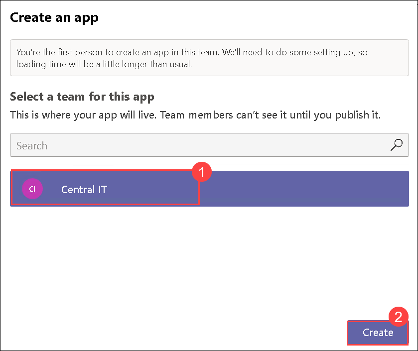

1. Enter **Special Request Lab 01 (1)** and select **Save (2)**. 

   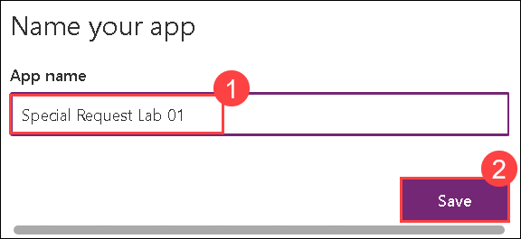

    >**Note**: You will be able to name the app only after the app is created that will take around 10-15 minutes as mentioned in the previous task.

1. Select **With data (1)**, and then select **+ Create new table (2)**.

   

1. On the **Create table** pane, select **Start with a blank table**.

   

1. Click on **Edit**.

   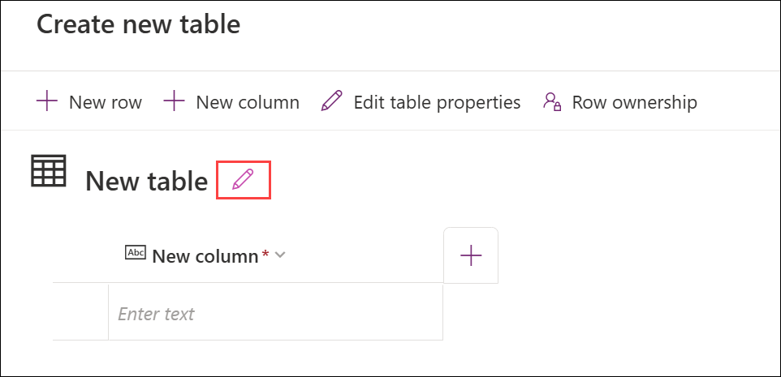

1. Enter **Lab 01 Request (1)** for the Table name, and choose **Save (2)**.

   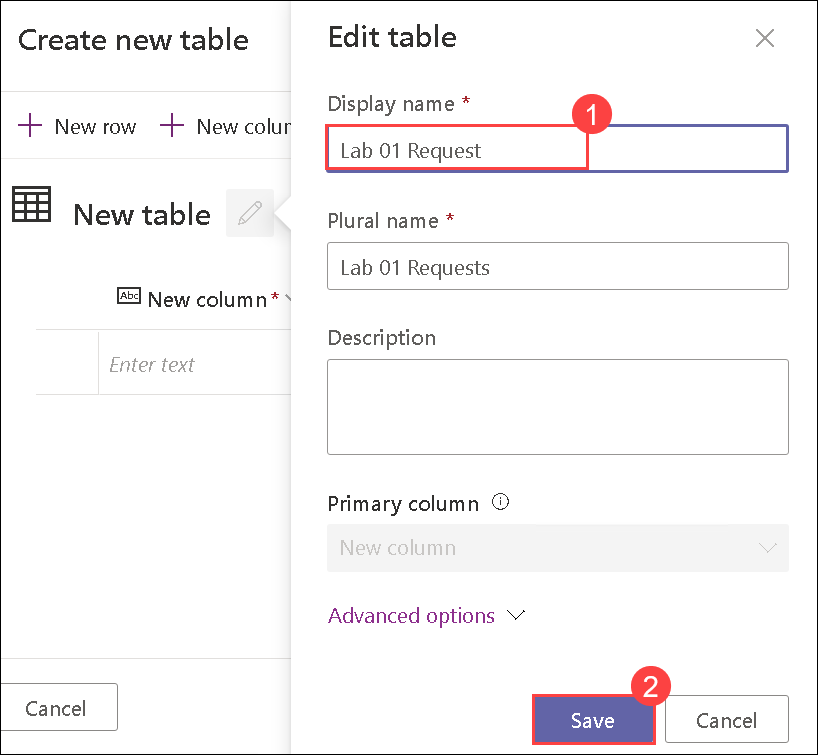

1. Select **+ New column**.

   

1. On the **New column** page, enter the followig details and then click on **Save (5)**.

   - Display name: Enter **Description (1)**
   - Data type: Select **Single line of text (2)** if not chosen already.
   - Format: **Text (3)**
   - Enable Required **(4)**

     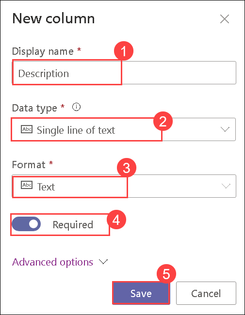

1. Select **+ New column** again.

1. On the **New column** page, enter the followig details and then click on **Save (5)**.

   - Display name: Enter **Requested date (1)**
   - Data type: Select **Date and time (2)** if not chosen already.
   - Format: **Date Only (3)**
   - Enable Required **(4)**

     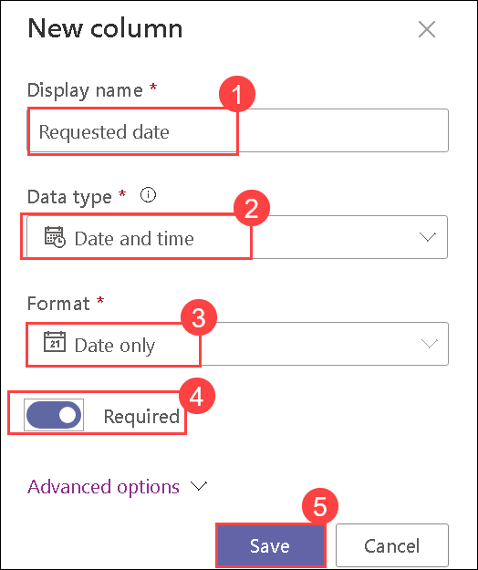

1. The table should now show three columns. 

    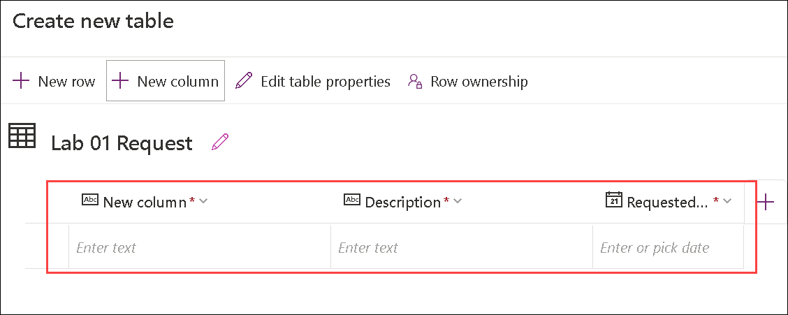

1. Select the first cell within the **Name** column, type **Ergonomic office chair**, enter a description within the **Description** cell and select today’s date for the **Requested date** cell.
 
    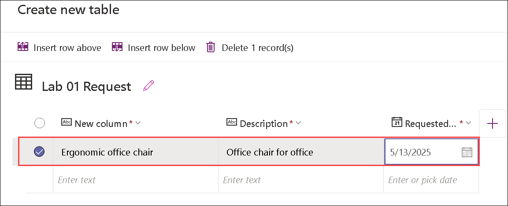

1. Add a few more request rows and select **Save and close**. You can use the following data to enter into the cells of the table:

     | Name                         | Description                                           | Date           |
     | ---------------------------- | ----------------------------------------------------- | -------------- |
     | Plotter Printer              | Facilities department needs a plotter printer         | (today's date) |
     | Security system              | The new A245 building doesn't have a security system  | (today's date) |
     | Fire suppression system test | Test the fire suppression system in buildings         | (today's date) |

     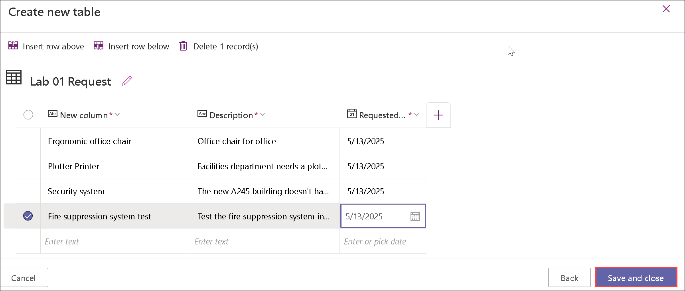

1. Select **With data (1)** and then choose **Lab 01 Requests (2)**.     

    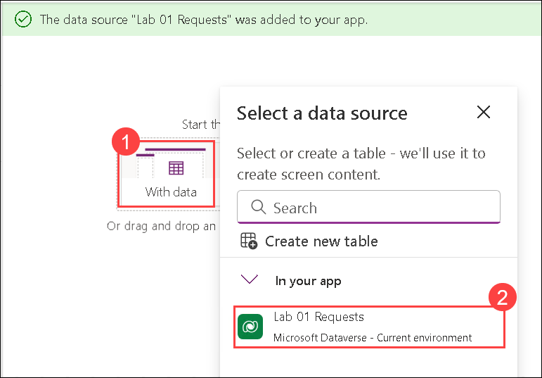

    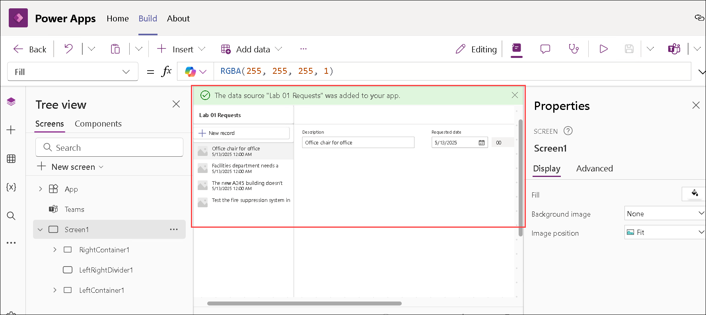    
    
     >**Note**: The app should now have a gallery and a form. Select **Save**, if Save is enabled otherwise no issues it will get saved by default and wait for the app to be saved.

      

1. Select **Preview**.

    

1. The app should start in a preview. Select **+ New record**.

    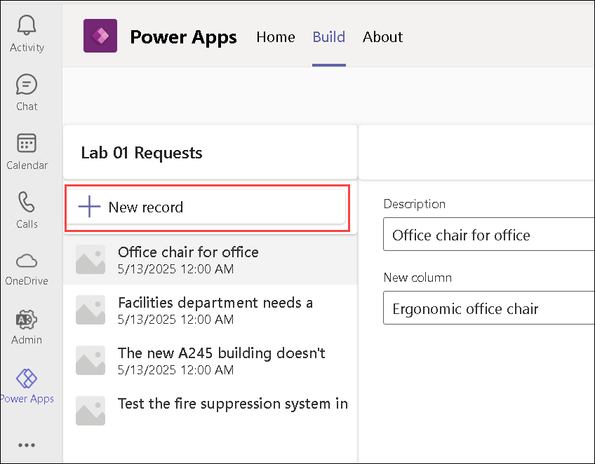 

1. Provide a Name, Description, and Requested data. Use the following data to fill in the fields for the new request:

     | New Column **(2)**                        | Description **(1)**                                                        | Requested Date **(3)** |
     | ---------------------------- | ------------------------------------------------------------------- | -------------- |
     | Covered outdoor work area    | Build a covered outdoor work area on the west side of building Az45 | (today's date) |

1. Select the **checkmark (4)** in the top right-hand corner to **Save** the record.

    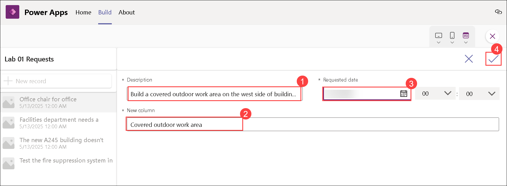

1. **Close** the preview.

    

1. Select **Publish to Teams**.

   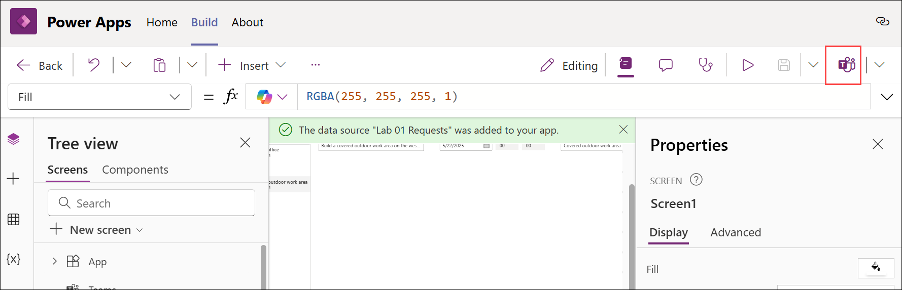

1. Review the information and select **Next**.

    

1. Select the **Plus sign (1)** next to the **General** channel to **Add app as a tab**. This will make it discoverable on the channel. Then, Select **Save and close (2)**.

    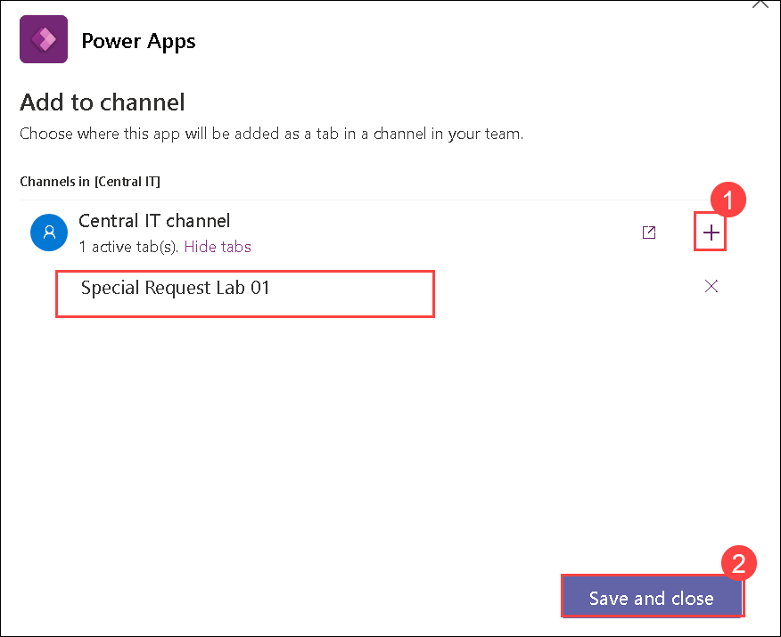

1. From the navigation bar, select **Chat (1)**, then click on **Central IT channel (2)**. Locate the app tab you added and select it **(3)**. The app should load.

   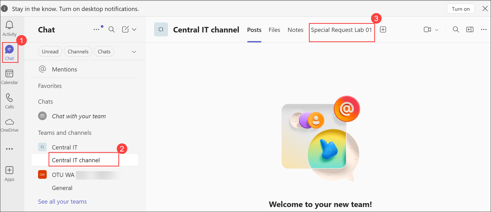

1. Ensure that you can see all of the data you entered into the app while it is in preview mode.

    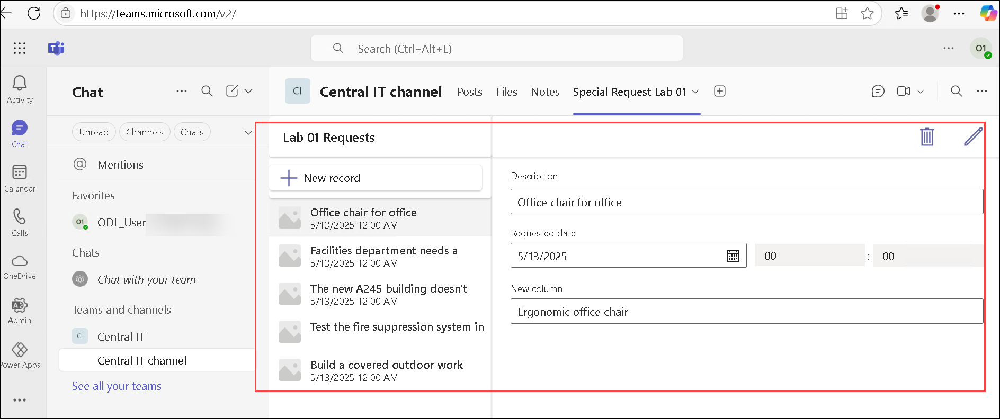

1. Do not navigate away from this page.

## Exercise 3: Share your app

### Task 1: Share the app

In this task, you will share the application and the table you created.

1. Select **Power Apps (1)** from the navigation bar to the left of the screen, then select **Build (2)**.

   

1. From here, choose the **Central IT (1)** team, and select **See all (2)**.

   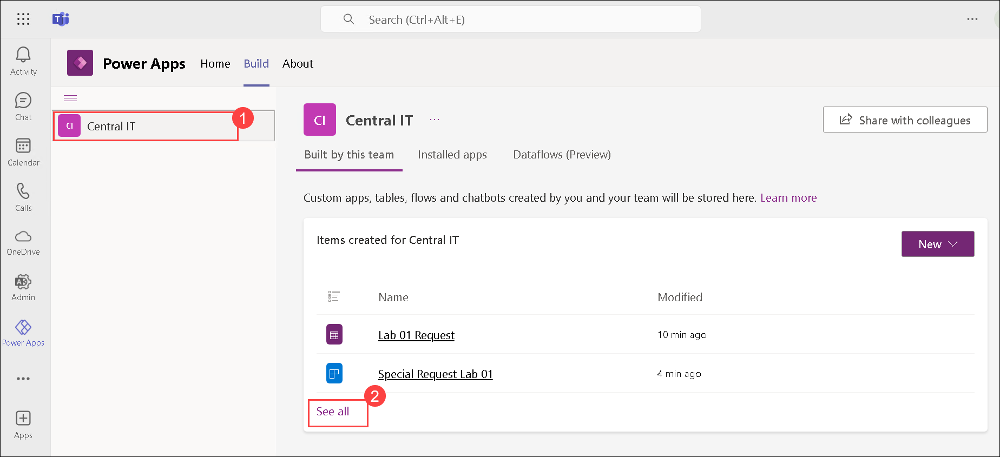

1. Select **Apps (1)** and then choose **Share with colleagues (2)**. This can share the app outside the team’s membership.

   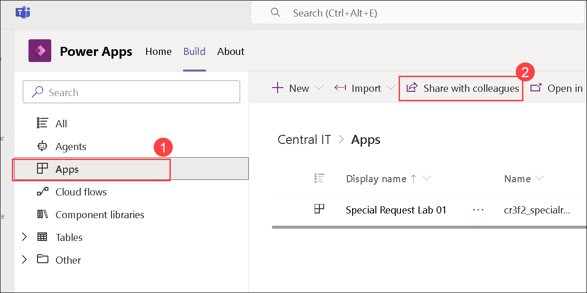

1. Within the search bar, search for **lab (1)** and select **Lab Admin Team (2)**.

   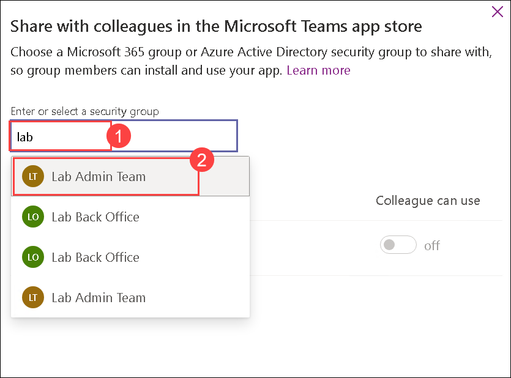

1. To make sure the **Lab Admin Team** team members can use the app, enable the **Colleague can use** toggle **(1)**  and then select **Save (2)**.

   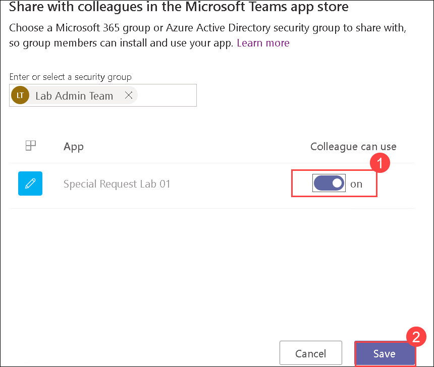

1. Select **Tables (1)**, select the **Lab 01 Request (2)** table that you have created. Click on the **elipses(...) (3)** and then choose **Manage permissions (4)**.

   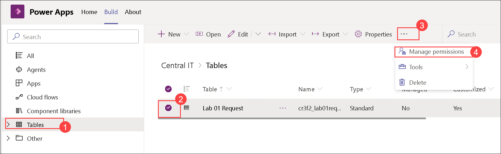

1. Select the **Lab Admin Team (1)** team, give the team members the **Collaborate (2)** permission, and select **Save (3)**. You have now completed sharing with the group.

   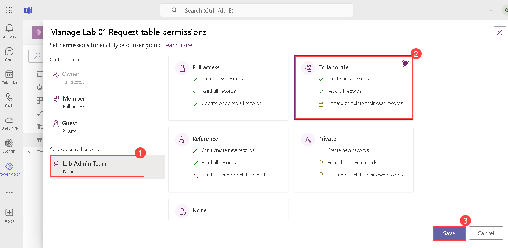 

### Review

In this lab, you have accomplished the following:

- Exercise 1 - Teams setup
- Exercise 2 - Create your first app 
- Exercise 3 - Share your app

### You have successfully completed this lab.   
