# Admin in a day

# M05A-HOL-Power Apps in Teams

## Table of Contents
   
   - Task 1: Create a team  

   - Task 2: Create an app

## Teams setup

### Task 1: Create a team

1. Navigate to Microsoft Teams and log in with the **admin account**.

2. Select **Join or create a team** at the bottom left of the screen.

   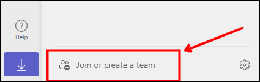

3. Select **Create a team**.

   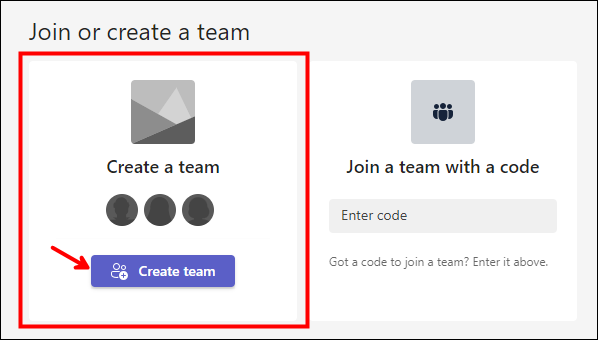

4. Select **From scratch**.

   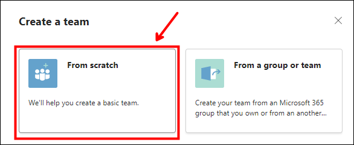

5. Select **Private**.

   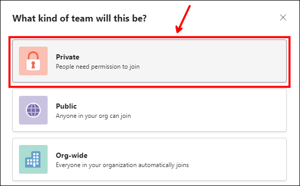

6. Enter **Central IT** for Team name and select **Create**.

   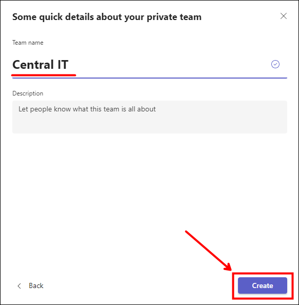

7. Search for **lab user** and select **Lab User01**.

   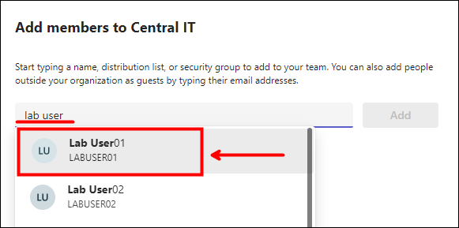

8. Search for **lab user** again and select **Lab User02**.

9. Do the same for the rest of the users up to **Lab User10** and then select **Add**. _(You will have Lab User__1 - 10 selected to be added to the Team)_

   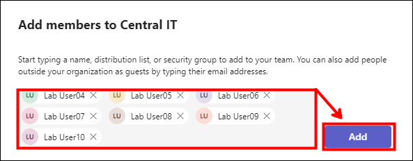

10. Change all the users to have the role of **Owner** to make them co **- owners** of the team and select **Close**.

    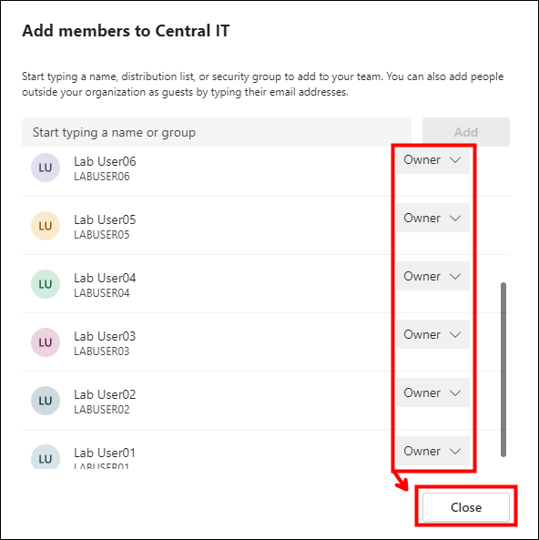

### Task 2: Create an app

1. Navigate to Microsoft Teams and log in with the **admin account**.

2. Select **∙∙∙** from the navigation bar to the left of the screen, and then select **Power Apps (1)** and select **Start now (2)** from the main card.

   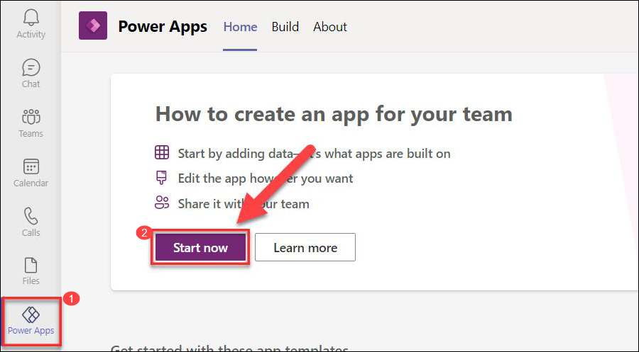

3. Select the **Central IT** team and then select **Create**.

   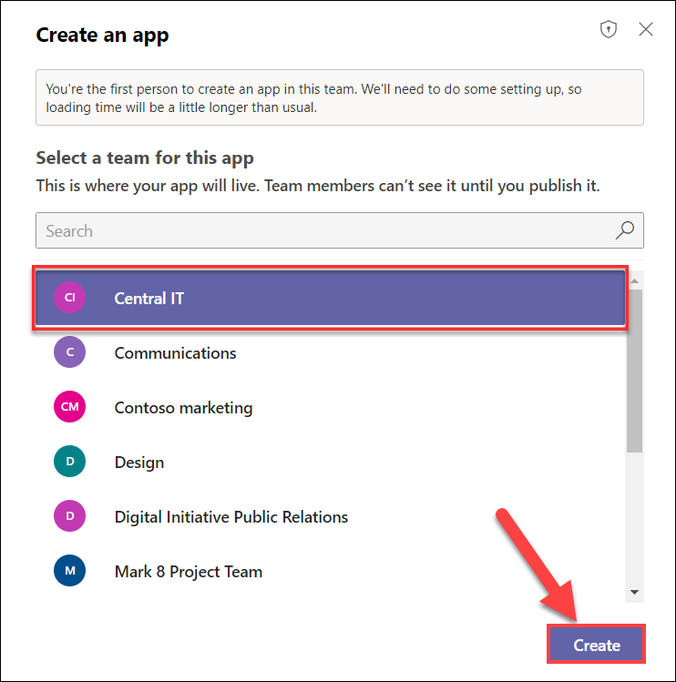

4. Enter **Accounts (1)** for App name, and then select **Save (2)**.

   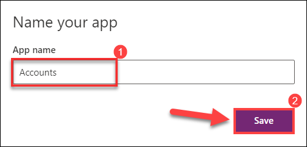
