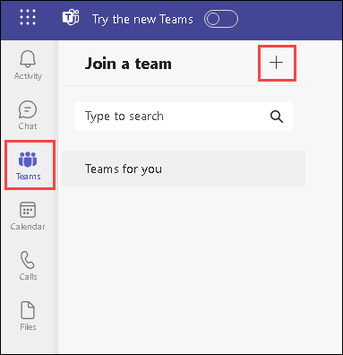
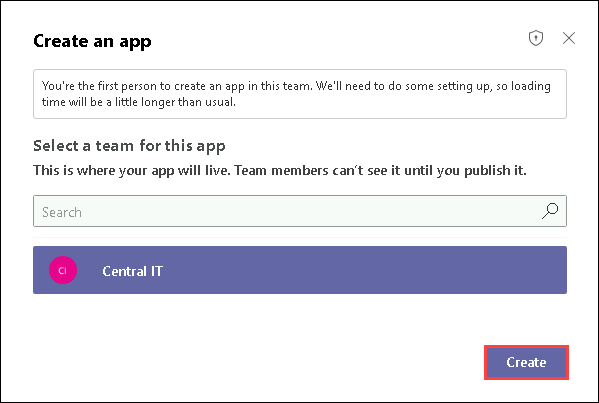

# Admin in a day

# M05A-HOL-Power Apps in Teams

## Table of Contents
   
   - Task 1: Create a team  

   - Task 2: Create an app

## Teams setup

### Task 1: Create a team

1. Navigate to Microsoft Teams and log in with the **admin account**.

2. Select **Teams** at the bottom left of the screen and click on **+** icon to create a team.

   

4. Select **From scratch**.

   

5. Select **Private**.

   

6. Enter **Central IT** for Team name and select **Create**.

   

7. Search for **lab user** and select **Lab User01**.

   

8. Search for **lab user** again and select **Lab User02**.

9. Do the same for the rest of the users up to **Lab User10** and then select **Add**. (You will have Lab User01 - 10 selected to be added to the Team)

   

10. Change all the users to have the role of **Owner** to make them **co-owners** of the team and select **Close**.

    

### Task 2: Create an app

1. Navigate to Microsoft Teams and log in with the **admin account**.

2. Select **∙∙∙** from the navigation bar to the left of the screen, and then select **Power Apps (1)** and select **Start now (2)** from the main card.

   

3. Select the **Central IT** team and then select **Create**.

   

4. Enter **Accounts (1)** for App name, and then select **Save (2)**.

   

   > **Congratulations** on completing the task! Now, it's time to validate it. Here are the steps:
   - Hit the Validate button for the corresponding task.
   - If you receive a success message, you can proceed to the next task.
   - If not, carefully read the error message and retry the step, following the instructions in the lab guide.
   - If you need any assistance, please contact us at cloudlabs-support@spektrasystems.com. We are available 24/7 to help you out.
 
   <validation step="2d8c92b8-a1b7-4905-b5a4-5550f3c9c011" /> 