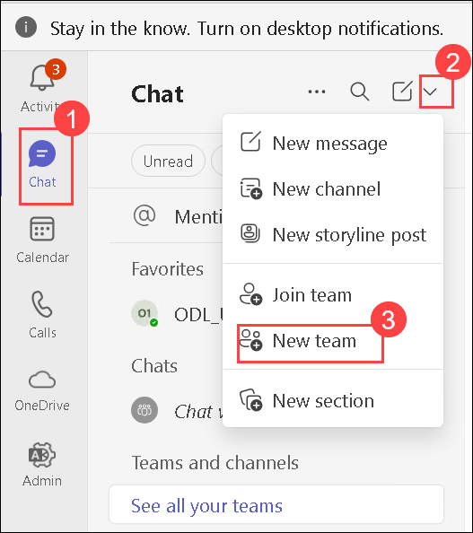
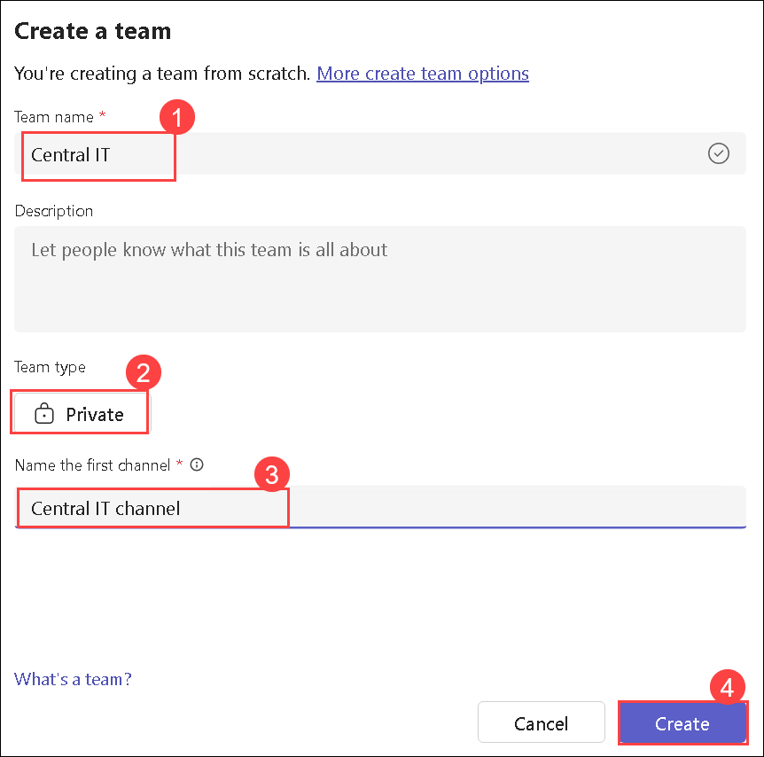
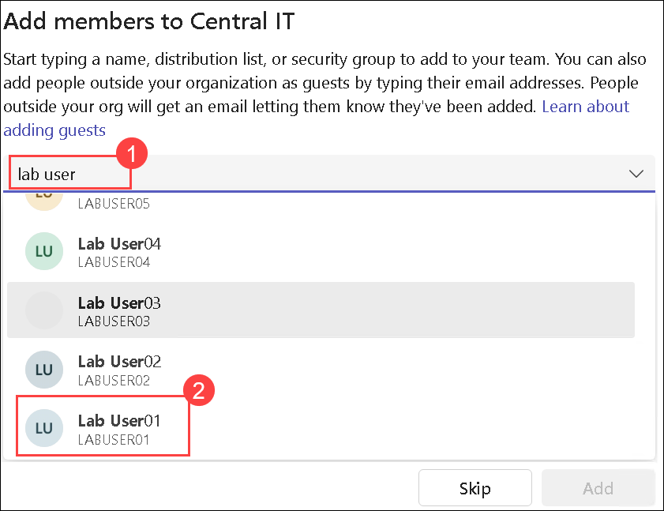
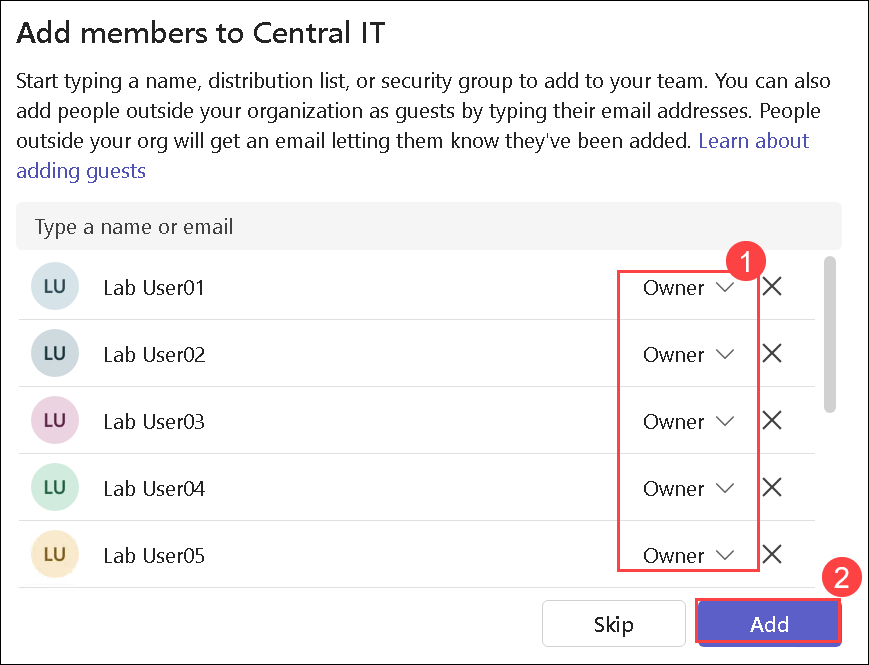
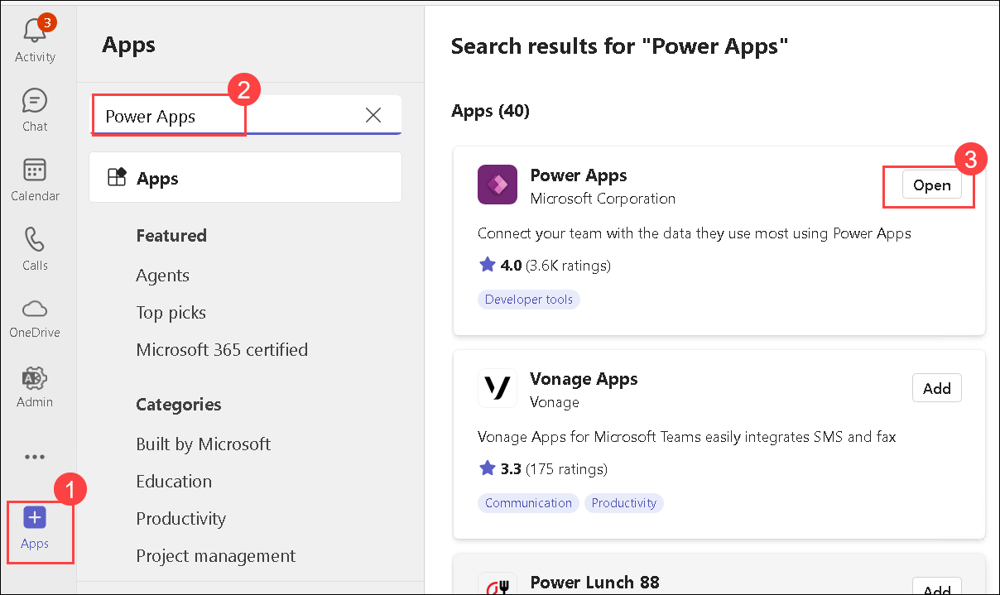
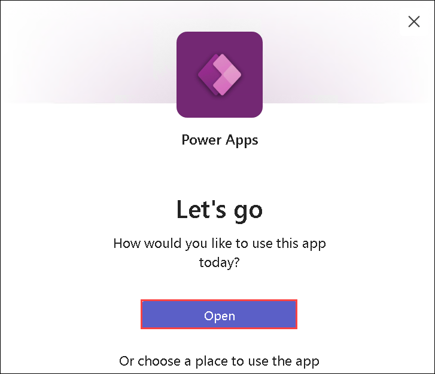
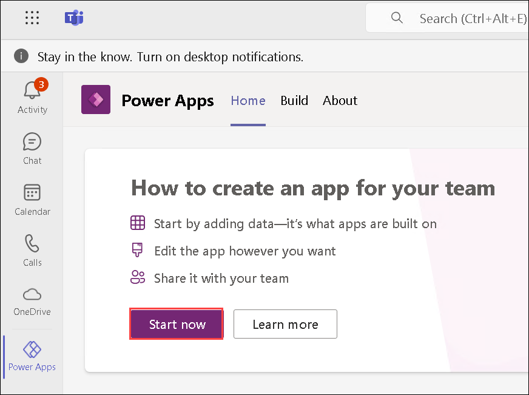
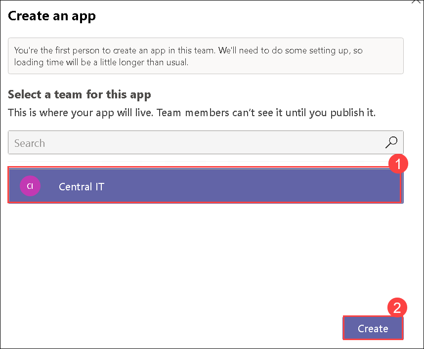
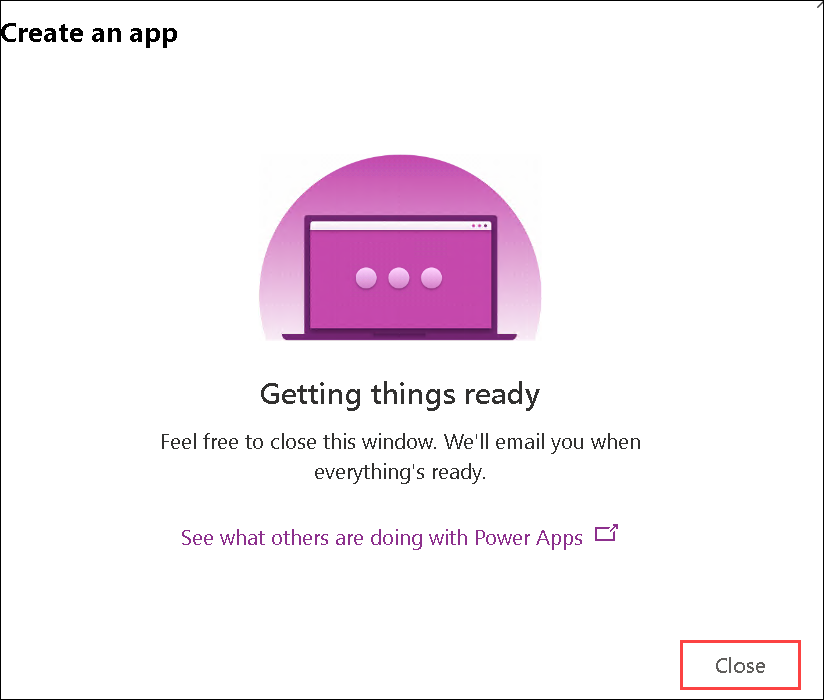
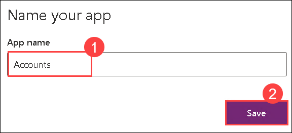

# Admin in a day

# M05A-HOL-Power Apps in Teams

## Table of Contents
   
   - Task 1: Create a team  

   - Task 2: Create an app

## Teams setup

### Task 1: Create a team

1. Navigate to **Microsoft Teams**, using the following link https://teams.microsoft.com/v2/. 

1. If prompted, log in with the lab credentials.

1. Click on the **Chat (1)**, select the dropdown **(2)** and then click on **New team (3)**.

   

1. On the **Create a team** page, provide the following details and then click on **Create (4)**:

   - Team name: Enter **Central IT (1)**
   - Team type: **Private (2)**
   - Name the first channel: Enter **Central IT channel (3)**

     

1. On the **Add members to Cental IT**, search for **lab user (1)** and select **Lab User01 (2)**.

   

1. Search for **lab user** again and select **Lab User02**.

1. Do the same for the rest of the users up to **Lab User10** and then select **Add**. (You will have **Lab User01 - 10** selected to be added to the Team).

1. Change all the users to have the role of **Owner (1)** to make them **co-owners** of the team and then click on **Create (2)**

   

### Task 2: Create an app

1. From the left navigation pane, click on **Apps (1)**, search for **Power Apps (2)** then select **Open (3)**.

   

1. Select **Open**.

   

1. Select **Start now** from the main card.

   

1. Select the **Central IT (2)** team and then select **Create (2)**.

   

1. Click on **Close**.

   

    >**Note**: It might take some time to create the App.

1. If promted, Enter **Accounts (1)** for App name, and then select **Save (2)**.

   

   > **Congratulations** on completing the task! Now, it's time to validate it. Here are the steps:
   - Hit the Validate button for the corresponding task.
   - If you receive a success message, you can proceed to the next task.
   - If not, carefully read the error message and retry the step, following the instructions in the lab guide.
   - If you need any assistance, please contact us at cloudlabs-support@spektrasystems.com. We are available 24/7 to help you out.
 
   <validation step="2d8c92b8-a1b7-4905-b5a4-5550f3c9c011" /> 

### You have successfully completed this lab.   