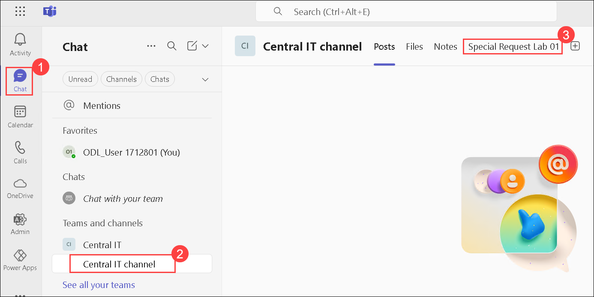

## Admin in a day

# M05B-HOL-Dataverse for Teams (Optional)

## Lab Scenario

In this hands-on lab, you will create a Power App in a team and see how to publish it to your team. You will also share with colleagues outside your team to see how broad distribution apps 
work.

## Lab Objectives

In this lab, you will complete the following exercises:

- Exercise 1 - Create your first app
- Exercise 2 – Share your app
- Exercise 3 - Explore the CoE Starter Kit
- Exercise 4 - Perform a risk assessment of overshared resources
- Exercise 5 - How much is a connector used in your

### Lab Test Environment

This hands-on lab is designed to be completed in an environment setup for multiple students to complete the Admin in a day series of hands-on labs.

You will be assigned one or more users to use to complete the tasks. Because this is a shared environment, some tasks that require a tenant Global Administrator or a Service Administrator 
will already be completed. Your account will only be an environment administrator.

## Exercise 1: Create your first app

### Task 1: Add Power Apps and pin it

In this task, you will add the Power Apps app, and then pin it to your pinned apps.

1. If not logged in yet, navigate to Microsoft Teams using the following link https://teams.microsoft.com/v2/ and log in with the lab credentials.

1. Select the **ellipsis (...) (1)** from the navigation bar to the left of the screen then select **Power Apps (2)**.

   

1. Within the navigation bar, right-click on the **Power Apps (1)** app and select **Pin (2)**.

   

1. Do not navigate away from this page.

### Task 2: Create an application and table

In this task, you will create an application, and a table, and add new columns to the table.

1. Select **Power Apps (1)** from the navigation bar, then select the **Home (2)** tab and choose **Start now (3)**.

   

1. Select the **Central IT (1)** team and then select **Create (2)**.

   

1. Enter **Special Request Lab 01 (1)** and select **Save (2)**. 

   

    >**Note**: If **Name your app** does not appear, please perform the steps again. Sometimes it might take some time.

1. Select **With data (1)**, and then select **+ Create new table (2)**.

   

1. On the **Create table** pane, select **Start with a blank table**.

   

1. Enter **Lab 01 Request (1)** for the Table name, and choose **Save (2)**.

   

1. Select **+ New column**.

   

1. On the **New column** page, enter the followig details and then click on **Save (5)**.

   - Display name: Enter **Description (1)**
   - Data type: Select **Single line of text (2)** if not chosen already.
   - Format: **Text (3)**
   - Enable Required **(4)**

     

1. Select **+ New column** again.

1. On the **New column** page, enter the followig details and then click on **Save (5)**.

   - Display name: Enter **Requested date (1)**
   - Data type: Select **Date and time (2)** if not chosen already.
   - Format: **Date Only (3)**
   - Enable Required **(4)**

     

1. The table should now show three columns. 

    

1. Select the first cell within the **Name** column, type **Ergonomic office chair**, enter a description within the **Description** cell and select today’s date for the **Requested date** cell.
 
    

1. Add a few more request rows and select **Save and close**. You can use the following data to enter into the cells of the table:

     | Name                         | Description                                           | Date           |
     | ---------------------------- | ----------------------------------------------------- | -------------- |
     | Plotter Printer              | Facilities department needs a plotter printer         | (today's date) |
     | Security system              | The new A245 building doesn't have a security system  | (today's date) |
     | Fire suppression system test | Test the fire suppression system in buildings         | (today's date) |

     

1. Select **With data (1)** and then choose **Lab 01 Requests (2)**.     

    

        
    
     >**Note**: The app should now have a gallery and a form. Select **Save**, if Save is enabled otherwise no issues it will get saved by default and wait for the app to be saved.

      

1. Select **Preview**.

    

1. The app should start in a preview. Select **+ New record**.

     

1. Provide a Name, Description, and Requested data. Use the following data to fill in the fields for the new request:

     | New Column **(2)**                        | Description **(2)**                                                        | Requested Date **(3)** |
     | ---------------------------- | ------------------------------------------------------------------- | -------------- |
     | Covered outdoor work area    | Build a covered outdoor work area on the west side of building Az45 | (today's date) |

1. Select the **checkmark (4)** in the top right-hand corner to **Save** the record.

    

1. **Close** the preview.

    

1. Select **Publish to Teams**.

    

1. Review the information and select **Next**.

    

1. Select the **Plus sign (1)** next to the **General** channel to **Add app as a tab**. This will make it discoverable on the channel. Then, Select **Save and close (2)**.

    

1. From the navigation bar, select **Chat (1)**, then click on **Central IT channel (2)**. Locate the app tab you added and select it **(3)**. The app should load.

    

1. Ensure that you can see all of the data you entered into the app while it is in preview mode.

    

1. Do not navigate away from this page.

## Exercise 2: Share your app

### Task 1: Share the app

In this task, you will share the application and the table you created.

1. Select **Power Apps (1)** from the navigation bar to the left of the screen, then select **Build (2)**.

   

1. From here, choose the **Central IT (1)** team, and select **See all (2)**.

   

1. Select **Apps (1)** and then choose **Share with colleagues (2)**. This can share the app outside the team’s membership.

   

1. Within the search bar, search for **lab (1)** and select **Lab Admin Team (2)**.

   

1. To make sure the **Lab Admin Team** team members can use the app, enable the **Colleague can use** toggle **(1)**  and then select **Save (2)**.

   

1. Select **Tables (1)**, select the **Lab 01 Request (2)** table that you have created. Click on the **elipses(...) (3)** and then choose **Manage permissions (4)**.

   

1. Select the **Lab Admin Team (1)** team, give the team members the **Collaborate (2)** permission, and select **Save (3)**. You have now completed sharing with the group.

    

## Exercise 3: Explore the CoE Starter Kit

### Scenario

In this exercise, you will explore some of the apps and analytics that are part of the Power Platform CoE Starter Kit. We have already installed and configured the starter kit for the 
tenant you are using for this lab. As part of configuring, we imported the solution, shared the apps, configured the flows that synchronize data and published the Power BI report. If you 
were doing this with your tenant, you would follow the instructions to complete these steps.

Now in this exercise, you will explore the following key components:

- Power Platform Admin View app
- Power BI Dashboard
- The business process that is used by the Developer Compliance process.

### Task 1: Explore the Power Platform Admin View app

1. Navigate to **Power Apps maker portal**.

2. Select the **Power Platform CoE** environment in the environment selector.

   

3. Select **Apps** from the left side navigation and you should see a list of available apps in this environment, select **Power Platform Admin View**.

   

4. When the app starts you will land on the Power Platform Dashboard page. This dashboard gives you a quick look at the most active makers, and environments.

   

5. Select **Power Apps** and you will see a list of all apps in all environments without having to visit each environment. The Flows navigation link does the same thing for Microsoft 
   Power Automate flows.

6. Select the **Device Ordering App** in the list to open the app details.

   

7. In the **Governance** tab you can see the Business Justification provided by the app maker using the Developer Compliance Center app. The bottom part is where you as an admin can 
   provide your risk assessment. You can also tag the app to show in the App Catalog and make it featured. You can customize the CoE entities to add additional fields here if needed.

   

8. Select **Environments** in the left navigation. This will show you a list of all the environments in your tenant and key metrics like several apps. To view all your environments, 
   similar to the image below, switch the view at the top to **Active Environments**.

   

9. Select the **User and Team Productivity** environment to open the detail form.

10. Review the data available.

11. Select the **Connectors** link from the left navigation. This shows all the connectors available.

    

12. In the upper right corner, search for **Microsoft Dataverse**.

    

13. In the search results, select the **Microsoft Dataverse** connector.

    

14. The **Used in** tab quickly shows you what apps are using this connector in all environments in your tenant.

15. Select **Users**, then **Makers** from the left navigation; this shows you all the people who have built apps in your company.

16. Select one of the Makers and explore the detail form.

### Task 2: Power BI Dashboard

#### Get the environment URL
You need the URL of the Power Platform environment where the CoE Starter Kit is installed. Power BI connects to Dataverse tables in that environment.

1. Go to the [Power Platform admin center](https://aka.ms/ppac).

2. Select Environments, then choose Power platform COE environment.

3. Right-click on the Environment URL and select Copy Link Address.

#### Configure the Production and Governance Power BI dashboard

1. Navigate to PowerBI using the following link https://app.powerbi.com/ in your browser.

1. If prompted, **Sign in** with your lab credentials.

    

1. Select **Next**.

    

1. If prompted, please solve the puzzle.    

1. Select **Continue**.

    

1. On the **Create your account** page, provide the following details and then click on **Get started (4)**.

   - Country: **Unites states (1)**
   - Job: **PowerPlatformEngineer(2)**
   - Phone number: Enter random 10 digits **(3)**

     

1. Click on **Get Started**.

    

1. Click on the Acoount manager icon **(1)** from the top right corner and then click on **Free trial (2)**.

    

1. Select **Activate**.

    

1. Select **Stay on current page**.

    

1. On the left side navigation select **Workspaces** and then click on **+ New workspace (2)**.

    

1. On the Create panel, provide a unique name like **CoE-LabAdmin<inject key="Deployment ID" enableCopy="false" /> (1)** and your lab admin user number and select **Apply (2)**.

   

1. Launch **Power BI Desktop** on your local computer from the desktop.

   

1. Close the popup window.

1. Click on **Sign in** from the top bar, sign-in with your lab admin account credentials.

1. Once signed in, click on **Open (1)**, then **Browse this device (2)**.

    

1. Navigate to Downloads folder in File Explorer> COE Starter Kit > Select Production_CoEDashboard_MMMYY.pbit **(1)**, and then **Open (2)**. Wait for sometime you will notice popup appears for org URL

    

1. Enter the URL of your environment instance. Include the https:// prefix for OrgUrl.

**Note:** Paste the Environment URL you copied earlier.

1. The report should load automatically once the refresh has been completed.

1. Follow the steps below to enable **map and filled map visuals**:

     a) Select **File** at the top right, then select **Options and Settings > Options**.
   
     
   
     b) Select **Security** from the left.
   
     c) Scroll down to the Map and Filled Map visuals section.
   
     d) Check the **Use Map and Filled Map visuals** checkbox.
   
     e) Select **OK** to close the Options dialog.

     

1. Review the **Introduction** page.

    

1. Select the **Overview – Power Apps** tab, notice it gives a good high-level look at our tenant activity. If you have multiple locations, it will quickly highlight which users are 
    more engaged with building apps. You can also quickly see which environments are most active. Additionally, items that are detailed as **(Blank)** indicate that there is no data to 
    reference in the table.

    

1. Review each page using the navigation at the bottom of the app and review the insights available.

1. Select the **Environments** page.

    

1. On the Environments page, use the date range picker and see how it affects the other data on the page. When you are done leave it set at the max date range.

    

1. Select the **Apps** tab from the navigation at the bottom of the screen.

    

1. On the Apps page notice the Creation Trend, this is an effective way to watch adoption progress.

    

1. Select the other pages via the tabs at the bottom and review the data available.

1. Select **Publish** from the **Home** tab in the ribbon at the top.

    

1. Save the report if prompted as **PBI Report (Your Initials)**, which will look something like **PBI** **Report HR** for example.

1. Select the **CoE-LabAdmin<inject key="Deployment ID" enableCopy="false" /> (1)** workspace you created and choose **Select (2)**.

     

1. Wait for the publishing to complete and select **Open 'PBI’** Report in Power BI or **Got it**.

     

1. If you selected **Open**, skip this step. Otherwise, if you selected ‘Got it’, navigate to Power BI. Select **Workspaces (1)** and then **CoE-LabAdmin<inject key="Deployment ID" enableCopy="false" /> (2)** Workspace you created. Otherwise, skip to step 37.

     

1. Select the **CoE Starter** with the type of **Report** from the list. You’ll notice a few other items have been generated; these are done by default.

     

1. Once the report loads, select the Environments page. Use the date slider to ensure the date range includes the last month.

     

1. You have now successfully deployed the Power BI reports that come with the CoE starter kit.

## Exercise 4: Perform a risk assessment of overshared resources

### Scenario

We were going to perform a risk assessment to look for apps that have been shared with your tenant. To accomplish this, you are going to use the Power BI report that you just published 
to look for apps that are over-shared.

### Task 1: Locate Overshared Apps

1. Navigate to the **Power BI report** you just published.

2. Select the **Apps** page in the report.

3. Select the Show navigation button and select **Apps Risk Assessment**. This will take you to the risk assessment page of the report.

   

4. The list of apps you'll see now is the ones that qualify for the default criteria. We want to focus on the ones that have been shared with the entire organization and validate that 
   they are appropriate.

   

5. In the filter panel, select True in the Shared with Everyone section.

   

6. The filter will take place immediately and you will see a small list of apps that have been shared with everyone. In many cases, a quick evaluation of the name of the app would 
   indicate whether it was appropriate, but it also allows you to drill down into more details by hovering your mouse pointer over the name of the app. You might also use the owner’s 
   name to contact the person who made the app to get more details to determine if it was appropriate to share with everyone.

## Exercise 5: How much is a connector used in your

### Scenario

Using the Power BI report, you can easily see what apps and flows are using a connector. In this exercise, you will find out who is using the SharePoint connector.

### Task 1: Locate resources that use the SharePoint connector

1. Navigate to the **Power BI report** you just published.

2. Select the **App Connections** page in the report.

   

3. In the filter panel, in the **Connector** section search for **Office 365 Outlook** and select it.

   

4. The page will now filter on makers, and apps that use Office 365.

5. Using this you could evaluate things like the impact of changing DLP policies or other governance or training that might be needed related to a connector.

## Exercise 6: Review tenant audit logs (Optional if you have time)

### Scenario

All other auditing of Power Apps and Power Automate flows (other than CDS data modification) are viewed through the Microsoft Purview site.

Before use, this must be enabled by a global tenant administrator using these instructions. In the tenant you are using we have already completed that for you as well as permitting you to view the audit log data for the tenant. That was done using the PowerShell command Add-RoleGroupMember “Compliance Management” -Member your user.

In this exercise, you will be using the log search and alert tools to work with the audit data.

### Task 1: Review audit logging in the environment

1. Navigate to **Microsoft purview** using the following link https://purview.microsoft.com/.

1. Click on **Get Started**.

   

1. Select **Solution (1)** and then choose **Audit (2)** on the left side navigation.

   

1. Click on the **Start recording user and admin activity**.

   

1. Select **Search** using the default search criteria.

   

1. The **Job Status** will read as **Queued** once it has been set to process. **Refresh** the audit every few minutes or so until the status reads as **Completed**.

   

1. Select the Search name, which defaults to the audit date if no name has been inputted.

   

    >**Note**: Portal will be updating your organization to support customization. So it might take around 24 to 48 hours to show the data and activities.

         

1. Please go through the steps, no need to perform as currently there is no data available.     

1. Review the items displayed; drill into a few of them to see the type of data available.

   

1. Select **Export** if you’d like to download the data for later viewing. Using export, you can open the data in other tools for analysis.

   

1. The export will begin and may take some time to complete.

    

1. Select **Audit search** breadcrumb at the top of the page to navigate back to the search. This will not interrupt the export.

    

1. Select the **Activities** dropdown and select all Power Apps and Power Automate activities.

    

1. Select **Search** again and review the results once the status is Completed.

1. Look for an activity of Edited Flow, and select the item to open the detail. Review what data is provided.

1. A common task is to look at all of the activity for a particular user. Copy the user from this Edited flow activity and go back to the Audit search.

1. Paste the user you copied into the Users filter and select search again. Now you are looking at all the activity for a single user.

1. Try selecting an item to view detail. Copy the Item field and then go back to the list and select the filter results. Paste the item info you just copied into the file. The results list will now only show activities related to that item. For example, you could use this to show all activities for a specific flow.

**Note:** Any information from before auditing was enabled, cannot be retrieved. This can be seen by selecting a date range from before the auditing was enabled.

### Review

In this lab, you have accomplished the following:

- Exercise 1 - Created your first app
- Exercise 2 – Shared your app
- Exercise 3 - Explore the CoE Starter Kit
- Exercise 4 - Perform a risk assessment of overshared resources
- Exercise 5 - How much is a connector used in your

### You have successfully completed this lab.  